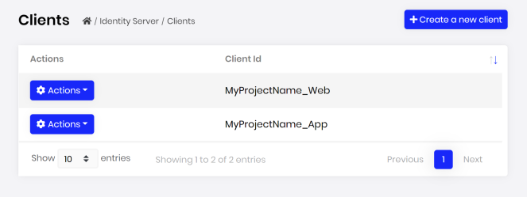
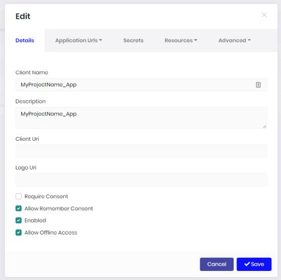
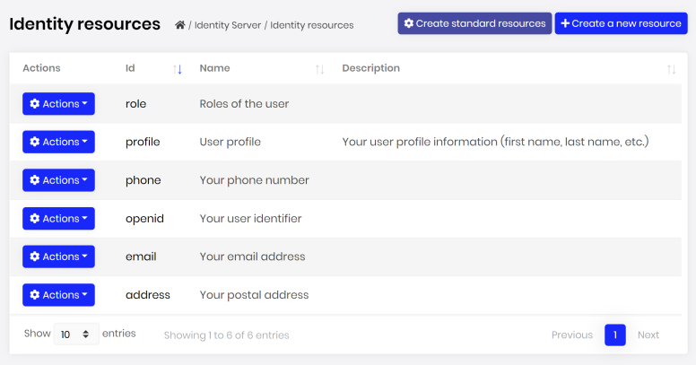
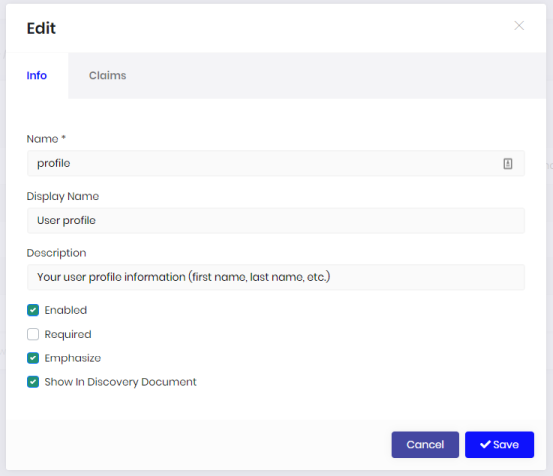
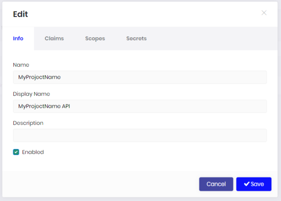

# Identity Module

This module provides integration and management functionality for Identity Server;

* Built on the [IdentityServer4 ](http://docs.identityserver.io/en/latest/) library.
* Manage **Clients**, **Identity resources** and **API resources** in the system. 
* Set **permissions** for clients.
* Create **standard identity resources** (like role, profile) easily.
* Create custom **identity resources**.
* Manage **API resources**

See [the module description page](https://commercial.abp.io/modules/Volo.identityserver.Ui) for an overview of the module features.

## How to Install

Identity Server is pre-installed in [the startup templates](../Startup-Templates/Index). So, no need to manually install it.

## Packages

This module follows the [module development best practices guide](https://docs.abp.io/en/abp/latest/Best-Practices/Index) and consists of several NuGet and NPM packages. See the guide if you want to understand the packages and relations between them.

### NuGet Packages

* Volo.Abp.IdentityServer.Domain
* Volo.Abp.IdentityServer.Domain.Shared
* Volo.Abp.IdentityServer.EntityFrameworkCore
* Volo.Abp.IdentityServer.MongoDB
* Volo.Abp.PermissionManagement.Domain.IdentityServer
* Volo.Abp.IdentityServer.Application
* Volo.Abp.IdentityServer.Application.Contracts
* Volo.Abp.IdentityServer.HttpApi
* Volo.Abp.IdentityServer.HttpApi.Client
* Volo.Abp.IdentityServer.Web

### NPM Packages

* @volo/abp.ng.identity-server
* @volo/abp.ng.identity-server.config

## User Interface

### Menu Items

Identity Server module adds the following items to the "Main" menu, under the "Administration" menu item:

* **Clients**: Client management page.
* **Identity resources**: Identity resource management page.
* **API resources**: API resource management page.

`AbpIdentityServerMenuNames` class has the constants for the menu item names.

### Pages

#### Client Management

Clients page is used to manage Identity Server clients. A client represent applications that can request tokens from your Identity Server.



You can create new clients or edit existing clients in this page:



#### Identity Resource Management

Identity resource page is used to manage identity resources of Identity Server. Identity resources are data like user ID, name, or email address of a user.



You can create a new identity resource or edit an existing identity resource in this page:



This page allows creating standard identity resources (role, profile, phone, openid, email and address) using "Create standard resources" button.

#### API Resource Management

Identity Server module allows to manage API resources. To allow clients to request access tokens for APIs, you need to define API resources.


You can create a new API resource or edit an existing API resource in this page:



## Data Seed

This module adds some initial data (see [the data seed system](https://docs.abp.io/en/abp/latest/Data-Seeding)) to the database when you run the `.DbMigrator` application:

* Creates standard identity resources which are role, profile, phone, openid, email and address.

You can delete or edit created standard identity resources in the identity resource management page. You can also re-create standard identity resources in the identity resource management page using "Create standard resources" button. 

## Options

### AbpIdentityServerBuilderOptions

`AbpIdentityServerBuilderOptions` can be configured in `PreConfigureServices` method of your Identity Server [module](https://docs.abp.io/en/abp/latest/Module-Development-Basics). Example:

````csharp
public override void PreConfigureServices(ServiceConfigurationContext context)
{
	PreConfigure<AbpIdentityServerBuilderOptions>(builder =>
	{
    	//Set options here...		
	});
}
````

`AbpIdentityServerBuilderOptions` properties:

* `UpdateJwtSecurityTokenHandlerDefaultInboundClaimTypeMap` (default: true): Updates `JwtSecurityTokenHandler.DefaultInboundClaimTypeMap` to be compatible with Identity Server claims.
* `UpdateAbpClaimTypes` (default: true): Updates `AbpClaimTypes` to be compatible with identity server claims.
* `IntegrateToAspNetIdentity` (default: true): Integrate to ASP.NET Identity.
* `AddDeveloperSigningCredential` (default: true): Set false to suppress AddDeveloperSigningCredential() call on the IIdentityServerBuilder.

## Internals

### Domain Layer

#### Aggregates

This module follows the [Entity Best Practices & Conventions](https://docs.abp.io/en/abp/latest/Best-Practices/Entities) guide.

##### ApiResource

API Resources are needed for allowing clients to request access tokens.

* `ApiResource` (aggregate root): Represents an API resource in the system.
  * `ApiSecret` (collection): secrets of the API resource.
  * `ApiScope` (collection): scopes of the API resource.
  * `ApiResourceClaim` (collection): claims of the API resource.
  
##### Client

Clients represent applications that can request tokens from your Identity Server.

* `Client` (aggregate root): Represents an Identity Server client application.
  * `ClientScope` (collection): Scopes of the client.
  * `ClientSecret` (collection): Secrets of the client.
  * `ClientGrantType` (collection): Grant types of the client.
  * `ClientCorsOrigin` (collection): CORS origins of the client.
  * `ClientRedirectUri` (collection): redirect URIs of the client.
  * `ClientPostLogoutRedirectUri` (collection): Logout redirect URIs of the client.
  * `ClientIdPRestriction` (collection): Provider restrictions of the client.
  * `ClientClaim` (collection): Claims of the client.
  * `ClientProperty` (collection): Custom properties of the client.

##### PersistedGrant

Persisted Grants stores AuthorizationCodes, RefreshTokens and UserConsent.

* `PersistedGrant` (aggregate root): Represents PersistedGrant for identity server.

##### IdentityResource

Identity resources are data like user ID, name, or email address of a user.

* `IdentityResource` (aggregate root): Represents and Identity Server identity resource.
  * `IdentityClaim` (collection): Claims of identity resource.

#### Repositories

This module follows the [Repository Best Practices & Conventions](https://docs.abp.io/en/abp/latest/Best-Practices/Repositories) guide.

Following custom repositories are defined for this module:

* `IApiResourceRepository`
* `IClientRepository`
* `IPersistentGrantRepository`
* `IIdentityResourceRepository`

#### Domain Services

This module follows the [Domain Services Best Practices & Conventions]( https://docs.abp.io/en/abp/latest/Best-Practices/Domain-Services) guide.

Identity Server module doesn't contain any domain service but overrides services below;

* `AbpProfileService` (Used when `AbpIdentityServerBuilderOptions.IntegrateToAspNetIdentity` is true)
* `AbpClaimsService`
* `AbpCorsPolicyService`

### Settings

This module doesn't define any settings.

### Application Layer

#### Application Services

* `ApiResourceAppService` (implements `IApiResourceAppService`): Implements the use cases of the API resource management UI.
* `IdentityServerClaimTypeAppService` (implement `IIdentityServerClaimTypeAppService`): Used to get list of claims.
* `ApiResourceAppService` (implements `IApiResourceAppService`): Implements the use cases of the API resource management UI.
* `IdentityResourceAppService` (implements `IIdentityResourceAppService`): Implements the use cases of the Identity resource management UI.

### Database Providers

#### Common

##### Table/Collection Prefix & Schema

All tables/collections use the `IdentityServer` prefix by default. Set static properties on the `AbpIdentityServerDbProperties` class if you need to change the table prefix or set a schema name (if supported by your database provider).

##### Connection String

This module uses `AbpIdentityServer` for the connection string name. If you don't define a connection string with this name, it fallbacks to the `Default` connection string.

See the [connection strings](https://docs.abp.io/en/abp/latest/Connection-Strings) documentation for details.

#### Entity Framework Core

##### Tables

* **IdentityServerApiResources**
  * IdentityServerApiSecrets
  * IdentityServerApiScopes
  	* IdentityServerApiScopeClaims
  * IdentityServerApiClaims
* **IdentityServerClients**
	* IdentityServerClientScopes
	* IdentityServerClientSecrets
	* IdentityServerClientGrantTypes
	* IdentityServerClientCorsOrigins
	* IdentityServerClientRedirectUris
	* IdentityServerClientPostLogoutRedirectUris
	* IdentityServerClientIdPRestrictions
	* IdentityServerClientClaims
	* IdentityServerClientProperties
* **IdentityServerPersistedGrants**
* **IdentityServerIdentityResources**
	* IdentityServerIdentityClaims

#### MongoDB

##### Collections

* **IdentityServerApiResources**
* **IdentityServerClients**
* **IdentityServerPersistedGrants**
* **IdentityServerIdentityResources**

### Permissions

See the `AbpIdentityServerPermissions` class members for all permissions defined for this module.

## Distributed Events

This module defines events for `Client` aggregate and `ClientCorsOrigin` entity. When a `Client` or  `ClientCorsOrigin` changes, `AllowedCorsOriginsCacheItemInvalidator` invalidates the cache for `AllowedCorsOriginsCacheItem`. See the [standard distributed events](https://docs.abp.io/en/abp/latest/Distributed-Event-Bus) for more information about distributed events.