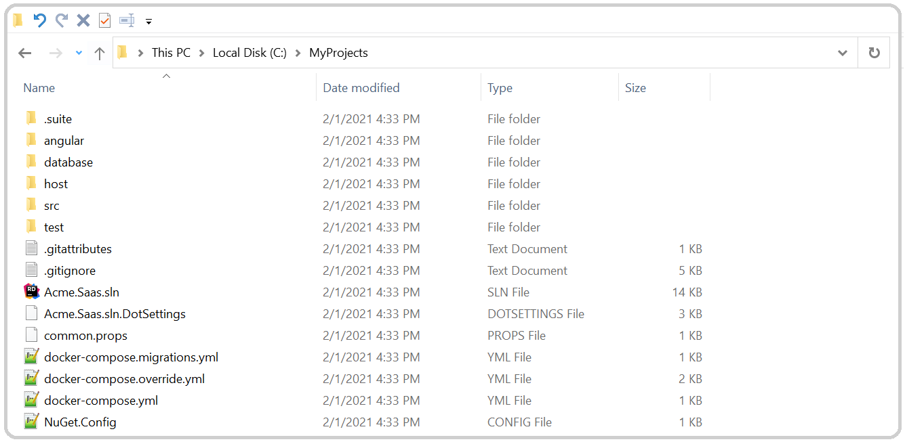

# Creating a new ABP module solution

## Create a new module solution

Creates a new ABP module solution. It's an alternative way of creating an ABP module project rather than [ABP CLI](https://docs.abp.io/en/abp/latest/CLI#new) or [abp.io](https://abp.io/get-started) website.  To create a new ABP module Solution, click the **Create a new solution** button. It will open a new dialog for the options.

You need to select the `Module template` as `Template type

- **Project name:** This is the module solution name and also the prefix for the namespace of your module solution. In this example `Acme.Saas` is the project name. The solution file will be named as `Acme.Saas.sln`. And the namespaces of `c#` files will start with `Acme.Saas.*`

- **Output folder:** This is the directory where the new module project will be created. Suite automatically creates the output directory if not exists and places the module project folder inside the output directory. See the below folder view for `Acme.Saas` project.

  

- **Create solution folder:** Creates a new folder in the output folder. If checked, the project will be in a new folder in the output folder, if unchecked project will be generated directly in the output folder.

- **No user interface:** Specifies to not include the UI. This makes possible to create service-only modules (a.k.a. microservices - without UI).

## What's Next?

* [Module Startup Template Solution Structure](solution-structure.md)
