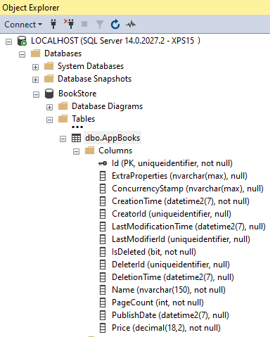
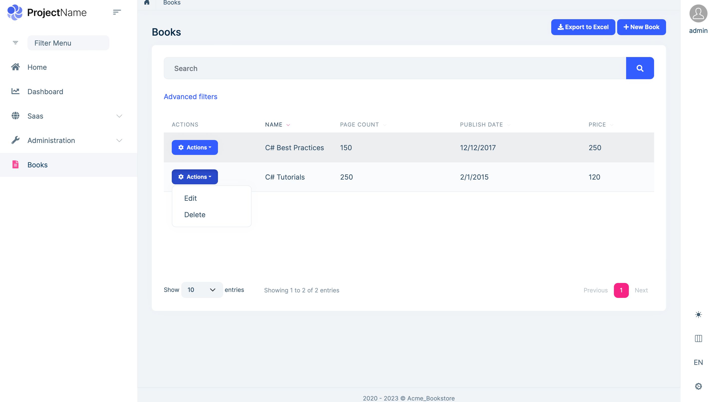

# Generating a CRUD page

When you add an existing project or create a new one, the project will be listed in the "Open Recent" section. To select the project, click on the project name. 

Be aware that, ABP Suite generates a unique URL for every project. After you select your project, you can safely bookmark it to your browser to access it faster.

## Entity info

To create a new entity, make sure the *-New entity-* is selected in the **Entity** combo box which is on the top-right of the page. In this section, you need to provide the meta data of your entity. Do not use [C# reserved keywords](https://docs.microsoft.com/en-us/dotnet/csharp/language-reference/keywords/) for your entity name, plural name, database table name or the namespace. 

* **Name**: Name of the entity.

* **Plural Name**: Folder names of the entity and name of `DbSet`in the `DbContext`.

* **Database table/collection name**: Name of the database table for relational databases or name of the collection name for NoSQL databases.

* **Namespace**: Namespaces of the entities, DTOs and other `C#` classes.

* **Base class**: There are several base classes that comes out of the box from the ABP Framework. Basically there are 2 main types of entity. `AggregateRoot` and simple `Entity`. And these two have 2 more variants with `Audited` and `FullAudited` derivatives. 

  If your entity consists of child entities like an `Order` with its `OrderDetail ` entities, then you should choose [AggregateRoot](https://github.com/abpframework/abp/blob/dev/framework/src/Volo.Abp.Ddd.Domain/Volo/Abp/Domain/Entities/AggregateRoot.cs) / [AuditedAggregateRoot](https://github.com/abpframework/abp/blob/dev/framework/src/Volo.Abp.Ddd.Domain/Volo/Abp/Domain/Entities/Auditing/AuditedAggregateRoot.cs) / [FullAuditedAggregateRoot](https://github.com/abpframework/abp/blob/dev/framework/src/Volo.Abp.Ddd.Domain/Volo/Abp/Domain/Entities/Auditing/FullAuditedAggregateRoot.cs).  

  If it doesn't have any child entities like a `City` entity, you can choose [Entity](https://github.com/abpframework/abp/blob/dev/framework/src/Volo.Abp.Ddd.Domain/Volo/Abp/Domain/Entities/Entity.cs) / [AuditedEntity](https://github.com/abpframework/abp/blob/dev/framework/src/Volo.Abp.Ddd.Domain/Volo/Abp/Domain/Entities/Auditing/AuditedEntity.cs) / [FullAuditedEntity](https://github.com/abpframework/abp/blob/dev/framework/src/Volo.Abp.Ddd.Domain/Volo/Abp/Domain/Entities/Auditing/FullAuditedEntity.cs)

  * **Entity** and **AggregateRoot** are the low-level simple base classes.

  * **AuditedEntity** and **AuditedAggregateRoot** adds these fields to the entity: 

    * `CreationTime`

    * `CreatorId`

    * `LastModificationTime`

    * `LastModifierId`

      Hence, it keeps track of who created and changed the data with the date time information.

  * **FullAuditedEntity** and **FullAuditedAggregateRoot** adds these fields to the entity: 

    * `CreationTime`

    * `CreatorId`

    * `LastModificationTime`

    * `LastModifierId`

    * `IsDeleted` 

    * `DeleterId`

    * `DeletionTime`

      It extends the audited entity features with soft delete functionality. When the data is deleted, it sets the `IsDeleted` field to `true` instead of physically removing it. The ABP Framework automatically filters the soft deleted data on data fetch. Also it saves who and when deleted.

* **Primary key type**:  Primary key is a field in a table or collection which uniquely identifies each record.  ABP Suite allows you to create an entity with one of the 4 types: `Int`,`Long`,`Guid` and `String`. ABP Suite recommends `Guid `  because,

  * You can identify objects at the application level.
  * You can generate `IDs` anywhere, instead of having to roundtrip to the database.
  * Better migration and replication! When working with other databases it's easy to migrate data with all its child entities because unique across every table, database and server.
  * Allows easy distribution of databases across multiple servers
  * The performance is not bad as `String` because database systems handle `Guids` nicely.
  * It's being generated as sequentially by the ABP Framework, so that the physical order of the data in your database will be creation order.
  * `Guids` use 16 bytes. When comparing to `Int` as 4 bytes,  additional 12 bytes do come at a cost.

  On the other hand `Int` and `Long` types have some other advantages:

  * Small storage footprint
  * Optimal join / index performance
  * Useful for data warehousing
  * Native data type of the OS and easy to work with in all languages

* **Multi-tenant**: For your multi-tenant application, you can set an entity as multi-tenant which means the data will be isolated between the tenants. To make an entity multi-tenant, ABP Suite adds the `IMultiTenant` interface to the entity.  Further information see [Multi-Tenancy](https://docs.abp.io/{{Document_Language_Code}}/abp/{{Document_Version}}/Multi-Tenancy)

* **Add migration:** Adds a new migration for the new entity. If you are updating an existing entity, it creates an update migration.

  * **Update database:** When you add a new migration, ABP Suite can automatically execute update-database command so that the changes are being applied to the database.

* **Create user interface:** Creates pages, modals, components, `JavaScript`, `CSS ` files and adds the new page to the main menu.  If you don't have a requirement to manage the entity via user interface, you can uncheck this option.

  ​	

## Properties

##### Define a property

A property is a field in the entity which refers a column in the relational database table or a `JSON` field in `NoSQL` database collection. In the properties section, you can manage the properties your entity. To add a new property, click the "Add Property" button on the top-right of the page. 

* **Property name:** Name of the field. Do not use [C# reserved keywords](https://docs.microsoft.com/en-us/dotnet/csharp/language-reference/keywords/) and database reserved keywords.
* **Property type:** Choose a relevant property type from the list.
* **Min-Max length:** These values are used to limit the data value. The length of the database column will also be created by taking this number into consideration. ABP validates the data on the client and server side according to these values.
* **Required:** Defines whether a value is required or not. 
* **Nullable**: Allows you to set the property as `nullable` for the `C#` supported data types.

### Property list

The list of all properties defined for the entity. You can delete or edit a property. 

#### Sorting

You can use sorting field column to specify or change the order in which results are sorted. To arrange sorting, click the first combo box (`Sort Index`) that you want to set order index. Choose `Ascending` or `Descending` to specify the sort order for the column.

## Navigation Properties

A **navigation property** is an optional **property** on an entity type that allows for **navigation** from one end of an association to the other end. Unlike other properties, **navigation properties** do not carry data.

Here's a navigation property example; The `student` entity holds a foreign key to the `teacher` entity which stores the primary key of the `teacher` entity.

#### How to define a navigation property?

* **Entity namespace**: Namespace of the **target entity** you want to use as the navigation property.
  * Example:`SampleMongoSchoolApp.Teachers`
* **Entity name**: Name of the **target entity**.
  * Example: `Teacher`
* **Entity collection name**: Collection name of the **target entity** in `DbContext`.
  * Example: `Teachers`
* **DTO namespace**: Namespace of DTO object of the entity.
  * Example:`SampleMongoSchoolApp.Teachers`
* **DTO name**: Name of the DTO object of the **target entity**.
  * Example:`TeacherDto`
* **Primary key**: Primary key type of the **target entity**.
  * Example: `Guid`
* **Property name**: Name of the (reference) property that will be created in the main entity.
  * Example: `TeacherId`
* **Display property**: Property name of the target entity which you want to show as display text. It must be a string property.
  * Example: `Name`
* **UI pick type**: Determinates how to set the navigation value. 
  * **Modal**: In a modal window, it opens the target entity list and allows you to select one. Recommended for entities with large data.
  * **Dropdown**: A dropdown will allow you to select a navigation property. Recommended for entities with fewer data.

In this example scenario, we will create a `Student` entity and add a navigation property to the already existing entity `Teacher`. In the end, the user will be able select a teacher for a student. 
See the screenshot that shows you how to do this:

### Saving an entity

There are 2 action to save the entity. 

#### Save as draft

Saves only the entity and not generates any code. This is useful when you don't want to apply changes to your project.

#### Save and generate

Saves the entity and generates related code. Your project will be updated.

### Database table

When you click **Save and generate** button it'll create all the related objects. The below screenshot is the MS SQL database table that's generated via ABP Suite.

## User interface

### New book dialog

###### 

### Book list page

## What's next?

[Updating packages](updating-packages.md)
