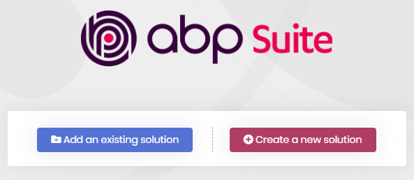

# Getting Started

````json
//[doc-params]
{
    "UI": ["MVC", "Blazor", "BlazorServer", "NG"],
    "DB": ["EF", "Mongo"],
    "Tiered": ["Yes", "No"]
}
````

> This tutorial assumes that you've already purchased an [ABP Commercial license](https://commercial.abp.io/pricing) and have an active ABP Commercial account.

> This document assumes that you prefer to use **{{ UI_Value }}** as the UI framework and **{{ DB_Value }}** as the database provider. For other options, please change the preference on top of this document.

## Create a new project

There are two ways of creating a new project: ABP Suite and ABP CLI.

### Using the ABP Suite to create a new project

> ABP Suite is the recommended way to create new solutions for the ABP Commercial.

Run the ABP Suite with the following command:

````bash
abp suite
````

This command starts the ABP Suite and opens in your default browser:



Click the **Create a new solution** button and fill the modal form:


Select the UI framework, Database provider, and other options based on your preferences, then click on the OK button.

{{ if UI == "NG" || UI == "Blazor" }}

For **Angular** and **Blazor WebAssembly** UIs, you get a **Progressive Web Application (PWA)** checkbox option at the bottom of the *Create a new solution* modal form.

{{ end }}

> You can use a different level of namespaces, e.g: BookStore, Acme.BookStore or Acme.Retail.BookStore. 

### Using the ABP CLI to create a new project

Use the `new` command of the ABP CLI to create a new project:

````shell
abp new Acme.BookStore -t app-pro{{if UI == "NG"}} -u angular{{else if UI == "Blazor"}} -u blazor{{else if UI == "BlazorServer"}} -u blazor-server{{end}}{{if DB == "Mongo"}} -d mongodb{{end}}{{if Tiered == "Yes"}}{{if UI == "MVC" || UI == "BlazorServer"}} --tiered {{else}} --separate-identity-server{{end}}{{end}}
````

* `-t` argument specifies the [startup template](startup-templates/application/index.md) name. `app-pro` is the startup template that contains the essential [ABP Commercial Modules](https://commercial.abp.io/modules) pre-installed and configured for you.

{{ if Tiered == "Yes" }}

{{ if UI == "MVC" || UI == "BlazorServer" }}

* `--tiered` argument is used to create n-tiered solution where the authentication server, UI and API layers are physically separated.

{{ else }}

* `--separate-identity-server` argument separates the identity server application from the API host application. If not specified, you will have a single endpoint on the server.

{{ end }}

{{ end }}

> You can use a different level of namespaces; e.g: BookStore, Acme.BookStore or Acme.Retail.BookStore. 

## Theme

### Lepton X

A new, modern and stylish Bootstrap UI theme with different color options, it's the newest theme and is the default. If you choose it, another option named **Theme style**** will show up, you can choose one out of 4 options: `System`, `Dim`, `Dark` or `Light`.

### Lepton

A modern, mature, responsive UI theme with different style and color options.

### Basic theme

A minimalist UI theme with plain Bootstrap colors and styles. Ideal if you will build your own UI theme.

## Mobile Development

### React Native

You can specify the `-m react-native` option to create a new application with React Native. This is a basic [React Native](https://reactnative.dev/) startup template to develop mobile applications integrated to your ABP-based backends.

See the [Getting Started with the React Native](getting-started-react-native.md) document to learn how to configure and run the React Native application.

### MAUI

You can specify the `-m maui` option to create a new application with MAUI. This is a basic [MAUI](https://docs.microsoft.com/en-us/dotnet/maui/what-is-maui) startup template to develop mobile applications integrated into your ABP based backends.

See the [Getting Started with the MAUI](getting-started-maui.md) document to learn how to configure and run the MAUI application.

> If you don't need a mobile project in your solution, you can provide the `-m none` option to the ABP CLI.

#### ABP CLI commands & options

[ABP CLI document](https://docs.abp.io/en/abp/latest/CLI) covers all of the available commands and options for the ABP CLI. The main difference for the ABP Commercial is the template names. See the [ABP Commercial Startup Templates](startup-templates/index.md) document for other commercial templates.

## The solution structure

The solution has a layered structure (based on the [Domain Driven Design](https://docs.abp.io/en/abp/Domain-Driven-Design)) and contains unit & integration test projects. See the [solution structure document](startup-templates/application/solution-structure.md) to understand the solution structure in details. 

{{ if DB == "Mongo" }}

#### MongoDB Transactions

The [startup template](startup-templates/application/index.md) **disables** transactions in the `.MongoDB` project by default. If your MongoDB server supports transactions, you can enable it in the *YourProjectMongoDbModule* class's `ConfigureServices` method:

  ```csharp
  Configure<AbpUnitOfWorkDefaultOptions>(options =>
  {
      options.TransactionBehavior = UnitOfWorkTransactionBehavior.Auto;
  });
  ```

> Or you can delete this code since this is already the default behavior.

{{ end }}

## Next Step

* [Running the solution](getting-started-running-solution.md)
