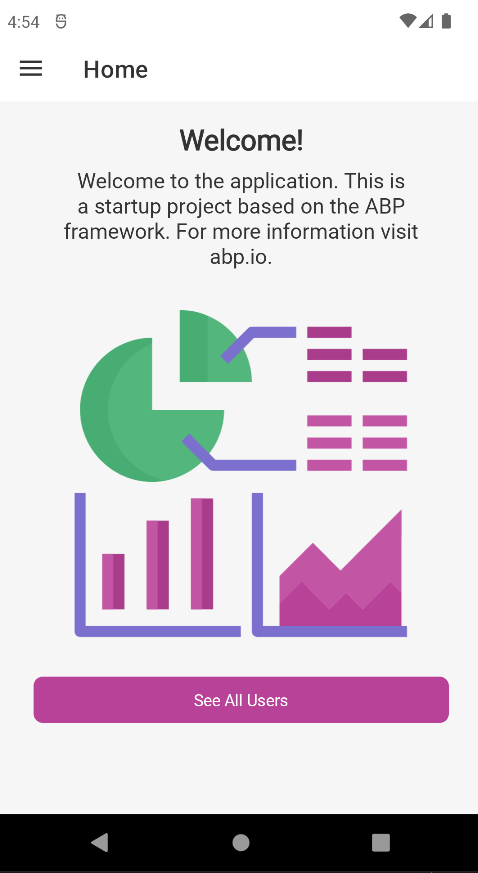

# Getting Started with the MAUI

ABP Commercial platform provides a basic [MAUI](https://docs.microsoft.com/en-us/dotnet/maui/what-is-maui) template to develop mobile applications **integrated to your ABP based backends**.

## Run the Server Application

Run the backend application described in the [getting started document](getting-started.md).

Open the `appsettings.json` in the `MAUI` project:

{{ if Tiered == "Yes" }}

* Make sure that `Authority` matches the running address of the `.AuthServer` project, `BaseUrl` matches the running address of the `.HttpApi.Host` project.

{{else}}

* Make sure that `Authority` and `BaseUrl` matches the running address of the `.HttpApi.Host` or `.Web` project.

{{ end }}

### Android

If you get the following error when connecting to the emulator or a physical phone, you need to set up port mapping.

```
Cannot connect to the backend on localhost. 
```

Open a command line terminal and run the `adb reverse` command to expose a port on your Android device to a port on your computer. For example:

`adb reverse tcp:44305: tcp:44305`

> You should run the command after starting the emulator.

### iOS

The iOS simulator uses the host machine network. Therefore, applications running in the simulator can connect to web services running on your local machine via the machines IP address or via the localhost hostname. For example, given a local secure web service that exposes a GET operation via the /api/todoitems/ relative URI, an application running on the iOS simulator can consume the operation by sending a GET request to https://localhost:<port>/api/todoitems/.

> If the simulator is used from Windows with a remote connection, follow the [Microsoft's documentation](https://docs.microsoft.com/en-us/xamarin/cross-platform/deploy-test/connect-to-local-web-services#specify-the-local-machine-address) to setup a proper configuration.


## Run the Mobile Application



When you click the *Login to the application* button, it redirects you to the login page. 
Enter **admin** as the username and **1q2w3E*** as the password to login to the application.


The user page shows you how to use CSharp client proxy to request backend API.

The application is up and running. You can continue to develop your application based on this startup template.
