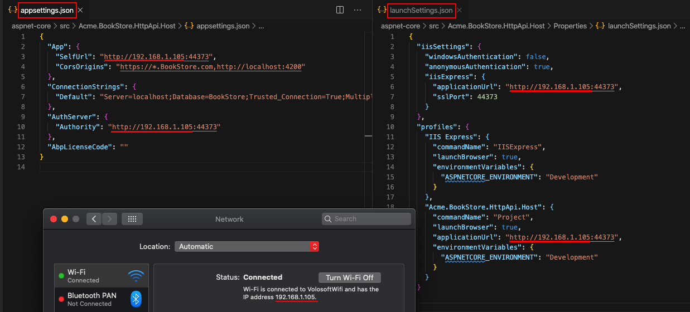
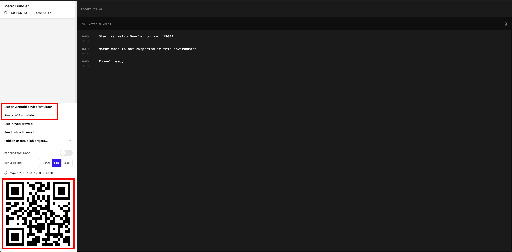
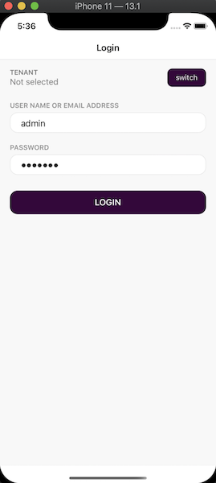
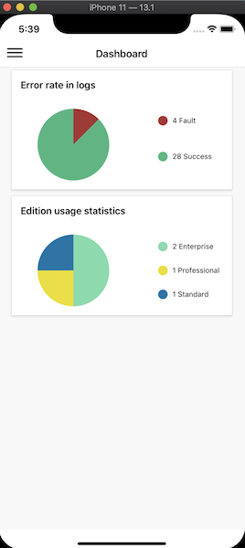

# Getting Started with the React Native

ABP Commercial platform provides a basic [React Native](https://reactnative.dev/) template to develop mobile applications **integrated to your ABP based backends**.

When you **create a new application** as described in the [getting started document](getting-started.md), the solution includes the React Native application in the `react-native` folder as default.

## Configure Your Local IP Address

A React Native application running on an Android emulator or a physical phone **cannot connect to the backend** on `localhost`. To fix this problem, it is necessary to run backend on your **local IP address**.

{{ if Tiered == "No"}}


* Open the `appsettings.json` in the `.HttpApi.Host` folder. Replace the `localhost` address on the `SelfUrl` and `Authority` properties with your local IP address.
* Open the `launchSettings.json` in the `.HttpApi.Host/Properties` folder. Replace the `localhost` address on the `applicationUrl` properties with your local IP address.

{{ else if Tiered == "Yes" }}


* Open the `appsettings.json` in the `.IdentityServer` folder. Replace the `localhost` address on the `SelfUrl` property with your local IP address.
* Open the `launchSettings.json` in the `.IdentityServer/Properties` folder. Replace the `localhost` address on the `applicationUrl` properties with your local IP address.
* Open the `appsettings.json` in the `.HttpApi.Host` folder. Replace the `localhost` address on the `Authority` property with your local IP address.
* Open the `launchSettings.json` in the `.HttpApi.Host/Properties` folder. Replace the `localhost` address on the `applicationUrl` properties with your local IP address.

{{ end }}


> You should turn off the "Https Restriction" if you're using OpenIddict as a central identity management solution. Because the IOS Simulator doesn't support self-signed certificates and OpenIddict is set to only work with HTTPS by default.

## How to disable the Https-only settings of OpenIddict

 Go to MyProjectNameHttpApiHostModule.cs under the host project. Add put these codes under the `PreConfigureServices` function.

```csharp
#if DEBUG
 PreConfigure<OpenIddictServerBuilder>(options => {
 options.UseAspNetCore()
 .DisableTransportSecurityRequirement();
 });
#endif
```

## Run the Server Application

Run the backend application as described in the [getting started document](getting-started.md).

> React Native application does not trust the auto-generated .NET HTTPS certificate, you should use the HTTP during development.

Go to the `react-native` folder, open a command line terminal, type the `yarn` command (we suggest to the [yarn](https://yarnpkg.com/) package manager while `npm install` will also work in most cases):

```bash
yarn
```

* Open the `Environment.js` in the `react-native` folder and replace the `localhost` address on the `apiUrl` and `issuer` properties with your local IP address as shown below:


{{ if Tiered == "Yes" }}

> Make sure that `issuer` matches the running address of the `.IdentityServer` project, `apiUrl` matches the running address of the `.HttpApi.Host` project.

{{else}}

> Make sure that `issuer` and `apiUrl` match the running address of the `.HttpApi.Host`, `.Web` or `.Blazor`(BlazorServer UI) projects.

{{ end }}

Once all node modules are loaded, execute `yarn start` (or `npm start`) command:

```bash
yarn start
```

Wait Expo CLI to start. Expo CLI opens the management interface on the `http://localhost:19002/` address.



In the above management interface, you can start the application with an Android emulator, an iOS simulator or a physical phone by the scan the QR code with the [Expo Client](https://expo.io/tools#client).

> See the [Android Studio Emulator](https://docs.expo.io/workflow/android-studio-emulator), [iOS Simulator](https://docs.expo.io/workflow/ios-simulator) documents on expo.io.



Enter **admin** as the username and **1q2w3E*** as the password to login to the application:



The application is up and running. You can continue to develop your application based on this startup template.
