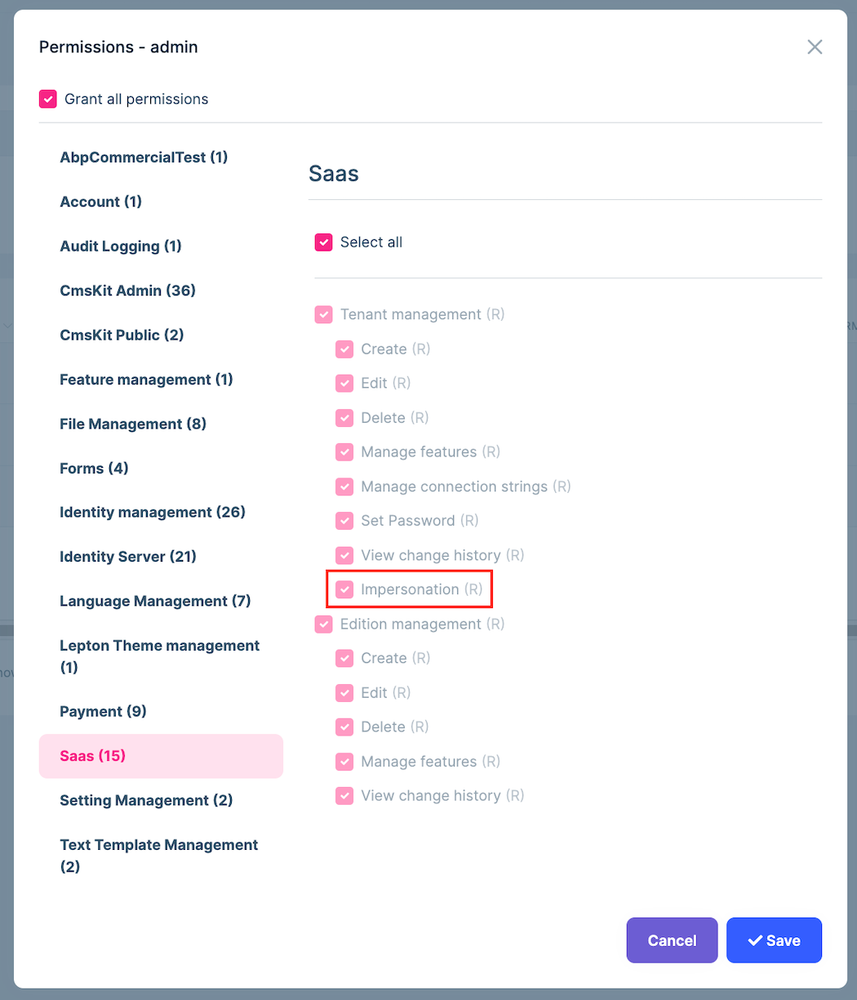

# Tenant impersonation & User impersonation

## Introduction

We may want to login as a user and perform operations on behalf of that user, without knowing the user's password. 

## How to enable impersonation feature?

> Impersonation is enabled by default in startup project templates of v5.0 and above.

### MVC

```cs
public override void ConfigureServices(ServiceConfigurationContext context)
{
    var configuration = context.Services.GetConfiguration();

    //For impersonation in Saas module
    context.Services.Configure<AbpSaasHostWebOptions>(options =>
    {
        options.EnableTenantImpersonation = true;
    });

    //For impersonation in Identity module
    context.Services.Configure<AbpIdentityWebOptions>(options =>
    {
        options.EnableUserImpersonation = true;
    });

    context.Services.Configure<AbpAccountOptions>(options =>
    {
        //For impersonation in Saas module
        options.TenantAdminUserName = "admin";
        options.ImpersonationTenantPermission = SaasHostPermissions.Tenants.Impersonation;

        //For impersonation in Identity module
        options.ImpersonationUserPermission = IdentityPermissions.Users.Impersonation;
    });
}
```

### MVC Tiered

#### IdentityServer

```cs
public override void ConfigureServices(ServiceConfigurationContext context)
{
    context.Services.Configure<AbpAccountOptions>(options =>
    {
        //For impersonation in Saas module
        options.TenantAdminUserName = "admin";
        options.ImpersonationTenantPermission = SaasHostPermissions.Tenants.Impersonation;

        //For impersonation in Identity module
        options.ImpersonationUserPermission = IdentityPermissions.Users.Impersonation;
    });
}
```

#### HttpApi.Host

Don't need to do anything.

#### Web

```cs
public override void ConfigureServices(ServiceConfigurationContext context)
{
    var configuration = context.Services.GetConfiguration();

    //For impersonation in Saas module
    context.Services.Configure<AbpSaasHostWebOptions>(options =>
    {
        options.EnableTenantImpersonation = true;
    });

    //For impersonation in Identity module
    context.Services.Configure<AbpIdentityWebOptions>(options =>
    {
        options.EnableUserImpersonation = true;
    });
}
```

### Blazor Server

```cs
public override void ConfigureServices(ServiceConfigurationContext context)
{
    var configuration = context.Services.GetConfiguration();

    //For impersonation in Saas module
    context.Services.Configure<SaasHostBlazorOptions>(options =>
    {
        options.EnableTenantImpersonation = true;
    });

    //For impersonation in Identity module
    context.Services.Configure<AbpIdentityProBlazorOptions>(options =>
    {
        options.EnableUserImpersonation = true;
    });

    context.Services.Configure<AbpAccountOptions>(options =>
    {
        //For impersonation in Saas module
        options.TenantAdminUserName = "admin";
        options.ImpersonationTenantPermission = SaasHostPermissions.Tenants.Impersonation;

        //For impersonation in Identity module
        options.ImpersonationUserPermission = IdentityPermissions.Users.Impersonation;
    });
}
```

### Blazor Server Tiered

#### Identity Server

```cs
public override void ConfigureServices(ServiceConfigurationContext context)
{
    context.Services.Configure<AbpAccountOptions>(options =>
    {
        //For impersonation in Saas module
        options.TenantAdminUserName = "admin";
        options.ImpersonationTenantPermission = SaasHostPermissions.Tenants.Impersonation;

        //For impersonation in Identity module
        options.ImpersonationUserPermission = IdentityPermissions.Users.Impersonation;
    });
}
```

#### HttpApi.Host

Don't need to do anything.

#### Blazor

```cs
public override void ConfigureServices(ServiceConfigurationContext context)
{
    //For impersonation in Saas module
    context.Services.Configure<SaasHostBlazorOptions>(options =>
    {
        options.EnableTenantImpersonation = true;
    });

    //For impersonation in Identity module
    context.Services.Configure<AbpIdentityProBlazorOptions>(options =>
    {
        options.EnableUserImpersonation = true;
    });
}
```

### Blazor WASM

It is currently not supported.

## Tenant & User Impersonation permissions



