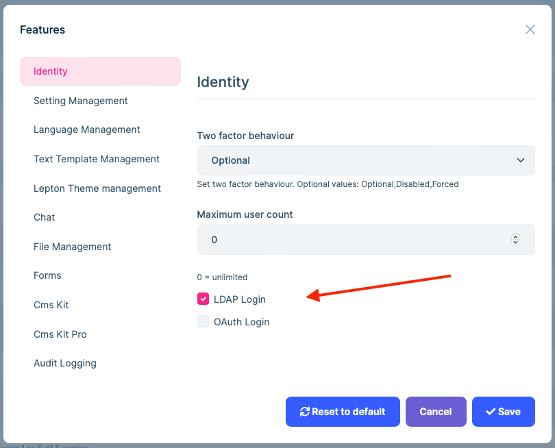
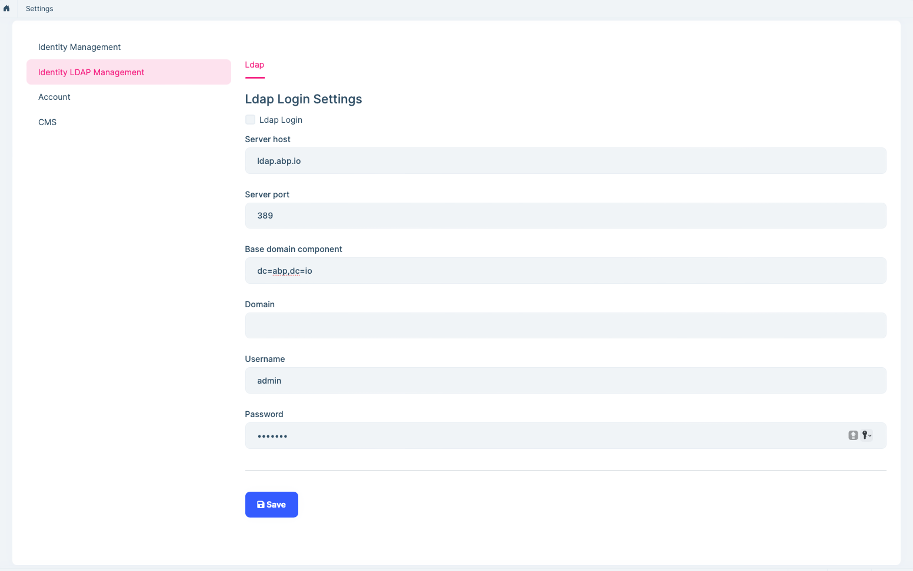

# LDAP External login Provider

## Introduction

The Account pro module has built-in `LdapExternalLoginProvider` and `OpenLdapManager` services. It implements LDAP authentication and gets user info for external login.

We use [ldap4net](https://github.com/flamencist/ldap4net) library. For more information you can check [its Github homepage](https://github.com/flamencist/ldap4net).

## How to enable LDAP external login?

We need to enable the LDAP login feature and configure related settings.





## Customize built-in services

The default `OpenLdapManager` service uses `$"cn={userName},{BaseDc}"` to normalize user name, and use `$"(&(uid={userName}))"` to search for users, use `mail` as attribute name to get email.

> The value of `BaseDc` is the setting of the `Base domain component`.

If your **username** has a prefix or a specific format, you can override the `NormalizeUserName` method of `OpenLdapManager` to handle it. You can also customize the `GetUserFilter` and `GetUserEmail` methods at the same time.

```cs
[Dependency(ReplaceServices = true)]
[ExposeServices(typeof(OpenLdapManager), typeof(ILdapManager), typeof(LdapManager))]
public class VoloOpenLdapManager : OpenLdapManager
{
    public VoloOpenLdapManager(IOptions<AbpLdapOptions> ldapSettingsOptions)
        : base(ldapSettingsOptions)
    {
    }

    protected override string NormalizeUserName(string userName)
    {
        return $"Volo\\{userName}";
    }

    protected override string GetUserFilter(string userName)
    {
        // Default is $"cn={userName},{LdapOptions.BaseDc}"
        return $"(&(objectClass=user)(sAMAccountName={userName}))";
    }

    protected override string GetUserEmail(LdapEntry ldapEntry)
    {
        // You can use another attribute to get user email.
        return ldapEntry.ToDirectoryEntry().GetAttribute("mail")?.GetValue<string>();
    }
}
```

At the same time, `$"uid={userName}, {BaseDc}"` is used in the built-in `LdapExternalLoginProvider` service to normalize the username, you have to change it together.

```cs
public class VoloLdapExternalLoginProvider : LdapExternalLoginProvider
{
    public VoloLdapExternalLoginProvider(
        IGuidGenerator guidGenerator,
        ICurrentTenant currentTenant,
        IdentityUserManager userManager,
        IIdentityUserRepository identityUserRepository,
        OpenLdapManager ldapManager,
        IOptions<AbpLdapOptions> ldapOptions,
        IFeatureChecker featureChecker,
        ISettingProvider settingProvider,
        IOptions<IdentityOptions> identityOptions)
        : base(guidGenerator,
            currentTenant,
            userManager,
            identityUserRepository,
            ldapManager,
            ldapOptions,
            featureChecker,
            settingProvider,
            identityOptions)
    {

    }

    protected override string NormalizeUserName(string userName)
    {
        // Default is $"uid={userName}, {BaseDc}"
        return $"Volo\\{userName}";
    }
}
```

Replace the default implementation with `VoloLdapExternalLoginProvider`.

```cs
public override void ConfigureServices(ServiceConfigurationContext context)
{
    //...
    Configure<AbpIdentityOptions>(options =>
    {
        options.ExternalLoginProviders.Remove(LdapExternalLoginProvider.Name);
        options.ExternalLoginProviders.Add<VoloLdapExternalLoginProvider>(LdapExternalLoginProvider.Name);
    });
    //...
}
```

## Test application

It is more complicated to test the LDAP configuration in the ABP project. We provide a test application for this. You can test those settings in the console.

See [AbpLdapSample/Program.cs](https://github.com/abpframework/abp-samples/blob/master/AbpLdapSample/AbpLdapSample/Program.cs)
