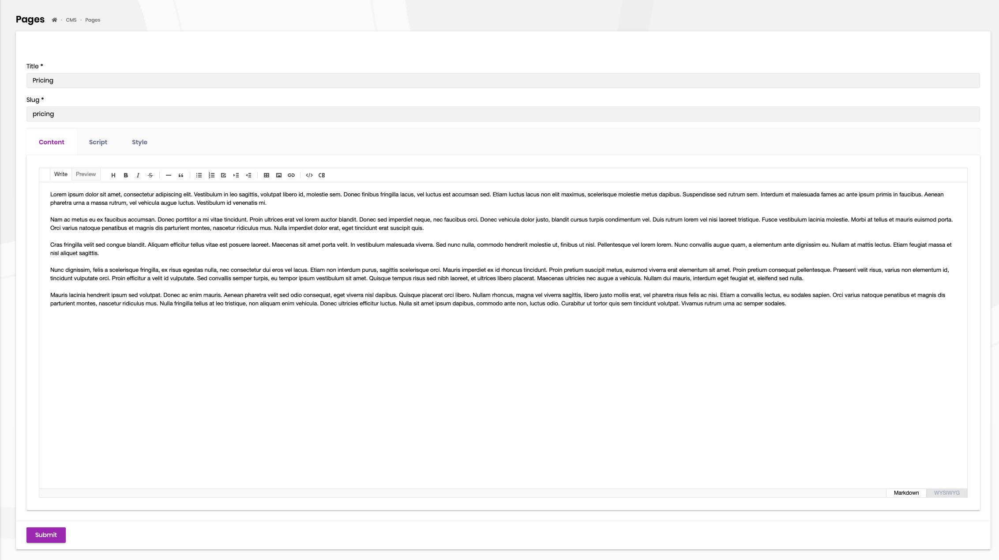
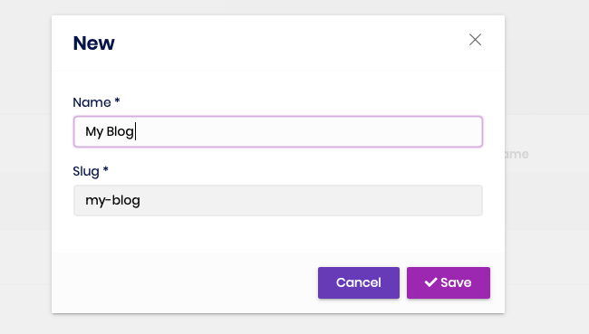
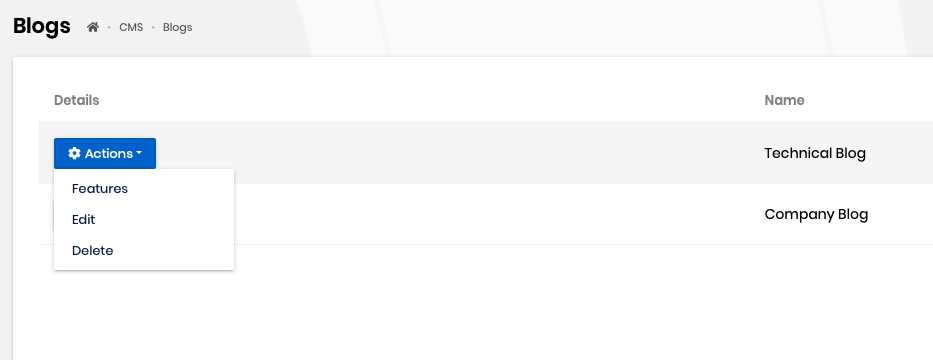
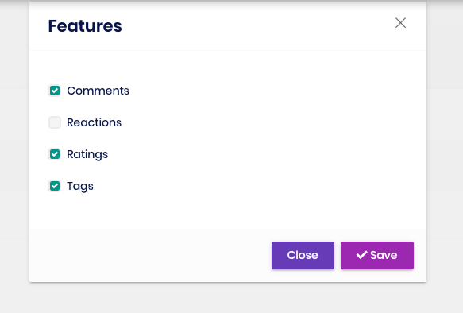

# CMS Kit Pro Module

This module provides CMS(Content Management System) capabilities for your application.

* Provides a **page** management system to manage dynamic pages.
* Provides a **blog** system to create blogs and publish posts.
* Provides a **tag** system to tag any kind of resources, like blog posts.
* Provides a **comment** system to add comments feature to any kind of resource, like blog posts.
* Provides a **reaction** system to add reactions feature to any kind of resource, like blog posts or comments.
* Provides a **rating** system to add ratings feature to any kind of resource.
* Provides a [**newsletter**](cms-kit/cms-kit-newsletter-system.md) system to allow users to subscribe to newsletters.
* Provides a [**contact form**](cms-kit/cms-kit-contact-management.md) system to allow users to write message to you.

See [the module description page](https://commercial.abp.io/modules/Volo.CmsKit.Pro) for an overview of the module features.

## How to install

CMS Kit Pro is pre-installed in [the startup templates](../startup-templates/application/index.md) if you create the solution with public website option. So, no need to manually install it. 

If you want to add the CMS kit to your solution manually, the ABP CLI allows adding a module to a solution using `add-module` command. CMS kit module can be added using the command below;

```bash
abp add-module Volo.CmsKit.Pro
```
Open the `GlobalFeatureConfigurator` class in the `Domain.Shared` project and place the following code to the `Configure` method to enable all open-source and commercial features in the CMS kit module.

```csharp
GlobalFeatureManager.Instance.Modules.CmsKit(cmsKit =>
{
    cmsKit.EnableAll();
});

GlobalFeatureManager.Instance.Modules.CmsKitPro(cmsKitPro =>
{
    cmsKitPro.EnableAll();
});
```

> If you are using EntityFrameworkCore, do not forget to add a new migration and update your database.

## Packages

This module follows the [module development best practices guide](https://docs.abp.io/en/abp/latest/Best-Practices/Index) and consists of several NuGet and NPM packages. See the guide if you want to understand the packages and relations between them.

CMS kit packages are designed for various usage scenarios. When you visit the [CMS kit module package list page](https://abp.io/packages?moduleName=Volo.CmsKit.Pro), you will see that packages have admin, public and unified versions. 
For example,
 - `Volo.CmsKit.Pro.Admin.Application`: Contains functionality required by admin websites.
 - `Volo.CmsKit.Pro.Public.Application`: Contains functionality required by public websites.
 - `Volo.CmsKit.Pro.Application` : Unified package dependent on both public and admin packages.

If you want to want to separate admin and public website codes, you can use the admin and public packages. However, if you want to keep admin and public website codes in a shared project, you can use the unified packages to include both admin and public packages. 

It is recommeded to use the unified packages instead of adding both admin and public packages.

## Feature System

CMS kit uses the [global feature](https://docs.abp.io/en/abp/latest/Global-Features) system for all implemented features. Startup templates come with all the CMS kit related features are enabled by default. If you want to use only some spesific features, you can disable the features using the global feature system.

You can see how to disable newsletter and page features below. 

Open the `GlobalFeatureConfigurator` class in the `Domain.Shared` project. You will see that all open-source and pro features are enabled. You can call the `Disable` method on the feature definitions.

```csharp
GlobalFeatureManager.Instance.Modules.CmsKit(cmsKit =>
{
    cmsKit.EnableAll();
    cmsKit.Pages.Disable();
});

GlobalFeatureManager.Instance.Modules.CmsKitPro(cmsKitPro =>
{
    cmsKitPro.EnableAll();
    cmsKitPro.Newsletter.Disable();
});
```

## User interface

### Menu items

CMS kit module adds the following items to the "Main" menu, under the "CMS" menu item:

* **Pages**: Page management page.
* **Blogs**: Blog management page.
* **Blog Posts**: Blog post management page.
* **Tags**: Tag management page.
* **Comments**: Comment management page.
* **Newsletters**: Newsletter subscription management page.

`CmsKitProAdminMenus` and `CmsKitAdminMenus` classes have the constants for the menu item names.

### Pages

### Page Management

Pages page is used to manage dynamic pages in the system.


You can create or edit an existing page on this page.



* When you create a page, you can access the created page via `pages/{slug}` URL.

### Blog Management

Blogs page is used to create and manage blogs in your system. 


A screenshot from the new blog creation modal:



#### Blog Features

You can enable or disable a specific feature for blogs by clicking the features action.



You can select/deselect the desired features for blog posts. 



### Blog Post Management

When you create blogs, you can manage blog posts on this page.


You can create and edit an existing blog post on this page. If you enable specific features such as tags, you can set tags for the blog post on this page.


### Tag Management

CMS Kit provides an extensible tagging mechanism to add tagging capabilities to various places. 


You can create or edit an existing tag on this page.


### Comment Management

CMS Kit provides an extensible commenting mechanism to add comments to various places. You can add comment control to anywhere you want and manage the comments.

You can view and manage comments on this page.


You can manage and view replies on this page.


### Newsletter System

Newsletter system allows you to place a newsletter subscription box to any page on your website. You can then view the subscribers and export the list as CSV file.


### Contact Management

CMS Kit provides an infrastructure to create contact forms on your websites and easily manage contact options. You can use the available contact form component on your pages like below. 


When a user sends a message through the contact form, the system automatically sends the form content to the configured email address. You can change the email address on the setting page.


### Reactions

CMS Kit provides an extensible reaction component system to allow users to send reactions to your content. Here how the reactions component looks in the comment system. 


You can also customize the reaction icons shown in the reaction component.

### Ratings

You can use the rating component to add rating a mechanism to your content. Here how the rating component looks on the blog post page. 

