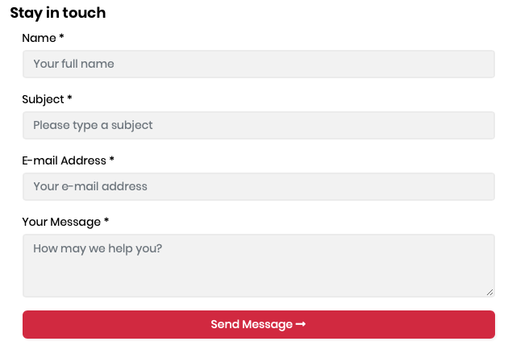

# Contact Management

CMS Kit provides a widget to create a contact form on your website.

### The Contact Widget

The contact management system provides a contact form [widget](https://docs.abp.io/en/abp/latest/UI/AspNetCore/Widgets) to create contact forms on the UI:

```csharp
@await Component.InvokeAsync(typeof(ContactViewComponent))
```

Here, a screenshot from the widget:



## Options

You can configure the `CmsKitContactOptions` to enable/disable recaptcha for contact form in the `ConfigureServices` method of your [module](https://docs.abp.io/en/abp/latest/Module-Development-Basics).

Example:

```csharp
Configure<CmsKitContactOptions>(options =>
{
    options.IsRecaptchaEnabled = true; //false by default
});
```

`CmsKitContactOptions` properties:

* `IsRecaptchaEnabled` (default: false): This flag enables or disables the reCaptcha for contact form. You can set it as **true** if you want to use reCaptcha in your contact form.

If you set **IsRecaptchaEnabled** as **true**, you also need to specify **SiteKey** and **SiteSecret** options for reCaptcha. To do that, add **CmsKit:Contact** section into your `appsettings.json` file:

```json
{
    "CmsKit": {
        "Contact": {
            "SiteKey": "your-site-key",
            "SiteSecret": "your-site-secret"
        }
    }
}
```

## Settings 

You can configure the receiver (email address) by using the CMS tab in the settings page. 


## Internals

* `ContactEmailSender` is used to send email to notify the configured receiver when a new contact form entry is arrived.