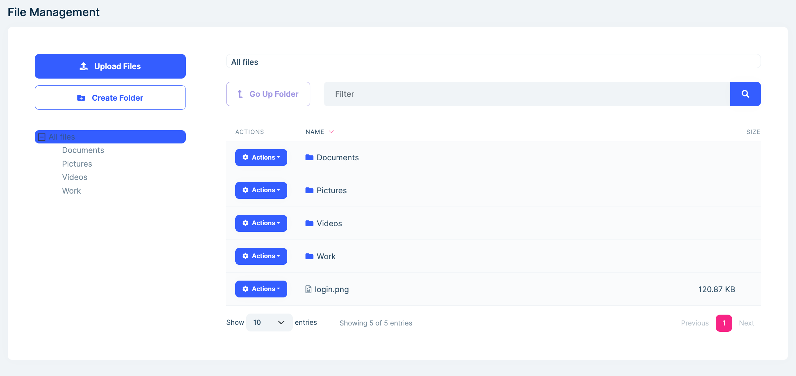

# File Management Module

This module is used to upload, download and organize files in a hierarchical folder structure. It is also compatible to multi-tenancy and you can determine total size limit for your tenants.

This module is based on the [BLOB Storing](https://docs.abp.io/en/abp/latest/Blob-Storing) system, so it can use different storage providers to store the file contents.

See [the module description page](https://commercial.abp.io/modules/Volo.FileManagement) for an overview of the module features.

## How to Install

File Management module is not installed in [the startup templates](../Startup-Templates/Index). So, it needs to be installed manually. There are two ways of installing a module into your application.

### 1. Using ABP CLI

ABP CLI allows adding a module to a solution using `add-module` command. You can check its [documentation](https://docs.abp.io/en/abp/latest/CLI#add-module) for more information. So, file management module can be added using the command below;

```bash
abp add-module Volo.FileManagement
```

### 2. Manual Installation

If you modified your solution structure, adding module using ABP CLI might not work for you. In such cases, file management module can be added to a solution manually.

In order to do that, add packages listed below to matching project on your solution. For example, `Volo.FileManagement.Application` package to your **{ProjectName}.Application.csproj** like below;

```json
<PackageReference Include="Volo.FileManagement.Application" Version="x.x.x" />
```

After adding the package reference, open the module class of the project (eg: `{ProjectName}ApplicationModule`) and add the below code to the `DependsOn` attribute.

```csharp
[DependsOn(
  //...
  typeof(FileManagementApplicationModule)
)]
```

If your project is using `EntityFrameworkCore`, you need to add following configuration to `OnModelCreating` method at your `DbContext`.

If your project is using `MongoDB`, you need to add following configuration to `CreateModel` method at your `DbContext`.

```csharp
builder.ConfigureFileManagement();
```

> If you are using EntityFrameworkCore, do not forget to add a new migration and update your database.

File Management module's MVC user interface depends on following npm packages. add `@volo/file-management` npm package to your `package.json` file.

```json
"dependencies": {
    ...
    "@volo/file-management": "^2.9.0"
  }
```

> After adding packages, you need to run `yarn` and `gulp` cli actions for your `Web` project.

## Setting BLOB Provider

File Management module is based on the [BLOB Storing](https://docs.abp.io/en/abp/latest/Blob-Storing) system as defined before, and it uses `FileManagementContainer` as a BLOB container.

You must set a BLOB provider for `FileManagementContainer`.

```csharp
Configure<AbpBlobStoringOptions>(options =>
{
    options.Containers.Configure<FileManagementContainer>(c =>
    {
        c.UseDatabase(); // You can use FileSystem or Azure providers also.
    });
});
```

Please check the [BLOB Storage Providers documentation](https://docs.abp.io/en/abp/latest/Blob-Storing#blob-storage-providers) for more information about providers and how to use them.

## Packages

This module follows the [module development best practices guide](https://docs.abp.io/en/abp/latest/Best-Practices/Index) and consists of several NuGet and NPM packages. See the guide if you want to understand the packages and relations between them.

You can visit [File Management module package list page](https://abp.io/packages?moduleName=Volo.FileManagement) to see list of packages related with this module.

## User Interface

### Menu Items

File Management module adds the following items to the "Main" menu, under the "Administration" menu item:

- **File Management**: List, view all folder structure and files.

`FileManagementMenuNames` class has the constants for the menu item names.

### Pages

#### File Management

File Management page is used to create folders, upload files and view the list of folders and files that stored in the application.



##### Folders

You can create a new folder by clicking `Create Folder` button that located at top left on the page. The folder will be created at active directory.

You can move a folder to another directory on the left tree view.

You can rename a folder by clicking `Actions -> Rename` on the table.

##### Files

You can upload files by clicking `Upload Files` button that located at top left on the page. This will open a new modal for selecting your local files to upload. The files will be uploaded at active directory.

You can move files by clicking `Actions -> Move` on the table.

You can rename a file by clicking `Actions -> Rename` on the table.

## Data Seed

This module doesn't seed any data.

## Internals

### Domain Layer

#### Aggregates

This module follows the [Entity Best Practices & Conventions](https://docs.abp.io/en/abp/latest/Best-Practices/Entities) guide.

##### TextTemplateContent

- `DirectoryDescriptor` (aggregate root): Represents a folder.
- `FileDescriptor` (aggregate root): Represents a file.

#### Repositories

This module follows the [Repository Best Practices & Conventions](https://docs.abp.io/en/abp/latest/Best-Practices/Repositories) guide.

Following custom repositories are defined for this module:

- `IDirectoryDescriptorRepository`
- `IFileDescriptorRepository`

#### Domain Services

This module follows the [Domain Services Best Practices & Conventions](https://docs.abp.io/en/abp/latest/Best-Practices/Domain-Services) guide.

##### DirectoryManager

`DirectoryManager` is used to manage your folders like create, rename, move and delete.

##### FileManager

`FileManager` is used to manage your files like create, rename, move and delete.

### Settings

This module doesn't define any setting.

### Features

You can enable or disable this module for each tenant, also you can set maximum storage size for each tenant.
See the `FileManagementFeatures` class members for all features defined for this module.

### Application Layer

#### Application Services

- `DirectoryDescriptorAppService` (implements `IDirectoryDescriptorAppService`): Implements the use cases of the file management UI.
- `FileDescriptorAppService` (implements `IFileDescriptorAppService`): Implements the use cases of the file management UI.

### Database Providers

#### Common

##### Table/Collection Prefix & Schema

All tables/collections use the `Fm` prefix by default. Set static properties on the `FileManagementDbProperties` class if you need to change the table prefix or set a schema name (if supported by your database provider).

##### Connection String

This module uses `FileManagement` for the connection string name. If you don't define a connection string with this name, it fallbacks to the `Default` connection string.

See the [connection strings](https://docs.abp.io/en/abp/latest/Connection-Strings) documentation for details.

#### Entity Framework Core

##### Tables

- **FmDirectoryDescriptors**
- **FmFileDescriptors**

#### MongoDB

##### Collections

- **FmDirectoryDescriptors**
- **FmFileDescriptors**

### Permissions

See the `FileManagementPermissions` class members for all permissions defined for this module.

## Distributed Events

This module doesn't define any additional distributed event. See the [standard distributed events](https://docs.abp.io/en/abp/latest/Distributed-Event-Bus).
