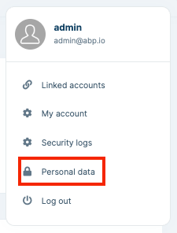
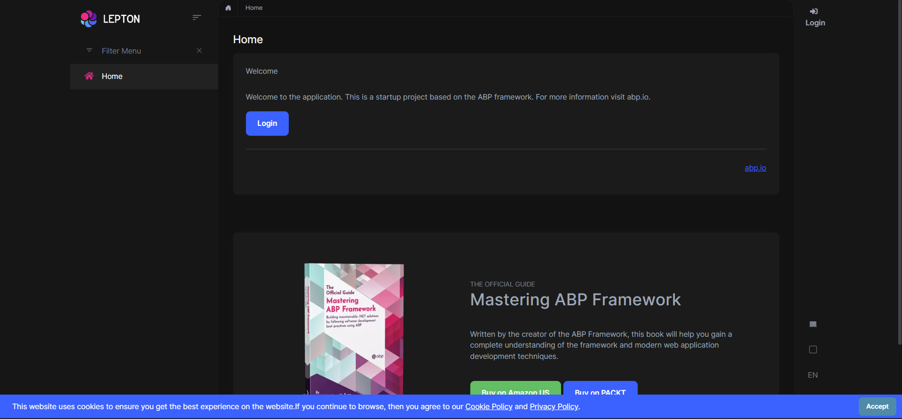

# GDPR Module

This module allows users to download and delete their personal data collected by the application. 

> The GDPR module requests the information from the other modules that reference the `Volo.Abp.Gdpr.Abstractions` package and merges the response data into a single JSON file and the personal data can be downloaded later by the user. Also, the user can delete her/his personal data and account permanently.

See [the module description page](https://commercial.abp.io/modules/Volo.Gdpr) for an overview of the module features.

## How to install

The GDPR module is pre-installed in the [Application](../startup-templates/application/index.md) and [Application (Single Layer) templates](../startup-templates/application-single-layer/index.md). So, no need to manually install it. 

If you need to install it manually, there are 2 ways of installing it:

* **Via ABP CLI:** Open a command-line terminal in your solution folder (in the folder where the `*.sln` file is located) and type the following command:

```bash
abp add-module Volo.Gdpr
```

* **Via ABP Suite:** [Run ABP Suite](../abp-suite/how-to-start.md), select your project, go to the **modules** page from the top menu and find the **GDPR** card and click the **add as project (with source-code)** or **add as package (without source-code)** button to add the module into your project.

## Packages

This module follows the [module development best practices guide](https://docs.abp.io/en/abp/latest/Best-Practices/Index) and consists of several NuGet and NPM packages. See the guide if you want to understand the packages and the relations between them.

You can visit the [Gdpr module package list page](https://abp.io/packages?moduleName=Volo.Abp.Gdpr) to see a list of packages related to this module.

## User interface

### Menu items

The GDPR module adds the following item to the "User" profile menu.

* **Personal Data**: Personal data management page. You can request your personal data, list all personal data requests, download and/or delete personal data, and delete the account permanently.



The `GdprMenus` class has the constant variable for the menu item name.

### Pages

#### Personal Data

The "Personal Data" page is used to manage personal data requests. You can view the past requests, current status of the latest request, create a new request, download data or delete all your personal data and account from the application. 


To see the other features of the GDPR module, visit [the module description page](https://commercial.abp.io/modules/Volo.Gdpr).

## Options

### AbpGdprOptions

`AbpGdprOptions` can be configured in the `ConfigureServices` method of your [module](https://docs.abp.io/en/abp/latest/Module-Development-Basics). 

Example:

```csharp
Configure<AbpGdprOptions>(options =>
{
    //Set options here...
});
```

`AbpGdprOptions` properties:

* `RequestTimeInterval` (default: 1 day): It uses to indicate the allowed request time interval. You can configure this property if you want to increase or decrease the personal data request interval. By default, users can request their personal data once a day.
* `MinutesForDataPreparation` (default: 60 minutes): Since the GDPR module is designed to support distributed scenarios, it should take a while to collect and prepare personal data. You can configure this property if you want to increase or decrease data preparation time by the size of your application.

### AbpCookieConsentOptions

`AbpCookieConsentOptions` is used to configure the options of the [**Cookie Consent**](#cookie-consent) and can be configured in the `ConfigureServices` method of your [module](https://docs.abp.io/en/abp/latest/Module-Development-Basics).

Example:

```csharp
Configure<AbpCookieConsentOptions>(options => 
{
    IsEnabled = true;
    CookiePolicyUrl = "/CookiePolicy";
    PrivacyPolicyUrl = "/PrivacyPolicy";
});
```

`AbpCookieConsentOptions` properties:

* `IsEnabled` (default: false): It uses to enable/disable to show **Cookie Consent** on the layout.
* `CookiePolicyUrl`: It defines the cookie policy page url and when it's configured, the "Cookie Policy" page url is added to the cookie consent. Thus, users can examine the cookie policy before accepting the cookie consent.
* `PrivacyPolicyUrl`: It defines the privacy policy page url and when it's configured, the "Privacy Policy" page url is added to the cookie consent. Thus, users can examine the privacy policy before accepting the cookie consent.

## Internals

### Domain layer

#### Aggregates

This module follows the [Entity Best Practices & Conventions](https://docs.abp.io/en/abp/latest/Best-Practices/Entities) guide.

##### GdprRequest

The main aggregate root of the GDPR requests. This aggregate root stores general information about the request and a list of `GdprInfo`s (personal data) collected from other modules.

* `GdprRequest` (aggregate root): Represents a GDPR request made by users.
  * `UserId`: Id of the user who made the request.
  * `ReadyTime`: Indicates the end time for the data preparation process. The `MinutesForDataPreparation` property of the `AbpGdprOptions` sums with the creation time of the request and this property is calculated.
  * `Info` (collection): This collection contains the collected personal data of the user.

#### Entities

##### GdprInfo

This entity is used to store the collected data from a module/provider.

* `GdprInfo` (entity): Represents the personal data of a user.
  * `RequestId`: Id of the GDPR request.
  * `Data`: Uses to store personal data.
  * `Provider`: Indicates the module where the personal data is collected.

#### Repositories

This module follows the [Repository Best Practices & Conventions](https://docs.abp.io/en/abp/latest/Best-Practices/Repositories) guide.

The following custom repositories are defined for this module:

* `IGdprRequestRepository`

#### Event Handlers

##### GdprUserDataEventHandler

Triggered by the personal data providers in the application. Saves the collected data to the database.

### Application layer

#### Application services

* `GdprRequestAppService` (implements `IGdprRequestAppService`): Implements the use cases of the personal data page.

### Database providers

#### Common

##### Table / collection prefix & schema

Set static properties on the `GdprDbProperties` class if you need to change the table prefix or set a schema name (if supported by your database provider).

##### Connection string

This module uses `AbpGdpr` for the connection string name. If you don't define a connection string with this name, it fallbacks to the `Default` connection string.

See the [connection strings](https://docs.abp.io/en/abp/latest/Connection-Strings) documentation for details.

#### Entity Framework Core / MongoDB

##### Tables / Collections

- **AbpGdprRequests**
- **AbpGdprInfos**

##### Entity Relationships


### Angular UI

#### Installation

In order to configure the application to use the `GdprModule`, you first need to import `GdprConfigModule` from `@volo/abp.ng.gdpr/config` to the root module. `GdprConfigModule` has a static `forRoot` method which you should call for a proper configuration.

```js
// app.module.ts
import { GdprConfigModule } from '@volo/abp.ng.gdpr/config';

@NgModule({
  imports: [
    // other imports
    GdprConfigModule.forRoot(),
    // other imports
  ],
  // ...
})
export class AppModule {}
```

The `GdprModule` should be imported and lazy-loaded in your routing module. It has a static `forLazy` method for configuration. Available options are listed below. It is available for import from `@volo/abp.ng.gdpr`.

```js
// app-routing.module.ts
const routes: Routes = [
  // other route definitions
  {
    path: 'gdpr',
    loadChildren: () =>
      import('@volo/abp.ng.gdpr').then(m => m.GdprModule.forLazy(/* options here */)),
  },
];

@NgModule(/* AppRoutingModule metadata */)
export class AppRoutingModule {}
```

> If you have generated your project via the startup template, you do not have to do anything, because it already has both `GdprConfigModule` and `GdprModule`.

<h4 id="h-gdpr-module-options">Options</h4>

You can modify the look and behavior of the module pages by passing the following options to the `GdprModule.forLazy` static method:

- **entityActionContributors:** Changes the grid actions. Please check [Entity Action Extensions for Angular](https://docs.abp.io/en/abp/latest/UI/Angular/Entity-Action-Extensions) for details.
- **toolbarActionContributors:** Changes the page toolbar. Please check [Page Toolbar Extensions for Angular](https://docs.abp.io/en/abp/latest/UI/Angular/Page-Toolbar-Extensions) for details.
- **entityPropContributors:** Changes the table columns. Please check [Data Table Column Extensions for Angular](https://docs.abp.io/en/abp/latest/UI/Angular/Data-Table-Column-Extensions) for details.
- **createFormPropContributors:** Changes the create form fields. Please check [Dynamic Form Extensions for Angular](https://docs.abp.io/en/abp/latest/UI/Angular/Dynamic-Form-Extensions) for details.
- **editFormPropContributors:** Changes the create form fields. Please check [Dynamic Form Extensions for Angular](https://docs.abp.io/en/abp/latest/UI/Angular/Dynamic-Form-Extensions) for details.


## Distributed Events

The GDPR module collects the data asynchronous to work that is compatible with microservice solutions. An event is published when a user requests their information. 

### GdprUserDataRequestedEto

This [Event Transfer Object](https://docs.abp.io/en/abp/latest/Distributed-Event-Bus#event-transfer-object) is published to trigger all personal data collectors to begin preparing their data. If you want to collect personal data for your module, you need to subscribe to this ETO class and publish the `GdprUserDataPreparedEto` event with your collected data.

### GdprUserDataPreparedEto

This [Event Transfer Object](https://docs.abp.io/en/abp/latest/Distributed-Event-Bus#event-transfer-object) is used to save the collected personal data into a single JSON file by module.


## Cookie Consent



Cookie Consent can be used to inform the users of the application, before saving any specific data about the users. 

This feature is enabled by default for the [Application](../startup-templates/application/index.md) and [Application Single Layer](../startup-templates/application-single-layer/index.md) Startup Templates.

> You can easily enable/disable to show the Cookie Consent by configuring the `AbpCookieConsentOptions`, which explained above.

### Configuring the Cookie Consent

You can add Cookie Consent to your application by configuring the `AddAbpCookieConsent` in your module class as below:

```csharp
context.Services.AddAbpCookieConsent(options =>
{
    options.IsEnabled = true;
    options.CookiePolicyUrl = "/CookiePolicy";
    options.PrivacyPolicyUrl = "/PrivacyPolicy";
});
```

After configuring the `AddAbpCookieConsent` and setting it enabled, a cookie consent text will be prepared according to the options and a cookie consent banner will be seen at the bottom of the page. Thus, the users of the application will be informed about the Cookie Policy and Privacy Policy of the company/application.