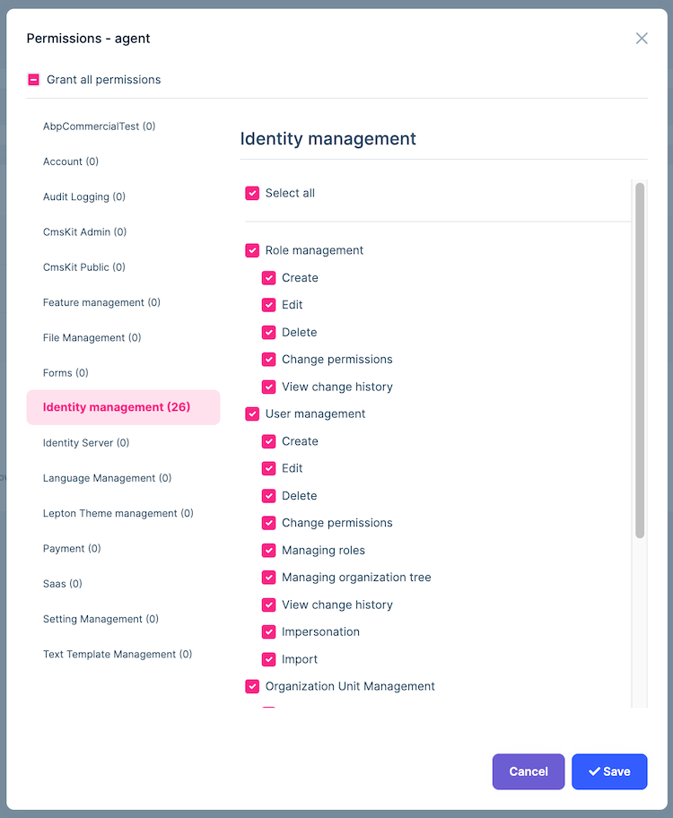
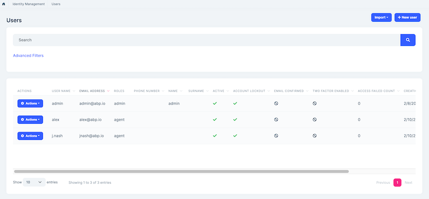
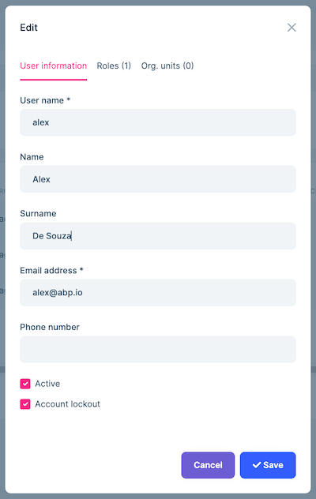
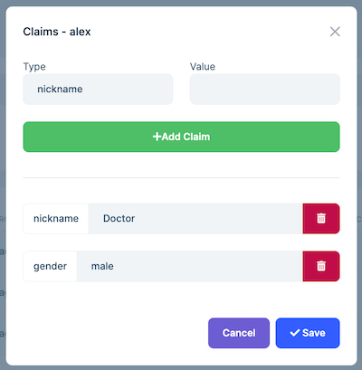
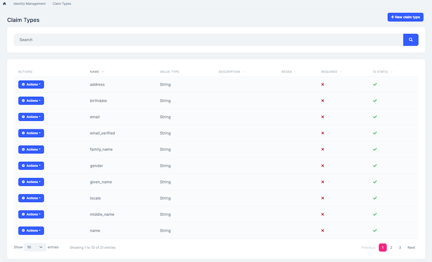
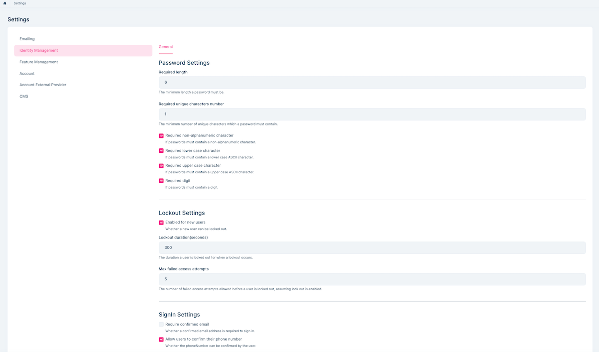

# Identity module

This module implements the User and Role system of an application;

* Built on the [Microsoft's ASP.NET Core Identity](https://docs.microsoft.com/en-us/aspnet/core/security/authentication/identity) library.
* Manage **roles** and **users** in the system. A user is allowed to have **multiple roles**.
* Set **permissions** in role and user levels.
* Enable/disable **two factor authentication** and user **lockout** per user.
* Manage basic **user profile** and **password**.
* Manage **claim types** in the system, set claims to roles and users.
* Setting page to manage **password complexity**, user sign-in, account and lockout.

See [the module description page](https://commercial.abp.io/modules/Volo.Identity.Pro) for an overview of the module features.

## How to install

Identity is pre-installed in [the startup templates](../Startup-Templates/Index). So, no need to manually install it.

## Packages

This module follows the [module development best practices guide](https://docs.abp.io/en/abp/latest/Best-Practices/Index) and consists of several NuGet and NPM packages. See the guide if you want to understand the packages and relations between them.

### NuGet packages

* Volo.Abp.Identity.Domain.Shared
* Volo.Abp.Identity.Domain
* Volo.Abp.Identity.Pro.Application.Contracts
* Volo.Abp.Identity.Pro.Application
* Volo.Abp.Identity.EntityFrameworkCore
* Volo.Abp.Identity.MongoDB
* Volo.Abp.Identity.AspNetCore
* Volo.Abp.PermissionManagement.Domain.Identity
* Volo.Abp.Identity.Pro.HttpApi
* Volo.Abp.Identity.Pro.HttpApi.Client
* Volo.Abp.Identity.Pro.Web

### NPM packages

* @volo/abp.ng.identity
* @volo/abp.ng.identity.config

## User interface

### Menu items

Identity module adds the following items to the "Main" menu, under the "Administration" menu item:

* **Roles**: Role management page.
* **Users**: User management page.
* **Claim Types**: Claim type management page.

`IdentityMenuNames` class has the constants for the menu item names.

### Pages

#### Role management

Roles page is used to manage roles in the system. A role is a set of permissions assigned to the users.


You can create a new role or edit a role in this page:


* **Default** roles are assigned to new users by default.
* **Public** roles are visible to other users.

##### Role permissions

You can manage permissions of a role:



* A permission is an **action of the application** granted to roles and users.
* A user with a role will **inherit** all the permissions granted for the role.
* Any module can **[define permissions](https://docs.abp.io/en/abp/latest/Authorization#permission-system)**. Once you define a new permission, it will be available in this page.
* Left side is the **list of modules**. Once you click to a module name, you can check/uncheck permissions related to that module.

##### Role claims

You can set custom claim values for a role:


Claim types are retrieved from the claim list defined in the Claim Types  Management page (see below).

#### User management

Users page is used to manage the users in your system.



You can create a new user or edit an existing user in this page:



* A user can have **zero or more roles** in the system.
* You can set **two factor** verification and user **lockout** settings per user.

##### User permissions

A user has union of the permissions of the assigned roles. Identity module also allows to grant extra permissions to a specific user.


##### User claims

You can also set custom claim values for a user:



Claim types are retrieved from the claim list defined in the Claim Type Management page (see below).

#### Claim type management

Identity module allows to define custom claim types.



* Custom claims can be used to store additional information to a user or role.
* Custom claim values then can be accessed in the application code for an authenticated user.
* Claim Types are also used by the Identity Server module if you're using it.

#### Identity module settings UI

Identity module adds a new tab to the Settings page to customize the behavior on runtime.



## Data seed

This module adds some initial data (see [the data seed system](https://docs.abp.io/en/abp/latest/Data-Seeding)) to the database when you run the `.DbMigrator` application:

* Creates an `admin` role with all the permissions granted.
* Creates an `admin` user with the `admin` role and `1q2w3E*` as the password.

You normally change this password when you first run the application in your production environment. But if you want to change the password of the seed data, find the *ProjectName*DbMigrationService in your solution, locate to the `MigrateAsync` method. There will be a line like that:

````csharp
await _dataSeeder.SeedAsync();
````

Change it like that:

````csharp
await _dataSeeder.SeedAsync(
    new DataSeedContext()
        .WithProperty("AdminPassword", "myPassW00rd42")
);
````

Just like the password, you can also set the admin email (use the `AdminEmail` key in this case).

> The [data seed contributor](https://docs.abp.io/en/abp/latest/Data-Seeding) class of the Identity module is `IdentityDataSeedContributor` which internally uses the `IIdentityDataSeeder` service.

## Options

### AbpIdentityAspNetCoreOptions

`AbpIdentityAspNetCoreOptions` can be configured in the UI layer, in the `ConfigureServices` method of your [module](https://docs.abp.io/en/abp/latest/Module-Development-Basics). Example:

````csharp
Configure<AbpIdentityAspNetCoreOptions>(options =>
{
    //Set options here...
});
````

`AbpIdentityAspNetCoreOptions` properties:

* `ConfigureAuthentication` (default: true): Identity module calls `AddAuthentication` and `AddIdentityCookies` extension methods by default to configure the authentication for the Identity library. It sets `DefaultScheme` to `IdentityConstants.ApplicationScheme` and `DefaultSignInScheme` to `IdentityConstants.ExternalScheme`. You can set this property to `false` to suppress it and configure it yourself.

## Internals

### Domain layer

#### Aggregates

This module follows the [Entity Best Practices & Conventions](https://docs.abp.io/en/abp/latest/Best-Practices/Entities) guide.

##### User

A user is generally a person logins to and uses the application.

* `IdentityUser` (aggregate root): Represents a user in the system.
  * `IdentityUserRole` (collection): Roles to the user.
  * `IdentityUserClaim` (collection): Custom claims of the user.
  * `IdentityUserLogin` (collection): External logins of the user.
  * `IdentityUserToken` (collection): Tokens of the user (used by the Microsoft Identity services).

##### Role

A role is typically a group of permissions to assign to the users.

* `IdentityRole` (aggregate root): Represents a role in the system.
  * `IdentityRoleClaim` (collection): Custom claims of the role.

##### Claim type

A claim type is a definition of a custom claim that can be assigned to other entities (like roles and users) in the system.

* `IdentityClaimType` (aggregate root): Represents a claim type definition. It contains some properties (e.g. Required, Regex, Description, ValueType) to define the claim type and the validation rules.

#### Repositories

This module follows the [Repository Best Practices & Conventions](https://docs.abp.io/en/abp/latest/Best-Practices/Repositories) guide.

Following custom repositories are defined for this module:

* `IIdentityUserRepository`
* `IIdentityRoleRepository`
* `IIdentityClaimTypeRepository`

#### Domain services

This module follows the [Domain Services Best Practices & Conventions]( https://docs.abp.io/en/abp/latest/Best-Practices/Domain-Services) guide.

##### User manager

`IdentityUserManager` is used to manage users, their roles, claims, passwords, emails, etc. It is derived from Microsoft Identity's `UserManager<T>` class where `T` is `IdentityUser`.

##### Role manager

`IdentityRoleManager` is used to manage roles and their claims. It is derived from Microsoft Identity's `RoleManager<T>` class where `T` is `IdentityRole`.

##### Claim type manager

`IdenityClaimTypeManager` is used to perform some operations for the `IdentityClaimType` aggregate root.

### Settings

See the `IdentitySettingNames` class members for all settings defined for this module.

### Application layer

#### Application services

* `IdentityUserAppService` (implements `IIdentityUserAppService`): Implements the use cases of the user management UI.
* `IdentityRoleAppService` (implement `IIdentityRoleAppService`): Implements the use cases of the role management UI.
* `IdentityClaimTypeAppService` (implements `IIdentityClaimTypeAppService`): Implements the use cases of the claim type management UI.
* `IdentitySettingsAppService` (implements `IIdentitySettingsAppService`): Used to get and update settings for the Identity module.
* `IdentityUserLookupAppService` (implements `IIdentityUserLookupAppService`): Used to get information for a user by `id` or `userName`. It is aimed to be used internally by the ABP framework.
* `ProfileAppService` (implements `IProfileAppService`): Used to change a user's profile and the password.

### Database providers

#### Common

##### Table / collection prefix & schema

All tables/collections use the `Abp` prefix by default. Set static properties on the `AbpIdentityDbProperties` class if you need to change the table prefix or set a schema name (if supported by your database provider).

##### Connection string

This module uses `AbpIdentity` for the connection string name. If you don't define a connection string with this name, it fallbacks to the `Default` connection string.

See the [connection strings](https://docs.abp.io/en/abp/latest/Connection-Strings) documentation for details.

#### Entity Framework Core

##### Tables

* **AbpRoles**
  * AbpRoleClaims
* **AbpUsers**
  * AbpUserClaims
  * AbpUserLogins
  * AbpUserRoles
  * AbpUserTokens
* **AbpClaimTypes**

#### MongoDB

##### Collections

* **AbpRoles**
* **AbpUsers**
* **AbpClaimTypes**

### Permissions

See the `IdentityPermissions` class members for all permissions defined for this module.

## Distributed Eevents

This module doesn't define any additional distributed event. See the [standard distributed events](https://docs.abp.io/en/abp/latest/Distributed-Event-Bus).