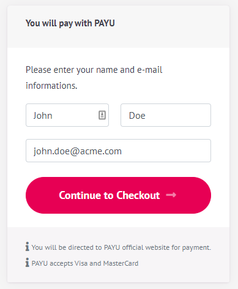

# Payment module

This module implements payment gateway integration of an application;

* Supports PayU and 2Checkout payment gateways.

See [the module description page](https://commercial.abp.io/modules/Volo.Identity.Pro) for an overview of the module features.

## How to install

Payment module is not installed in [the startup templates](../Startup-Templates/Index). So, it needs to be installed manually. There are two ways of installing a module into your application.


### 1. Using ABP CLI

ABP CLI allows adding a module to a solution using ```add-module``` command. You can check its [documentation](https://docs.abp.io/en/abp/latest/CLI#add-module) for more information. So, payment module can be added using the command below;

```bash
abp add-module Volo.Payment
```

### 2. Manual Installation

If you modified your solution structure, adding module using ABP CLI might not work for you. In such cases,  payment module can be added to a solution manually.

In order to do that, add packages listed below to matching project on your solution. For example, ```Volo.Payment.Application``` package to your **{ProjectName}.Application.csproj** like below;

```json
<PackageReference Include="Volo.Payment.Application" Version="x.x.x" />
```

After adding the package reference, open the module class of the project (eg: `{ProjectName}ApplicationModule`) and add the below code to the `DependsOn` attribute.

```csharp
[DependsOn(
  //...
  typeof(AbpPaymentApplicationModule)
)]
```

### Supported Gateway Packages

In order to use Payment Gateway you want to use, you need to add related NuGet packages to your related project as explained in Manual Installation section above and add ```DependsOn``` to your related module. For example, if you don't want to use PayU, you don't have to use its NuGet packages. 

## Packages

This module follows the [module development best practices guide](https://docs.abp.io/en/abp/latest/Best-Practices/Index) and consists of several NuGet and NPM packages. See the guide if you want to understand the packages and relations between them.

### NuGet packages

* Volo.Payment.Domain.Shared
* Volo.Payment.Domain
* Volo.Payment.Application.Contracts
* Volo.Payment.Application
* Volo.Payment.EntityFrameworkCore
* Volo.Payment.MongoDB
* Volo.Payment.HttpApi
* Volo.Payment.HttpApi.Client
* Volo.Payment.Web
* Volo.Payment.Payu.Domain
* Volo.Payment.Payu.Web
* Volo.Payment.TwoCheckout.Domain
* Volo.Payment.TwoCheckout.Web

## User interface

### Pages

#### Payment gateway selection

This page allows selecting a payment gateway. If there is one payment gateway configured for final application, this page will be skipped.


#### PayU prepayment page

This page is used to send Name, Surname and Email Address of user to PayU.



## Options

### PaymentOptions

`PaymentOptions` is used to store list of payment gateways. You don't have to configure this manually for existing payment gateways. You can, however, add a new gateway like below;

````csharp
Configure<PaymentOptions>(options =>
{
	options.Gateways.Add(
		new PaymentGatewayConfiguration(
			"MyPaymentGatewayName",
			new FixedLocalizableString("MyPaymentGatewayName"),
			typeof(MyPaymentGateway)
		)
	);
});
````

`AbpIdentityAspNetCoreOptions` properties:

* `PaymentGatewayConfigurationDictionary`: List of gateway configuration.
  * ```Name```: Name of payment gateway.
  * ```DisplayName```: DisplayName of payment gateway.
  * ```PaymentGatewayType```: type of payment gateway.
  * ```Order```: Order of payment gateway.

### PaymentWebOptions

```PaymentWebOptions``` is used to configure web application related configurations.

* ```CallbackUrl```: Final callback URL for internal payment gateway modules to return. User will be redirected to this URL on your website.
* ```RootUrl```: Root URL of your website.
* ```PaymentGatewayWebConfigurationDictionary```:  Used to store web related payment gateway configuration.
  * ```Name```: Name of payment gateway.
  * ```PrePaymentUrl```: URL of the page before redirecting user to payment gateway for payment.
  * ```PostPaymentUrl```: URL of the page when user redirected back from payment gateway to your website. This page is used to validate the payment mostly.
  * ```Order```: Order of payment gateway for gateway selection page.
  * ```Recommended```: Is payment gateway is recommended or not. This information is displayed on payment gateway selection page.
  * ```ExtraInfos```: List of informative strings for payment gateway. These texts are displayed on payment gateway selection page.


## Internals

### Domain layer

#### Aggregates

This module follows the [Entity Best Practices & Conventions](https://docs.abp.io/en/abp/latest/Best-Practices/Entities) guide.

##### PaymentRequest

A payment request represents a request for a payment in the application.

* `PaymentRequest` (aggregate root): Represents a payment request in the system.
  * `Products` (collection): List of products for payment request.
  * `State` : State of payment request (can be Waiting, Completed or Failed).
  * `Currency` : Currency code of payment request (USD, EUR, etc...).
  * `Gateway` : Name of payment gateway used for this payment request.
  * ```FailReason```: Reason for failed payment requests.

#### Repositories

This module follows the [Repository Best Practices & Conventions](https://docs.abp.io/en/abp/latest/Best-Practices/Repositories) guide.

Following custom repositories are defined for this module:

* `IPaymentRequestRepository`

### Application layer

#### Application services

* `PaymentRequestAppService` (implements `IPaymentRequestAppService`): Used to create payment requests and access payment request details.

### Database providers

#### Common

##### Table / collection prefix & schema

All tables/collections use the `Pay` prefix by default. Set static properties on the `PaymentDbProperties` class if you need to change the table prefix or set a schema name (if supported by your database provider).

##### Connection string

This module uses `AbpPayment` for the connection string name. If you don't define a connection string with this name, it fallbacks to the `Default` connection string.

See the [connection strings](https://docs.abp.io/en/abp/latest/Connection-Strings) documentation for details.

#### Entity Framework Core

##### Tables

* **PayPaymentRequests**
  * **AbpRoleClaims**
    * PayPaymentRequestProducts

#### MongoDB

##### Collections

* **PayPaymentRequests**

## Distributed Events

This module doesn't define any additional distributed event. See the [standard distributed events](https://docs.abp.io/en/abp/latest/Distributed-Event-Bus).