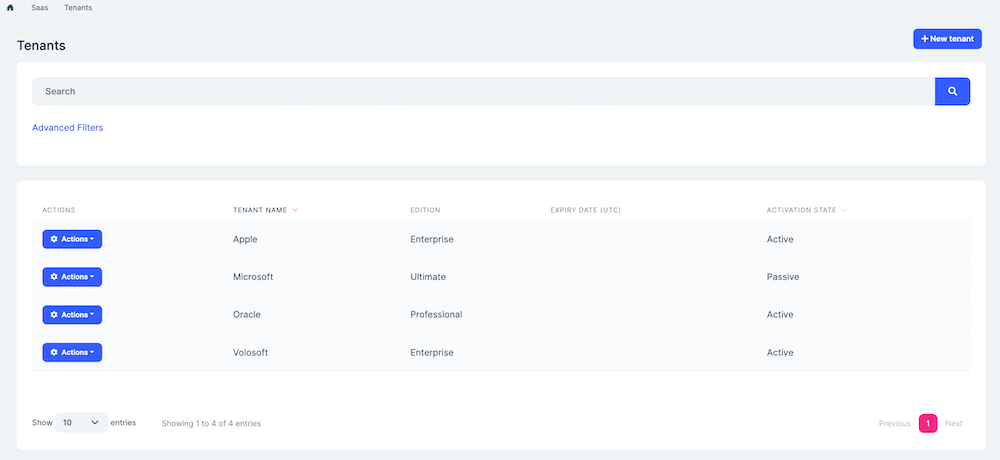
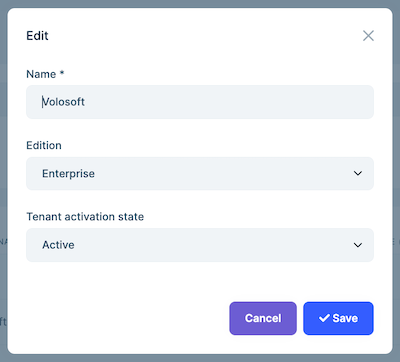
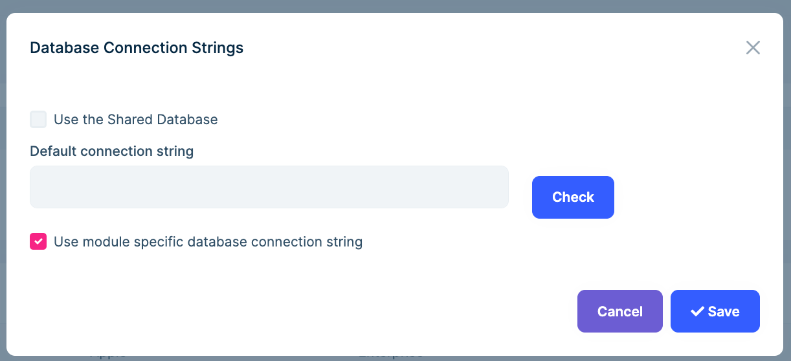
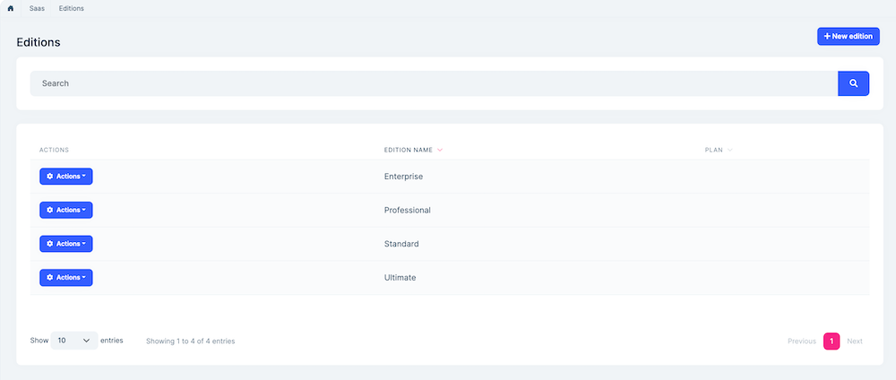
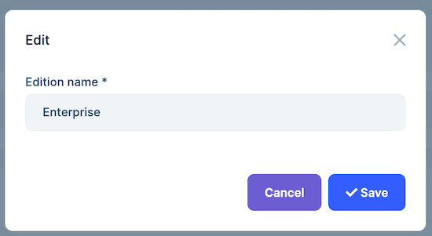

# SaaS module

This module implements the User and Role system of an application;

* Manage **tenants** and **editions** in the system. A tenant is allowed to have one **edition**.
* Set **features** of tenants.
* Set **connection string** of tenants.
* Set **features** of editions.

See [the module description page](https://commercial.abp.io/modules/Volo.Identity.Pro) for an overview of the module features.

## How to install

Identity is pre-installed in [the startup templates](../Startup-Templates/Index). So, no need to manually install it.

## Packages

This module follows the [module development best practices guide](https://docs.abp.io/en/abp/latest/Best-Practices/Index) and consists of several NuGet and NPM packages. See the guide if you want to understand the packages and relations between them.

### NuGet packages

* Volo.Saas.Domain.Shared
* Volo.Saas.Domain
* Volo.Saas.EntityFrameworkCore
* Volo.Saas.MongoDB
* Volo.Saas.Tenant.Application
* Volo.Saas.Tenant.Application.Contracts
* Volo.Saas.Tenant.HttpApi
* Volo.Saas.Tenant.HttpApi.Client
* Volo.Saas.Tenant.Web
* Volo.Saas.Host.Application
* Volo.Saas.Host.Application.Contracts
* Volo.Saas.Host.HttpApi
* Volo.Saas.Host.HttpApi.Client
* Volo.Saas.Host.Web

### NPM packages

* @volo/abp.ng.saas
* @volo/abp.ng.saas.config

## User interface

### Menu items

SaaS module adds the following items to the "Main" menu, under the "Administration" menu item:

* **Tenants**: Tenant management page.
* **Editions**: Edition management page.

`SaasHostMenuNames` and `SaasTenantMenuNames`  classes have the constants for the menu item names.

### Pages

#### Tenant management

Tenant page is used to manage tenants in the system. 

You can create a new tenant or edit a tenant in this page:

##### Connection String

You can manage connection string of a tenant in case you want to use a separate database for a specific tenant. If you want to use Host database for a tenant, select "Use the Shared Database" option.

##### Tenant Features

You can set features of tenants.

#### Edition management

Editions page is used to manage the editions in your system.

You can create a new edition or edit an existing edition in this page:

##### Edition Features

You can set features of an edition in this page:

## Data seed

This module adds some initial data (see [the data seed system](https://docs.abp.io/en/abp/latest/Data-Seeding)) to the database when you run the `.DbMigrator` application:

* Creates an `Standard` edition.

## Internals

### Domain layer

#### Aggregates

This module follows the [Entity Best Practices & Conventions](https://docs.abp.io/en/abp/latest/Best-Practices/Entities) guide.

##### Tenant

A tenant is generally represents a group of users who share a common access with specific privileges to the software instance.

* `Tenant` (aggregate root): Represents a tenant in the system.
  * `TenantConnectionString` (collection): Connection strings of a tenant.

##### Edition

An edition is typically a category of features of the application.

* `Edition` (aggregate root): Represents an edition in the system.

#### Repositories

This module follows the [Repository Best Practices & Conventions](https://docs.abp.io/en/abp/latest/Best-Practices/Repositories) guide.

Following custom repositories are defined for this module:

* `ITenantRepository`
* `IEditionRepository`

#### Domain services

This module follows the [Domain Services Best Practices & Conventions]( https://docs.abp.io/en/abp/latest/Best-Practices/Domain-Services) guide.

##### Tenant manager

`TenantManager` is used to create tenants, change and validate name of tenants.

### Application layer

#### Application services

* `TenantAppService` (implements `ITenantAppService`): Implements the use cases of the tenant management UI.
* `EditionAppService` (implement `IEditionAppService`): Implements the use cases of the edition management UI.

### Database providers

#### Common

##### Table / collection prefix & schema

All tables/collections use the `Saas` prefix by default. Set static properties on the `SaasDbProperties` class if you need to change the table prefix or set a schema name (if supported by your database provider).

##### Connection string

This module uses `Saas` for the connection string name. If you don't define a connection string with this name, it fallbacks to the `Default` connection string.

See the [connection strings](https://docs.abp.io/en/abp/latest/Connection-Strings) documentation for details.

#### Entity Framework Core

##### Tables

* **SaasTenants**
  * SaasTenantConnectionStrings
* **SaasEditions**

#### MongoDB

##### Collections

* **SaasTenants**
* **SaasEditions**

### Permissions

See the `SaasHostPermissions` class members for all permissions defined for this module.

## Distributed Events

This module doesn't define any additional distributed event. See the [standard distributed events](https://docs.abp.io/en/abp/latest/Distributed-Event-Bus).