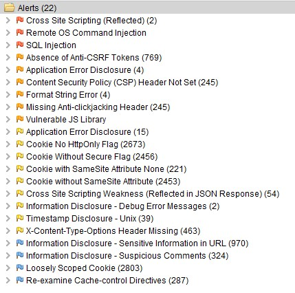
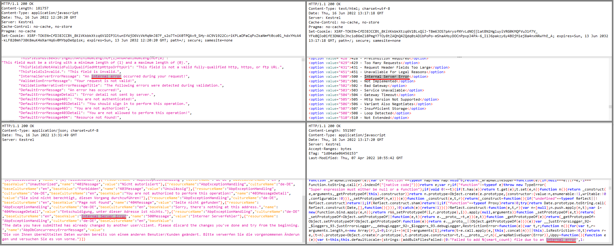
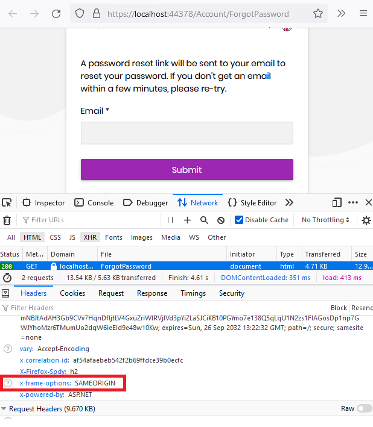
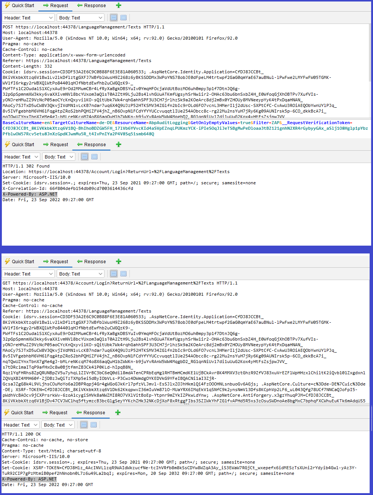

# ABP Commercial Penetration Test Report

ABP Commercial MVC `v5.3.2` application template has been tested against security vulnerabilities via [OWASP ZAP v2.11.1](https://www.zaproxy.org/) tool. The demo web application was started on the `https://localhost:44378` address. The below alerts have been reported by the pentest tool. These alerts are sorted by the risk level  as high, medium and low. The informational alerts are not mentioned in this document. Many of these alerts are false-positive, meaning the vulnerability scanner detected these issues, but they are not exploitable. It's clearly explained for each false-positive alert why this alert is a false-positive. In the next sections, you will find the affected URLs, alert descriptions, false-positive explanations and fixes for the issues. Some positive alerts are already fixed, and some of them will be fixed in the next milestone. The issue links for the fixes are mentioned in each positive alert.


## Alerts

There are high _(red flag)_, medium _(orange flag)_, low _(yellow flag)_ and informational _(blue flag)_ alerts. 



### Cross Site Scripting (Reflected)  [Risk: High] — Positive (Fixed)

* *[GET]* — https://localhost:44378/Abp/Languages/Switch?culture=%3CscrIpt%3Ealert%281%29%3B%3C%2FscRipt%3E&returnUrl=%2F&uiCulture=ar
* *[GET]* — https://localhost:44378/Abp/Languages/Switch?culture=ar&returnUrl=%2F&uiCulture=%3CscrIpt%3Ealert%281%29%3B%3C%2FscRipt%3E

The above URLs reported to be vulnerable against "Cross Site Scripting (Reflected)" attack. This vulnerability has been fixed with the following issue in the ABP Framework's Language Management Module: https://github.com/abpframework/abp/issues/13183


### Remote OS Command Injection [Risk: High] — False Positive

* *[GET]* — https://localhost:44378/SettingManagement?AccountRecaptchaSettings.UseCaptchaOnLogin=false&AccountRecaptchaSettings.UseCaptchaOnRegistration=false&AccountSettings.EnableLocalLogin=false&AccountSettings.IsSelfRegistrationEnabled=false&AccountTwoFactorSettings.IsRememberBrowserEnabled=false&AccountTwoFactorSettings.UsersCanChange=false&BoxedLayout=true&EnableLocalLogin=true&IsRememberBrowserEnabled=true&IsSelfRegistrationEnabled=true&MenuPlacement=Left&MenuStatus=AlwaysOpened&PublicLayoutStyle=Style1&Score=0.5&SiteKey=ZAP&SiteSecret=ZAP&Style=Style6&TwoFactorBehaviour=Optional&UseCaptchaOnLogin=true%7Ctimeout+%2FT+5&UseCaptchaOnRegistration=true&UsersCanChange=true&VerifyBaseUrl=https%3A%2F%2Fwww.google.com%2F&Version=3

**Description:** 

Attack technique used for unauthorized execution of operating system commands. This attack is possible when an application accepts untrusted input to build operating system commands in an insecure manner involving improper data sanitization, and/or improper calling of external programs.

**Explanation:** 

This is a false-positive alert. The URL param is given  `UseCaptchaOnLogin=true%7Ctimeout+%2FT+5`. As the attacker sends `true|timeout /T 15`, it should wait the request thread for 5 seconds. Because it pauses the thread. But this command is not being evaluated in the OS. Because it's being binded to a boolean property in the backend: `public bool UseCaptchaOnLogin { get; set; }` and any invalid value comes from the client will result in `false` value. To check if it's being evaluated we set it to a very high number like `timeout /T 999` and we see the request completes very fast and doesn't evaluate this pause OS command.


### SQL Injection [Risk: High] — False Positive

* *[POST]* — https://localhost:44378/LanguageManagement/Texts

**Description:** 

SQL injection may be possible. The page results were successfully manipulated using the boolean conditions [de-DE' AND '1'='1] and [de-DE' AND '1'='2]. The parameter value being modified was NOT stripped from the HTML output for the purposes of the comparison
Data was returned for the original parameter. The vulnerability was detected by successfully restricting the data originally returned, by manipulating the parameter

**Explanation:**

ABP uses Entity Framework Core. In the specified endpoint it runs the following database query. This is a false-positive alert. When the culture name is sent as `de-DE' AND '1'='1` the backend throws `[ERR] Culture is not supported. (Parameter 'name')` exception. That is why the modified value was not stripped the HTML output. 


### Absence of Anti-CSRF Tokens [Risk: Medium] — False Positive

* *[GET] — https://localhost:44378/Account/Manage*

**Description**: 

No Anti-CSRF tokens were found in a HTML submission form.
A cross-site request forgery is an attack that involves forcing a victim to send an HTTP request to a target destination without their knowledge or intent in order to perform an action as the victim. The underlying cause is application functionality using predictable URL/form actions in a repeatable way. The nature of the attack is that CSRF exploits the trust that a web site has for a user. By contrast, cross-site scripting (XSS) exploits the trust that a user has for a web site. Like XSS, CSRF attacks are not necessarily cross-site, but they can be. Cross-site request forgery is also known as CSRF, XSRF, one-click attack, session riding, confused deputy, and sea surf.

**Explanation:**

This is false-positive alert because ABP Framework provides the Anti-CSRF token via cookie as seen on the following screenshot.  


### Application Error Disclosure [Risk: Medium] — False Positive

- *[GET] — https://localhost:44378/Abp/ApplicationConfigurationScript*
- *[GET] —https://localhost:44378/api/language-management/language-texts?filter=&resourceName=&baseCultureName=en&targetCultureName=de-DE&getOnlyEmptyValues=false&sorting=name%20asc&skipCount=0&maxResultCount=10*
- *[GET] —https://localhost:44378/AuditLogs*
- *[GET] —https://localhost:44378/libs/uppy/uppy.min.js*

**Description**: 

This page contains an error/warning message that may disclose sensitive information like the location of the file that produced the unhandled exception. This information can be used to launch further attacks against the web application. The alert could be a false positive if the error message is found inside a documentation page.

**Explanation:**

There are 4 URLs that are reported as exposing error messages. This is a false-positive alert. As seen on the following screenshot, all these endpoints returns `Internal Error` text for the localization purposes and there is no exception thrown.




### Content Security Policy (CSP) Header Not Set [Risk: Medium] — Positive (Fixed)

- *[GET] — https://localhost:44378*

**Description:** 

Content Security Policy (CSP) is an added layer of security that helps to detect and mitigate certain types of attacks, including Cross Site Scripting (XSS) and data injection attacks. These attacks are used for everything from data theft to site defacement or distribution of malware. CSP provides a set of standard HTTP headers that allow website owners to declare approved sources of content that browsers should be allowed to load on that page — covered types are JavaScript, CSS, HTML frames, fonts, images and embeddable objects such as Java applets, ActiveX, audio and video files.

**Solution:** 

Ensure that your web server, application server, load balancer, etc. is configured to set the `Content-Security-Policy` header, to achieve optimal browser support: "Content-Security-Policy" for Chrome 25+, Firefox 23+ and Safari 7+, "X-Content-Security-Policy" for Firefox 4.0+ and Internet Explorer 10+, and "X-WebKit-CSP" for Chrome 14+ and Safari 6+.

In ASP.NET Core, you can create middleware to set the header to http  response, here is a minimal middleware to do this. You need to add this  code to the `Configure()` method in `Startup.cs` before the `UseEndpoints` method.

```
app.Use(async (context, next) =>
{
    context.Response.Headers.Add("Content-Security-Policy", "default-src 'self';");
    await next();
});
```

This vulnerability is being fixed in ABP v7.0. You can check track the issue from https://github.com/abpframework/abp/issues/14173


### Format String Error [Risk: Medium] — Positive (Fixed)

- *[GET] — https://localhost:44378/Abp/Languages/Switch?culture=ar&returnUrl=%2F&uiCulture=ZAP%25n%25s%25n%25s%25n%25s%25n%25s%25n%25s%25n%25s%25n%25s%25n%25s%25n%25s%25n%25s%25n%25s%25n%25s%25n%25s%25n%25s%25n%25s%25n%25s%25n%25s%25n%25s%25n%25s%25n%25s%0A*  
- *[GET] — https://localhost:44378/Abp/Languages/Switch?culture=ZAP%25n%25s%25n%25s%25n%25s%25n%25s%25n%25s%25n%25s%25n%25s%25n%25s%25n%25s%25n%25s%25n%25s%25n%25s%25n%25s%25n%25s%25n%25s%25n%25s%25n%25s%25n%25s%25n%25s%25n%25s%0A&returnUrl=%2F&uiCulture=ar*  
- *[POST] — https://localhost:44378/Account/Login*  
- *[POST] — https://localhost:44378/Account/Register*

**Description:** 

A Format String error occurs when the submitted data of an input string is evaluated as a command by the application.

**Solution:** 

Rewrite the background program using proper deletion of bad character strings.  This will require a recompile of the background executable. The first affected URL is being fixed by this issue https://github.com/abpframework/abp/issues/14174. The second URL is already fixed with  https://github.com/abpframework/abp/issues/13183. The last 2 URLs are false-positive because there is no bad character strings in the response. For example the third request's response is the following and as seen there is no invalid chars in the response.

```
Volo.Abp.Validation.AbpValidationException: ModelState is not valid! See ValidationErrors for details.
   at Volo.Abp.AspNetCore.Mvc.Validation.ModelStateValidator.Validate(ModelStateDictionary modelState)
   at Volo.Abp.Account.Web.Pages.Account.IdentityServerSupportedLoginModel.OnPostAsync(String action)
   at Microsoft.AspNetCore.Mvc.RazorPages.Infrastructure.ExecutorFactory.GenericTaskHandlerMethod.Convert[T](Object taskAsObject)
   at Microsoft.AspNetCore.Mvc.RazorPages.Infrastructure.ExecutorFactory.GenericTaskHandlerMethod.Execute(Object receiver, Object[] arguments)
   at Microsoft.AspNetCore.Mvc.RazorPages.Infrastructure.PageActionInvoker.InvokeHandlerMethodAsync()
   at Microsoft.AspNetCore.Mvc.RazorPages.Infrastructure.PageActionInvoker.InvokeNextPageFilterAsync()
   at Microsoft.AspNetCore.Mvc.RazorPages.Infrastructure.PageActionInvoker.Rethrow(PageHandlerExecutedContext context)
   at Microsoft.AspNetCore.Mvc.RazorPages.Infrastructure.PageActionInvoker.Next(State& next, Scope& scope, Object& state, Boolean& isCompleted)
   at Microsoft.AspNetCore.Mvc.RazorPages.Infrastructure.PageActionInvoker.InvokeInnerFilterAsync()
   at Microsoft.AspNetCore.Mvc.Infrastructure.ResourceInvoker.<InvokeNextExceptionFilterAsync>g__Awaited|26_0(ResourceInvoker invoker, Task lastTask, State next, Scope scope, Object state, Boolean isCompleted)
   at Microsoft.AspNetCore.Mvc.Infrastructure.ResourceInvoker.Rethrow(ExceptionContextSealed context)
   at Microsoft.AspNetCore.Mvc.Infrastructure.ResourceInvoker.Next(State& next, Scope& scope, Object& state, Boolean& isCompleted)
   at Microsoft.AspNetCore.Mvc.Infrastructure.ResourceInvoker.InvokeNextResourceFilter()
--- End of stack trace from previous location ---
   at Microsoft.AspNetCore.Mvc.Infrastructure.ResourceInvoker.Rethrow(ResourceExecutedContextSealed context)
   at Microsoft.AspNetCore.Mvc.Infrastructure.ResourceInvoker.Next(State& next, Scope& scope, Object& state, Boolean& isCompleted)
   at Microsoft.AspNetCore.Mvc.Infrastructure.ResourceInvoker.InvokeFilterPipelineAsync()
--- End of stack trace from previous location ---
   at Microsoft.AspNetCore.Mvc.Infrastructure.ResourceInvoker.<InvokeAsync>g__Logged|17_1(ResourceInvoker invoker)
   at Microsoft.AspNetCore.Mvc.Infrastructure.ResourceInvoker.<InvokeAsync>g__Logged|17_1(ResourceInvoker invoker)
   at Microsoft.AspNetCore.Routing.EndpointMiddleware.<Invoke>g__AwaitRequestTask|6_0(Endpoint endpoint, Task requestTask, ILogger logger)
   at Volo.Abp.AspNetCore.Serilog.AbpSerilogMiddleware.InvokeAsync(HttpContext context, RequestDelegate next)
   at Microsoft.AspNetCore.Builder.UseMiddlewareExtensions.<>c__DisplayClass6_1.<<UseMiddlewareInterface>b__1>d.MoveNext()
--- End of stack trace from previous location ---
   at Volo.Abp.AspNetCore.Auditing.AbpAuditingMiddleware.InvokeAsync(HttpContext context, RequestDelegate next)
   at Volo.Abp.AspNetCore.Auditing.AbpAuditingMiddleware.InvokeAsync(HttpContext context, RequestDelegate next)
   at Microsoft.AspNetCore.Builder.UseMiddlewareExtensions.<>c__DisplayClass6_1.<<UseMiddlewareInterface>b__1>d.MoveNext()
--- End of stack trace from previous location ---
   at Swashbuckle.AspNetCore.SwaggerUI.SwaggerUIMiddleware.Invoke(HttpContext httpContext)
   at Swashbuckle.AspNetCore.Swagger.SwaggerMiddleware.Invoke(HttpContext httpContext, ISwaggerProvider swaggerProvider)
   at Microsoft.AspNetCore.Authorization.AuthorizationMiddleware.Invoke(HttpContext context)
   at IdentityServer4.Hosting.IdentityServerMiddleware.Invoke(HttpContext context, IEndpointRouter router, IUserSession session, IEventService events, IBackChannelLogoutService backChannelLogoutService)
   at IdentityServer4.Hosting.MutualTlsEndpointMiddleware.Invoke(HttpContext context, IAuthenticationSchemeProvider schemes)
   at Microsoft.AspNetCore.Authentication.AuthenticationMiddleware.Invoke(HttpContext context)
   at IdentityServer4.Hosting.BaseUrlMiddleware.Invoke(HttpContext context)
   at Volo.Abp.AspNetCore.Uow.AbpUnitOfWorkMiddleware.InvokeAsync(HttpContext context, RequestDelegate next)
   at Microsoft.AspNetCore.Builder.UseMiddlewareExtensions.<>c__DisplayClass6_1.<<UseMiddlewareInterface>b__1>d.MoveNext()
--- End of stack trace from previous location ---
   at Volo.Abp.AspNetCore.ExceptionHandling.AbpExceptionHandlingMiddleware.InvokeAsync(HttpContext context, RequestDelegate next)
   at Volo.Abp.AspNetCore.ExceptionHandling.AbpExceptionHandlingMiddleware.InvokeAsync(HttpContext context, RequestDelegate next)
   at Microsoft.AspNetCore.Builder.UseMiddlewareExtensions.<>c__DisplayClass6_1.<<UseMiddlewareInterface>b__1>d.MoveNext()
--- End of stack trace from previous location ---
   at Volo.Abp.AspNetCore.MultiTenancy.MultiTenancyMiddleware.InvokeAsync(HttpContext context, RequestDelegate next)
   at Microsoft.AspNetCore.Builder.UseMiddlewareExtensions.<>c__DisplayClass6_1.<<UseMiddlewareInterface>b__1>d.MoveNext()
--- End of stack trace from previous location ---
   at Microsoft.AspNetCore.Builder.ApplicationBuilderAbpJwtTokenMiddlewareExtension.<>c__DisplayClass0_0.<<UseJwtTokenMiddleware>b__0>d.MoveNext()
--- End of stack trace from previous location ---
   at Microsoft.AspNetCore.Authentication.AuthenticationMiddleware.Invoke(HttpContext context)
   at Volo.Abp.AspNetCore.Tracing.AbpCorrelationIdMiddleware.InvokeAsync(HttpContext context, RequestDelegate next)
   at Microsoft.AspNetCore.Builder.UseMiddlewareExtensions.<>c__DisplayClass6_1.<<UseMiddlewareInterface>b__1>d.MoveNext()
--- End of stack trace from previous location ---
   at Microsoft.AspNetCore.Localization.RequestLocalizationMiddleware.Invoke(HttpContext context)
   at Microsoft.AspNetCore.RequestLocalization.AbpRequestLocalizationMiddleware.InvokeAsync(HttpContext context, RequestDelegate next)
   at Microsoft.AspNetCore.Builder.UseMiddlewareExtensions.<>c__DisplayClass6_1.<<UseMiddlewareInterface>b__1>d.MoveNext()
--- End of stack trace from previous location ---
   at Microsoft.AspNetCore.Diagnostics.DeveloperExceptionPageMiddleware.Invoke(HttpContext context)

HEADERS
=======

Host: localhost:44378
User-Agent: Mozilla/5.0 (Windows NT 10.0; Win64; x64; rv:92.0) Gecko/20100101 Firefox/92.0
Cache-Control: no-cache
Content-Type: application/x-www-form-urlencoded
Cookie: .AspNetCore.Culture=c%3Des%7Cuic%3Des; XSRF-TOKEN=CfDJ8JCCBt_8KiVKkbkXtzq6V1BEYfhL6Rn88RfFmrkfC8EzpKhj8ZWhGP8HT8Su_7q2wcmhITLg9rrh-Pj-Tu2c88c--wQg5UvXiQBVc_LqlQiqzMUWyxSrrxDIq22_1kmRA62cvIOrUkGLe4ezmZIYCRU; .AspNetCore.Antiforgery.x3gzYhuqPJM=CfDJ8JCCBt_8KiVKkbkXtzq6V1Ar3NwJpY9vG9eyrUYeAySYBUHsTHCmdGylFpjWOKf6CGVEnPNtJP3FDmgWIXe8le2DgOYxcAIkBkM5W1bybUkamp4yVbDYcimwEswXU1tsMSv3el885ZapGup7WneIcZo
Pragma: no-cache
Referer: https://localhost:44378/Account/Login
Content-Length: 639
X-Correlation-Id: 2c103514abd44a17b1ec792b6a5c1dc3
```


### Missing Anti-clickjacking Header [Risk: Medium] — False Positive

- *[GET] — https://localhost:44378* 
- *[GET] — https://localhost:44378/Abp/MultiTenancy/TenantSwitchModal*

**Description:** 

There are 248 URLs reported to be vulnerable against missing Anti-clickjacking header. The above 2 URLs are written to be examples. In this topic, the tools reports that the response does not include either `Content-Security-Policy` with 'frame-ancestors' directive or `X-Frame-Options` to protect against ClickJacking attacks.

**Solution:** 

This vulnerability is same as "Content Security Policy (CSP) Header Not Set" and with the following issue, this is also being fixed.
https://github.com/abpframework/abp/issues/14173. On the other hand `X-Frame-Options`  header is already being added in the following middleware in ABP Framework core module: https://github.com/abpframework/abp/blob/dev/framework/src/Volo.Abp.AspNetCore/Volo/Abp/AspNetCore/Security/AbpSecurityHeadersMiddleware.cs#L20.

In the below screenshot it is seen that the header is being added. The reason that the OWASP ZAP tool reported this vulnerability is that, the project was running in Debug mode and the security headers are being added only in the Release mode.



Besides, there is a tracking issue for this vulnerability: https://github.com/abpframework/abp/issues/14175

### Vulnerable JS Library [Risk: Medium] — Positive (Fixed)

* *[GET] — https://localhost:44378/libs/jquery/jquery.js*

**Description:** 

The identified library jQuery, version 3.3.1 is vulnerable.

**Solution:** 

The ABP templates uses jQuery v3.6.0 and it is configured at https://github.com/abpframework/abp/blob/dev/npm/packs/jquery/package.json#L14. Even it's configured to use the not vulnerable version, the templates uses the v3.3.1. This issue is being tracked at https://github.com/abpframework/abp/issues/14176.

### Application Error Disclosure [Risk: Low] — False Positive (Fixed)

- *[POST] — https://localhost:44378/Account/ImpersonateTenant*
- *[POST] — https://localhost:44378/Account/ImpersonateUser*  
- *[POST] — https://localhost:44378/Account/Manage?returnUrl=https://localhost:44378/AuditLogs*
- *[POST] — https://localhost:44378/Account/Manage?returnUrl=https://localhost:44378/Identity/ClaimTypes*
- *[POST] — https://localhost:44378/Account/Manage?returnUrl=https://localhost:44378/Identity/SecurityLogs*  
- *[POST] — https://localhost:44378/Account/Manage?returnUrl=https://localhost:44378/IdentityServer/ApiResources* 
- *[POST] — https://localhost:44378/Account/Manage?returnUrl=https://localhost:44378/IdentityServer/ApiScopes*
- *[POST] — https://localhost:44378/Account/Manage?returnUrl=https://localhost:44378/IdentityServer/Clients*
- *[POST] — https://localhost:44378/Account/Manage?returnUrl=https://localhost:44378/IdentityServer/IdentityResources*
- *[POST] — https://localhost:44378/Account/Manage?returnUrl=https://localhost:44378/LanguageManagement*
- *[POST] — https://localhost:44378/Account/Manage?returnUrl=https://localhost:44378/LanguageManagement/Texts*
- *[POST] — https://localhost:44378/Account/Manage?returnUrl=https://localhost:44378/SettingManagement*
- *[POST] — https://localhost:44378/Account/Manage?returnUrl=https://localhost:44378/TextTemplates* 
- *[POST] — https://localhost:44378/SettingManagement?BoxedLayout=true&MenuPlacement=Left&MenuStatus=AlwaysOpened&PublicLayoutStyle=Style1&Style=Style6*
- *[POST] — https://localhost:44378/SettingManagement?IdentitySettings.Lockout.AllowedForNewUsers=true&IdentitySettings.Lockout.LockoutDuration=300&IdentitySettings.Lockout.MaxFailedAccessAttempts=5&IdentitySettings.Password.RequireDigit=true&IdentitySettings.Password.RequireLowercase=true&IdentitySettings.Password.RequireNonAlphanumeric=true&IdentitySettings.Password.RequireUppercase=true&IdentitySettings.Password.RequiredLength=6&IdentitySettings.Password.RequiredUniqueChars=1&IdentitySettings.SignIn.EnablePhoneNumberConfirmation=true&IdentitySettings.SignIn.RequireConfirmedEmail=true&IdentitySettings.SignIn.RequireConfirmedPhoneNumber=true&IdentitySettings.User.IsEmailUpdateEnabled=true&IdentitySettings.User.IsUserNameUpdateEnabled=true*

**Description:** 

The reported pages contain an error/warning message that may disclose sensitive information like the location of the file that produced the unhandled exception. This information can be used to launch further attacks against the web application. The alert could be a false positive if the error message is found inside a documentation page.

**Explanation:** 

This vulnerability was reported as a positive alert because the application ran on `Development` mode. ABP Framework throws exceptions for developers in the `Development` environment. We set the environment to `Production` and re-run the test, then the server sent a 500-Internal Error. Therefore this alert is false-positive. Further information can be found at the following issue https://github.com/abpframework/abp/issues/14177.

### Cookie No `HttpOnly`  [Risk: Low] — Positive (No need a fix)

* *[GET] — https://localhost:44378*

**Description:** 

A cookie has been set without the secure flag, which means that the cookie can be accessed via unencrypted connections.

**Explanation:** 

The following alert also includes this issue. To understand this alert, you can take a look at the next alert: _Cookie Without Secure Flag [Risk: Low]_


### Cookie Without Secure Flag [Risk: Low] — Positive (No need a fix)

* *[GET] — https://localhost:44378 (and there are several URLs)*

**Description:** A cookie has been set without the secure flag, which means that the cookie can be accessed via unencrypted connections. The following cookies don't have `httponly` flag.

* `XSRF-TOKEN` (Anti CSRF token cookie)
* `.AspNetCore.Culture` (ASP.NET Core culture cookie)
* `idsrv.session` (Identity Server 4 cookie)

**Explanation:** 

All the pages that are setting `XSRF-TOKEN` , `.AspNetCore.Culture` and `idsrv.session` in the HTTP response are reported as "No `HttpOnly` Flag" vulnerability. This is a positive alert. `idsrv.session` cookie is being used in IDS4 and after ABP 6.x the support for IDS will be dropped therefore this cookie will not be used anymore. Also, there is an issue related to the `idsrv.session` cookie cannot be set as `HttpOnly`; you can see the related thread at its own repository https://github.com/IdentityServer/IdentityServer4/issues/3873. 

On the other hand, the cookies `.AspNetCore.Culture` and `XSRF-TOKEN` are being retrieved via JavaScript in ABP Angular, MVC and Blazor WASM projects. Therefore cannot be set as `HttpOnly`. You can check out the following modules that retrieve these cookies via JavaScript:

* https://github.com/abpframework/abp/blob/dev/framework/src/Volo.Abp.Swashbuckle/wwwroot/swagger/ui/abp.swagger.js#L28
* https://github.com/abpframework/abp/blob/dev/modules/cms-kit/src/Volo.CmsKit.Admin.Web/Pages/CmsKit/Pages/update.js#L54
* https://github.com/abpframework/abp/blob/dev/modules/cms-kit/src/Volo.CmsKit.Admin.Web/Pages/CmsKit/Pages/create.js#L84
* https://github.com/abpframework/abp/blob/392beb897bb2d7214db8facba7a2022be7aa837c/modules/cms-kit/src/Volo.CmsKit.Admin.Web/Pages/CmsKit/BlogPosts/update.js#L91
* https://github.com/abpframework/abp/blob/dev/modules/cms-kit/src/Volo.CmsKit.Admin.Web/Pages/CmsKit/BlogPosts/create.js#L127
* https://github.com/abpframework/abp/blob/dev/modules/docs/app/VoloDocs.Web/wwwroot/libs/abp/jquery/abp.jquery.js#L261
* https://github.com/abpframework/abp/blob/dev/framework/src/Volo.Abp.AspNetCore.Components.Web/Volo/Abp/AspNetCore/Components/Web/AbpBlazorClientHttpMessageHandler.cs#L94

**Setting `XSRF-TOKEN` cookie as `HttpOnly`:**
If you want to set  you can do it in [AbpAntiForgeryOptions](https://github.com/abpframework/abp/blob/dev/framework/src/Volo.Abp.AspNetCore.Mvc/Volo/Abp/AspNetCore/Mvc/AntiForgery/AbpAntiForgeryOptions.cs#L56) class.

**Setting `.AspNetCore.Culture` cookie as `HttpOnly`:**
If you want to set you can do it in [AbpRequestCultureCookieHelper](https://github.com/abpframework/abp/blob/dev/framework/src/Volo.Abp.AspNetCore/Microsoft/AspNetCore/RequestLocalization/AbpRequestCultureCookieHelper.cs#L16) class. Set the option `HttpOnly = true`.

The related issue for this alert is https://github.com/abpframework/abp/issues/14214.


### Cookie with SameSite Attribute None [Risk: Low] — Positive 

* *[GET] — https://localhost:44378 (and there are several URLs)*

**Description:** 

A cookie has been set with its `SameSite ` attribute set to `none`, which means that the cookie can be sent as a result of a `cross-site` request. The `SameSite` attribute is an effective counter measure to cross-site request forgery, cross-site script inclusion, and timing attacks.

**Solution:** 

Ensure that the `SameSite` attribute is set to either `lax` or ideally `strict` for all cookies. This vulnerability will be fixed with the following issue https://github.com/abpframework/abp/issues/14215.


### Cookie without `SameSite` Attribute [Risk: Low] — Positive 

* *[GET] — https://localhost:44378/Abp/Languages/Switch?culture=ar&returnUrl=%2F&uiCulture=ar* 

_(and there are several URLs with different parameters of https://localhost:44378/Abp/Languages/Switch endpoint)_

**Description:** 

A cookie has been set with its `SameSite ` attribute set to `none`, which means that the cookie can be sent as a result of a `cross-site` request. The `SameSite` attribute is an effective counter measure to cross-site request forgery, cross-site script inclusion, and timing attacks.

**Solution:** 

Ensure that the `SameSite` attribute is set to either `lax` or ideally `strict` for all cookies. This vulnerability will be fixed with the following issue https://github.com/abpframework/abp/issues/14215.


### Cross Site Scripting Weakness (Reflected in JSON Response) [Risk: Low] — Positive 

* *[GET] — https://localhost:44378/Abp/MultiTenancy/TenantSwitchModal*
* *[GET] — https://localhost:44378/api/identity/organization-units/75e2ae9d-a624-aa67-f819-3a047edddf34/members?filter=zap&sorting=userName+asc&skipCount=%3CscrIpt%3Ealert%281%29%3B%3C%2FscRipt%3E&maxResultCount=100*
* *[GET] —* https://localhost:44378/api/audit-logging/audit-logs/statistics/average-execution-duration-per-day?startDate=%3CscrIpt%3Ealert%281%29%3B%3C%2FscRipt%3E&endDate=2022-06-16T00%3A00%3A00.000Z
* *[GET] — https://localhost:44378/api/identity/security-logs?startTime=%3CscrIpt%3Ealert%281%29%3B%3C%2FscRipt%3E&endTime=&applicationName=&identity=&action=&userName=&clientId=&correlationId=&sorting=creationTime+desc&skipCount=0&maxResultCount=10*
* *[GET] — https://localhost:44378/api/identity/users?filter=alper&roleId=&organizationUnitId=&userName=&phoneNumber=&emailAddress=&isLockedOut=&notActive=%3CscrIpt%3Ealert%281%29%3B%3C%2FscRipt%3E&sorting=email+asc&skipCount=0&maxResultCount=10*
* *[GET] — https://localhost:44378/api/language-management/languages?filter=&skipCount=0&maxResultCount=%3CscrIpt%3Ealert%281%29%3B%3C%2FscRipt%3E*
* *[GET] — https://localhost:44378/api/saas/tenants?filter=tenant1&editionId=&expirationDateMin=&expirationDateMax=&activationState=&sorting=name+asc&skipCount=0&maxResultCount=%3CscrIpt%3Ealert%281%29%3B%3C%2FscRipt%3E*
* *[GET] — https://localhost:44378/api/text-template-management/template-definitions?filterText=&sorting=name+asc&skipCount=0&maxResultCount=%3CscrIpt%3Ealert%281%29%3B%3C%2FscRipt%3E*

**Description:**  

A XSS attack was reflected in a `JSON` response, this might leave content consumers vulnerable to attack if they don't appropriately handle the data (response).

**Solution:**  

For every web page that is generated, use and specify a character encoding such as ISO-8859-1 or UTF-8. When an encoding is not specified, the web browser may choose a different encoding by guessing which encoding is actually being used by the web page. This can cause the web browser to treat certain sequences as special, opening up the client to subtle XSS attacks. See CWE-116 for more mitigations related to encoding/escaping.

To help mitigate XSS attacks against the user's session cookie, set the session cookie to be `HttpOnly`. In browsers that support the  `HttpOnly`feature, this attribute can prevent the user's session cookie from being accessible to malicious client-side scripts that use `document.cookie`. This is not a complete solution, since  `HttpOnly`is not supported by all browsers. More importantly, `XMLHTTPRequest` and other powerful browser technologies provide read access to HTTP headers, including the Set-Cookie header in which the  `HttpOnly`flag is set.

Assume all input is malicious. Use an "accept known good" input validation strategy, i.e., use an allow list of acceptable inputs that strictly conform to specifications. Reject any input that does not strictly conform to specifications, or transform it into something that does. Do not rely exclusively on looking for malicious or malformed inputs (i.e., do not rely on a deny list). However, deny lists can be useful for detecting potential attacks or determining which inputs are so malformed that they should be rejected outright.

When performing input validation, consider all potentially relevant properties, including length, type of input, the full range of acceptable values, missing or extra inputs, syntax, consistency across related fields, and conformance to business rules. As an example of business rule logic, "boat" may be syntactically valid because it only contains alphanumeric characters, but it is not valid if you are expecting colors such as "red" or "blue."

Ensure that you perform input validation at well-defined interfaces within the application. This will help protect the application even if a component is reused or moved elsewhere.

The vulnerability will be fixed in the following issue https://github.com/volosoft/volo/issues/12124.


### Information Disclosure - Debug Error Messages [Risk: Low] — False Positive

* *[GET] —* https://localhost:44378/api/language-management/language-texts?filter=&resourceName=&baseCultureName=en&targetCultureName=de-DE&getOnlyEmptyValues=false&sorting=name%20asc&skipCount=0&maxResultCount=10
* *[GET] — https://localhost:44378/AuditLogs*

**Description:**  

The response appeared to contain common error messages returned by platforms such as ASP.NET, and Web-servers such as IIS and Apache. You can configure the list of common debug messages.

**Solution:**  

Disable debugging messages before pushing to production.

**Explanation:** 

The following 2 responses are the responses of https://localhost:44378/api/language-management/language-texts and https://localhost:44378/AuditLogs. Both responses return localization texts which are not real error messages. As there is no real error in the backend, this vulnerability is a false-positive alert.


### Server Leaks Information via "X-Powered-By" Header [Risk: Low] — Positive (Fix on your project)

* *[GET] — https://localhost:44378/Account/Login*
* *[POST] — https://localhost:44378/LanguageManagement/Texts*

**Description:**  

The web/application server is leaking information via one or more `X-Powered-By` HTTP response headers. Access to such information may facilitate attackers identifying other frameworks/components your web application is reliant upon and the vulnerabilities such components may be subject to.

**Solution:**  

Ensure that your web server, application server, load balancer, etc. is configured to suppress `X-Powered-By` headers.

**Explanation:** 

The `X-Powered-By` header is automatically being added by IIS or IIS Express. If you are running your application on IIS or IIS Express, you can simply remove this header by adding the below code into your `web.config` file. As ABP Commercial and open-source application templates do not include `web.config` file, you need to do this in your web project. For further information, see the following issue https://github.com/abpframework/abp/issues/14216.

```xml
<?xml version="1.0" encoding="utf-8"?>
<configuration>
  <system.webServer> 
    <httpProtocol>
      <customHeaders>
        <remove name="x-powered-by" />
      </customHeaders>
    </httpProtocol>
  </system.webServer>
</configuration>
```



### Timestamp Disclosure - Unix [Risk: Low] — False Positive 

* *[GET] — https://localhost:44378/Abp/ApplicationConfigurationScript*
* *[GET] — https://localhost:44378/api/identity-server/clients*
* *[GET] — https://localhost:44378/api/identity/security-logs*
* *[GET] — https://localhost:44378/images/favicon/safari-pinned-tab.svg*
* *[GET] — https://localhost:44378/libs/abp/core/abp.js*
* *[GET] — https://localhost:44378/libs/chart.js/chart.js*
* *[GET] — https://localhost:44378/libs/datatables.net/js/jquery.dataTables.js*
* *[GET] — https://localhost:44378/libs/jquery-validation/jquery.validate.js*
* *[GET] — https://localhost:44378/libs/jquery/jquery.js*
* *[GET] — https://localhost:44378/libs/jstree/jstree.min.js*
* *[GET] — https://localhost:44378/libs/uppy/uppy.min.js*
* *[GET] — https://localhost:44378/Pages/Identity/Users/setPassword.js*
* *[GET] — https://localhost:44378/Themes/Lepton/Global/Styles/lepton6.css*
* *[GET] — https://localhost:44378/Themes/Lepton/Global/Styles/lepton6.rtl.css*
* *[POST] — https://localhost:44378/Account/ImpersonateTenant*
* *[POST] — https://localhost:44378/Account/ImpersonateUser*
* *[POST] — https://localhost:44378/Account/Manage*
* *[POST] — https://localhost:44378/SettingManagement*

**Description:**  A timestamp was disclosed by the application/web server - Unix

**Solution:**  Manually confirm that the timestamp data is not sensitive, and that the data cannot be aggregated to disclose exploitable patterns.

**Explanation:** All the responses reported in this vulnerability have a programmatic value and these values are not sensitive. Therefore this is not an exploitable attack vector. The following lines are some of the responses of the reported URLs: 

Example-1
```
"Abp.Identity.OrganizationUnit.MaxUserMembershipCount": "2147483647",
```
Example-2
```
<!DOCTYPE svg PUBLIC "-//W3C//DTD SVG 20010904//EN"
```
Example-3
```
cookieValue = cookieValue + "; expires=" + (new Date(new Date().getTime() - 86400000)).toUTCString();
```
Example-4
```
day: {common: true, size: 86400000, steps: 30},
```


### X-Content-Type-Options Header Missing [Risk: Low] — False Positive 

* *[GET] — https://localhost:44378*
* *[GET] — https://localhost:44378/Abp/ApplicationConfigurationScript*
* *[GET] — https://localhost:44378/Abp/MultiTenancy/TenantSwitchModal*
* *[GET] — https://localhost:44378/Abp/ServiceProxyScript*
* *[GET] — https://localhost:44378/Account/ForgotPassword*
* *[GET] — https://localhost:44378/Account/Login*
* *[GET] — https://localhost:44378/Account/Manage*
* *[GET] — https://localhost:44378/Account/Register* 
* *[GET] — https://localhost:44378/Account/SecurityLogs*
* *[GET] — https://localhost:44378/AuditLogs* (and there are other URLs...)

**Description:**  

The Anti-MIME-Sniffing header `X-Content-Type-Options` was not set to `nosniff`. This allows older versions of Internet Explorer and Chrome to perform MIME-sniffing on the response body, potentially causing the response body to be interpreted and displayed as a content type other than the declared content type. 

**Solution:**  

Ensure that the application/web server sets the `Content-Type` header appropriately, and that it sets the X-Content-Type-Options header to `nosniff` for all web pages. If possible, ensure that the end user uses a standards-compliant and modern web browser that does not perform MIME-sniffing at all, or that can be directed by the web application/web server to not perform MIME-sniffing.

**Explanation:** 

ABP Framework adds the `X-Content-Type-Options` with the `nosniff` value in the following middleware: 

https://github.com/abpframework/abp/blob/dev/framework/src/Volo.Abp.AspNetCore/Volo/Abp/AspNetCore/Security/AbpSecurityHeadersMiddleware.cs#L14

But in some URLs the penetration tools reported that the response has no  `X-Content-Type-Options` header. This situation will be checked and revised with the following issue https://github.com/abpframework/abp/issues/14217.

The other vulnerabilities are *Informational* alerts.  There is no need to take any action for *Information* level findings as they are not exploitable.

---

> You can report any suspected security vulnerabilities related to the ABP Framework to info@abp.io.
