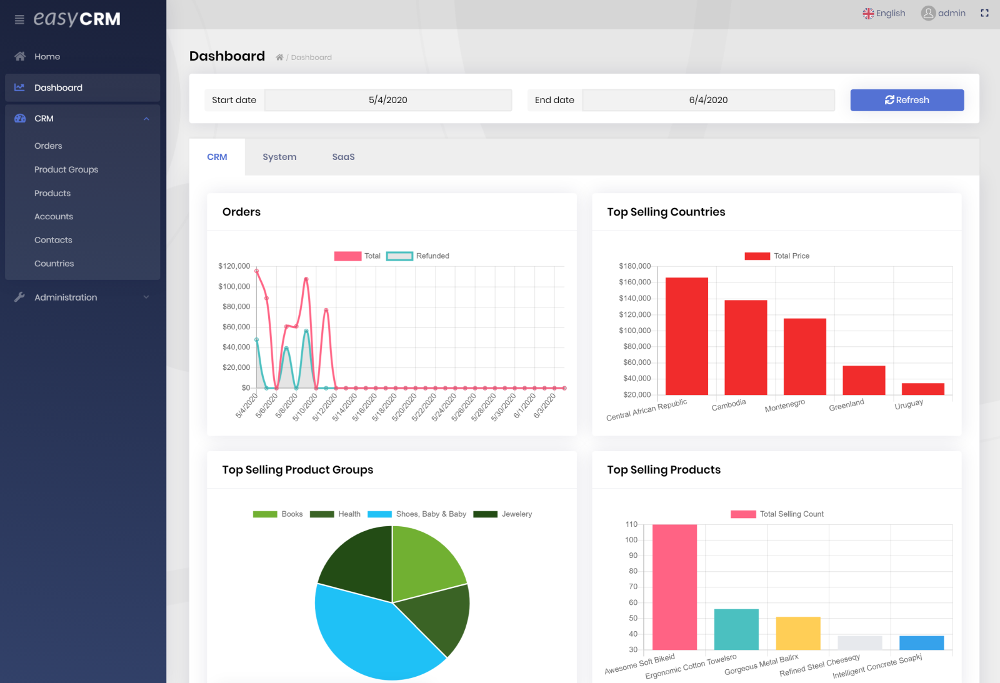

# Easy CRM - Sample ABP Project

This is a sample solution developed on top of ABP Commercial.

## Download

* You can download the complete source-code from [https://abp.io/api/download/samples/easy-crm](https://abp.io/Account/Login?returnUrl=/api/download/samples/easy-crm)

## How To Run?

When you download and open the zip file, you will see two folders:

* **mvc** folder contains the server side and the MVC (Razor Pages) UI.
* **angular** folder contains the Angular UI.

### Server Side / MVC (Razor Pages) Application

* Open the solution (inside the mvc folder) in **Visual Studio 2019** or later (or with another IDE that supports ASP.NET Core).
* Run the `Volo.EasyCrm.DbMigrator` console application to create the database and seed the initial data. It uses SQL Server by default. You can [switch](https://docs.abp.io/en/abp/latest/Entity-Framework-Core-Other-DBMS) it to your favorite DBMS.
* Run the `Volo.EasyCrm.Web` application.
* You can login using `admin` as the user name and `1q2w3E*` as the password.
* To generate random data, click to "**Generate and import sample data**" on the home page.
* Enjoy and check the source code!

### Angular UI

* First, follow all the steps above to run the server side and seed the sample data.
* Open a command prompt in the angular folder.
* Run the `yarn` command to install NPM packages (requires the [Yarn](https://yarnpkg.com/) package manager).
* Run the `yarn start` command to run the Angular application. It will automatically open the `localhost://4200` in your default browser once the application initialized.