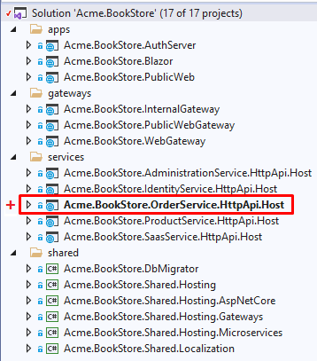
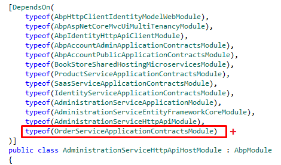
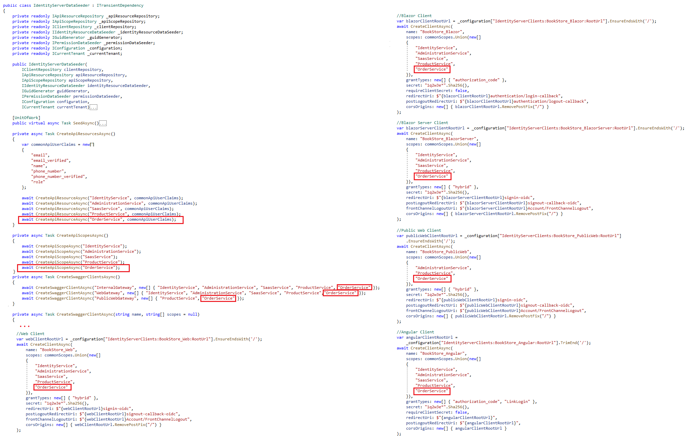
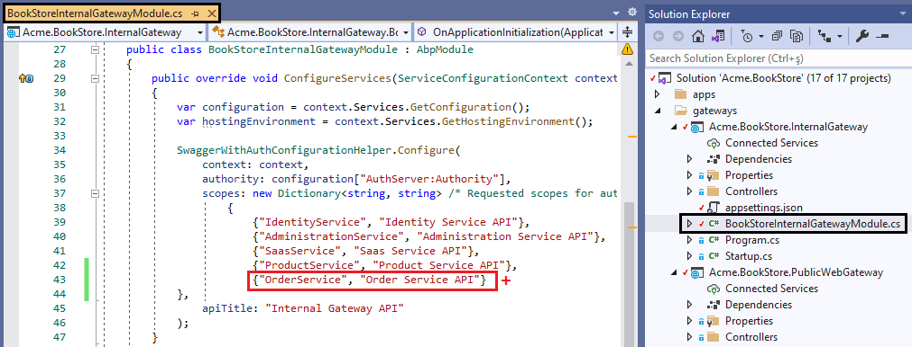
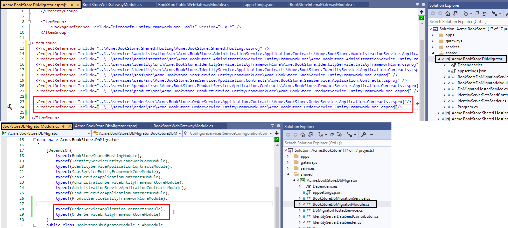
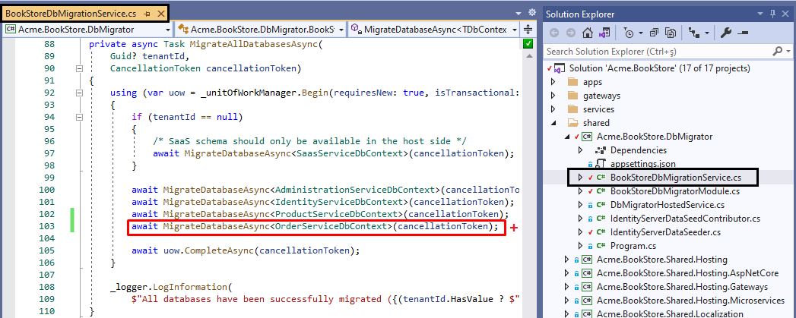
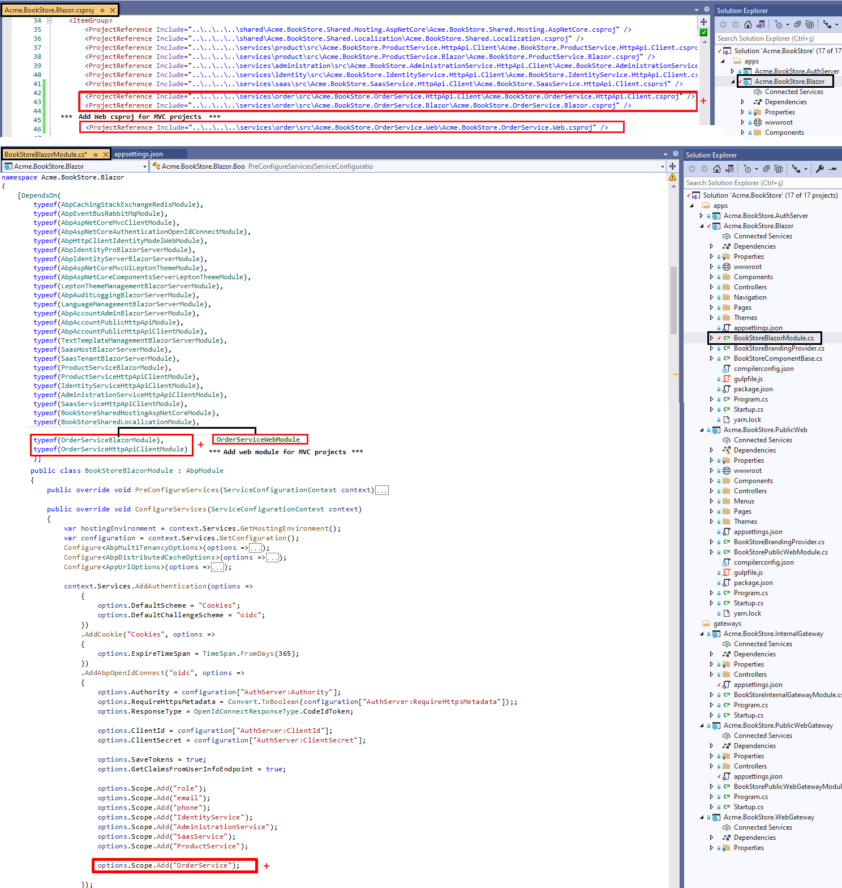
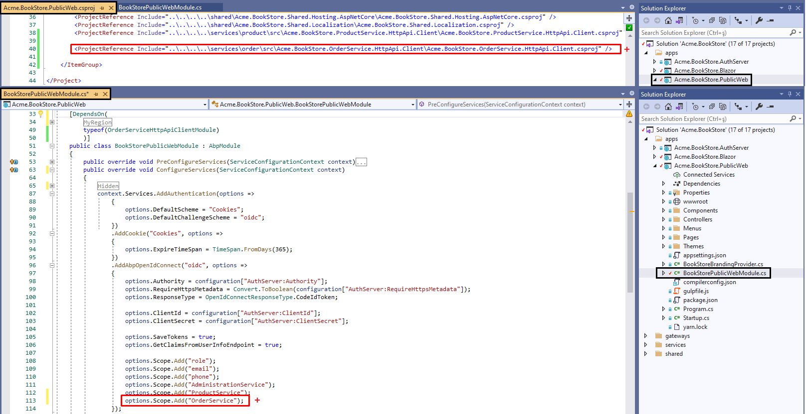
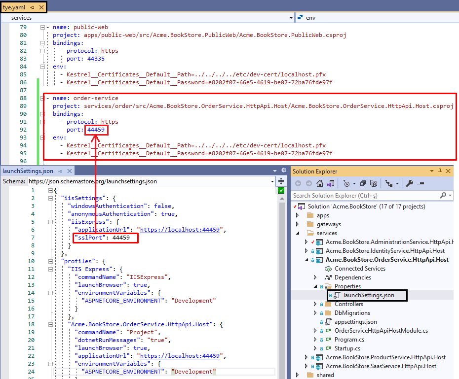

# Add new Microservices to the Solution

> This documentation introduces guidance for creating a new microservice for your microservice startup template. Eventually, these steps will be automated in the future however learning these steps may provide insight to learn the relations between microservices.

## Creating new service

You can create a new service (sub microservice) into your microservice solution by using the ABP CLI. Use the following command to create a new service:

```powershell
abp new OrderService -t microservice-service-pro
```

The new service is created in the **services** folder of your solution. Build the new service with the following command. Run this command in the `\services\order` directory:

```bash
dotnet build
```

## Add the new service to the solution

Add **Acme.BookStore.OrderService.HttpApi.Host.csproj** as an existing project to your main solution under the `services` folder. This will help you manage the host projects from single solution. While you can add it by Visual Studio, you can also run the following dotnet CLI command to add the Host project.

```bash
dotnet sln add services/order/src/Acme.BookStore.OrderService.HttpApi.Host/Acme.BookStore.OrderService.HttpApi.Host.csproj --solution-folder services
```



You need to update other dependent projects in order to integrate your new service into your composition.  Follow the next steps to integrate your new service.

## Convert Dynamic C# API Client Proxies to Static.

The new service uses [Dynamic C# API Client Proxies](https://docs.abp.io/en/abp/latest/API/Dynamic-CSharp-API-Clients) by default. It is recommended that you convert to use [Static C# API Client Proxie](https://docs.abp.io/en/abp/latest/API/Static-CSharp-API-Clients) for performance benefits.

## Updating Administration Microservice

Administration microservice hosts the **permission management**. In order to show your microservice permissions on the permission management page, you need to add the project reference of **Acme.BookStore.OrderService.Application.Contracts** project and then add module dependency to **AdministrationServiceHttpApiHostModule**.

* **Add csproj reference**:

  Open **Acme.BookStore.AdministrationService.HttpApi.Host.csproj** and add the following project reference

```json
<ProjectReference Include="..\..\..\order\src\Acme.BookStore.OrderService.Application.Contracts\Acme.BookStore.OrderService.Application.Contracts.csproj" />
```

* **Add DependsOn attribute**:

  Open **AdministrationServiceHttpApiHostModule.cs** class and add the following module dependency
  
```csharp
typeof(OrderServiceApplicationContractsModule)
```

  


## IdentityServer Configuration

> You can also do the same functionality explained in this step by using IdentityServer Management UI. However it is a good practice to keep `IdentityServerDataSeeder` updated. 

To keep `IdentityServerDataSeeder` updated, you need to do the following steps in the **IdentityServerDataSeeder.cs** class. Note that there are 2 **IdentityServerDataSeeder.cs** classes in the solution:

1. `Acme.BookStore.DbMigrator\IdentityServerDataSeeder.cs`
2. `Acme.BookStore.IdentityService.HttpApi.Host\DbMigrations\IdentityServerDataSeeder.cs`. 

If you will use the DbMigrator application you need to do the same steps in both classes.

- **Create ApiResource**: 

  `OrderService` itself is a new API resource, you should add it to the API resources. Open `IdentityServerDataSeeder.cs` and add the below line in 

```csharp
await CreateApiResourceAsync("OrderService", commonApiUserClaims);
```


- **Create ApiScope**: 

  To make OrderService a reachable scope for other services, you should add it as a new scope by updating **CreateApiScopesAsync** method with: 

```csharp
await CreateApiScopeAsync("OrderService");
```


- **Add Swagger Client Scopes**: 

  Swagger clients are used to **authorize** the microservice endpoints via *authorization code* flow for the swagger endpoints. You need to update the related swagger client scopes by adding the **OrderService** scope. You can select the gateways you want to grant for new service to be reached. **Keep in mind** that you need to add route configuration for each gateway. 

- **Update Clients**: 

  Update Web and/or Public (angular or blazor if application is not mvc) client creations in **CreateClientsAsync** method. Add **OrderService** scope. If you want to call **OrderService** from an other service, add **OrderService** scope to caller service client as well.

- **Create New Client:** 

  If you want **OrderService** to be able call the other services, you need to add the **OrderService** as a client under **CreateClientsAsync** as well. Then, update appsettings.json of the OrderService with **IdentityClients** section with the ClientId and granted scopes you have defined in **CreateClientAsync** method for client credential flow. For more information, see [Microservice Synchronous Interservice Communication](synchronous-interservice-communication.md) document.
  
  > AdministrationService microservice has configuration for making sync calls to IdentityService which can be examined if you are planning sync communication for your new microservice.  


> Hint: You can search for "*Product*" keyword in this class to find the places where you will add the OrderService.


Below you can see a screenshot of the final **IdentityServerDataSeeder.cs** , creating `OrderService ` `ApiResource` and `ApiScope` granting scopes to all Swagger clients.




## Updating Gateways

If you need to expose the new service endpoints, you need to configure all the 3 gateways:  

- **InternalGateway** 
- **WebGateway** 
- **PublicWebGateway**

You need to repeat the following steps for the 3 gateways:

1. **Add project reference and module dependency**: 

   Add **OrderService.HttpApi** project reference to your gateway project dependency and add **OrderServiceHttpApiModule** to gateway module dependency like:
* **Add csproj reference**

```json
<ProjectReference Include="..\..\..\..\services\order\src\Acme.BookStore.OrderService.HttpApi\Acme.BookStore.OrderService.HttpApi.csproj" />
```

   * **Add DependsOn attribute**

```csharp
typeof(OrderServiceHttpApiModule)
```


​     

Add the **OrderService** scope to the Swagger UI. To do this add `{"OrderService", "Order Service API"}` into the scopes dictionary in ` SwaggerWithAuthConfigurationHelper.Configure()` method. Do this step for the 3 gateways.


 


2. **Update appsettings.json for Ocelot configuration:** 

   You need to add new Downstream and Upstream path templates for the new service as shown below. 
   

```json
  {
    "DownstreamPathTemplate": "/api/order-service/{everything}",
    "DownstreamScheme": "https",
    "DownstreamHostAndPorts": [
      {
        "Host": "localhost",
        "Port": 44371 ***** do not forget to replace this port with yours *****
      }
    ],
    "UpstreamPathTemplate": "/api/order-service/{everything}",
    "UpstreamHttpMethod": [ "Put", "Delete", "Get", "Post" ]
  }
```

**Important**: The port `44371` is not same for all services. You can get your service port from `\services\order\src\Acme.BookStore.OrderService.HttpApi.Host\Properties\launchSettings.json`


  > You can make different configurations for each method or endpoint for your service and add QoS configurations based on your business requirements. You can check [ocelot documentation](https://ocelot.readthedocs.io/en/latest/) for more.


The 2 steps above are explained for **InternalGateway**, you need to repeat these steps for **WebGateway** and **PublicWebGateway**.


## Updating DbMigrator

Since **OrderService** is using its own database, you should add it to the `DbMigrator` project as well to handle the new service migrations and data seeding. 

1. **Add OrderService Dependencies:** 

   Add **Acme.BookStore.OrderService.Application.Contracts** and **Acme.BookStore.OrderService.EntityFrameworkCore** project references to the **DbMigrator** project. And add the below `DependsOn` types to the **DbMigratorModule** as below:

* **Add csproj references:**

```json
<ProjectReference Include="..\..\services\order\src\Acme.BookStore.OrderService.Application.Contracts\Acme.BookStore.OrderService.Application.Contracts.csproj"/>
   
<ProjectReference Include="..\..\services\order\src\Acme.BookStore.OrderService.EntityFrameworkCore\Acme.BookStore.OrderService.EntityFrameworkCore.csproj"/>
```

* **Add DependsOn attributes**:
```csharp
typeof(OrderServiceApplicationContractsModule),
typeof(OrderServiceEntityFrameworkCoreModule)
```


   

   

2. **Update DbMigrationService:** 

   **DbMigratorHostedService** runs the [MigrateAsync()]() method which eventually runs the **MigrateAllDatabasesAsync** method. Add the new database migration with the others: 

```csharp
await MigrateDatabaseAsync<OrderServiceDbContext>(cancellationToken);
```

   


3. **Add connection string:** 

   DbMigrator gets connection string from configuration (`appsettings.json`). Each service has its own connection string. Add the OrderService connection string to the `appsettings.json` of the DbMigrator project. This name is defined in `OrderServiceDbProperties.ConnectionStringName`.
   
````json
"OrderService": "Server=localhost,1434;Database=BookStore_OrderService;User Id=sa;password=myPassw0rd;MultipleActiveResultSets=true"
````

   


## Adding UI to Applications

You can develop UI for your application in two different ways:

### 1-) Modular UI Development:

Develop your application UI like any ABP application template; add your pages under **OrderService.Web** project. This way, the back-office application will show the UI without hosting the microservice application just by using as a remote service. You can check [Module Architecture Best Practices & Conventions](https://docs.abp.io/en/abp/latest/Best-Practices/Module-Architecture#layers-packages) **Section C** for more information. 

**Add your service UI to the back-office application:**

Add **HttpApi.Client** and **Web** (or **Blazor**) projects as references to the Web project and add new dependencies to **WebModule** as below:

* **Add csproj references**:

**MVC:** If your microservice project is MVC add the references to the `Acme.BookStore.Web.csproj`, if it's Blazor add the references to the `Acme.BookStore.Blazor.csproj`.

```json
<ProjectReference Include="..\..\..\..\services\order\src\Acme.BookStore.OrderService.HttpApi.Client\Acme.BookStore.OrderService.HttpApi.Client.csproj" />
    
<ProjectReference Include="..\..\..\..\services\order\src\Acme.BookStore.OrderService.Web\Acme.BookStore.OrderService.Web.csproj" />
```

 **Blazor**: If your project is Blazor then add the references to the `Acme.BookStore.Blazor.csproj`

```json
<ProjectReference Include="..\..\..\..\services\order\src\Acme.BookStore.OrderService.HttpApi.Client\Acme.BookStore.OrderService.HttpApi.Client.csproj" />
      
<ProjectReference Include="..\..\..\..\services\order\src\Acme.BookStore.OrderService.Blazor\Acme.BookStore.OrderService.Blazor.csproj" />
```

​    


* **Add DependsOn attributes**:

**MVC**:

```csharp
typeof(OrderServiceWebModule),
typeof(OrderServiceHttpApiClientModule)
```

**Blazor**:

```csharp
typeof(OrderServiceBlazorModule),
typeof(OrderServiceHttpApiClientModule)
```


**Add to OpenID Connect Scopes:**

You need to add the new service scope in your startup project. 

**MVC**: Open **BookStoreWebModule.cs** and add the below scope in `AddAbpOpenIdConnect()` method.

**Blazor**: Open **BookStoreBlazorModule.cs** and add the below scope in `AddAbpOpenIdConnect()` method.

```csharp
options.Scope.Add("OrderService");
```

> ProductService.Web module is designed this way. You can examine ProductService.Web project for the sample implementation.


This approach can benefit you to have backend and frontend integrity in your microservice as a whole, as you can develop the backend and frontend of your microservice in the same microservice solution.




### 2-) Monolith UI Development inside application:

Develop your application UI inside the application; add your pages under application layer of your solution and use microservice as a remote service. You can check [Module Architecture Best Practices & Conventions](https://docs.abp.io/en/abp/latest/Best-Practices/Module-Architecture#layers-packages) **Section D** for more information.  In this approach, you can separate the front-end and back-end team and develop each in their reputable solution.

**To add your microservice UI to your application (PublicWeb application in this case):**

Add **HttpApi.Client** reference to **PublicWeb** project and add new dependency to **PublicWebModule** as below:

* **Add csproj reference**:

```json
<ProjectReference Include="..\..\..\..\services\order\src\Acme.BookStore.OrderService.HttpApi.Client\Acme.BookStore.OrderService.HttpApi.Client.csproj" />
```

* **Add DependsOn attribute:**

```csharp
typeof(OrderServiceHttpApiClientModule)
```



> You can check out the sample project ProductService.PublicWeb module to understand this implementation.

### Updating Angular application:

If you are using the Angular application, you need to add the new scope to the **oAuthConfig** in `envrionment.ts`:


## Updating Tye configuration:

If you are planning to use [Tye](https://github.com/dotnet/tye) to develop and deploy microservices, you need to update your `tye.yaml` configuration which exists in the root directory of your solution. Add **OrderService.HttpApi.Host.csproj** path and port with self-sign development certification information as below:

```yaml
- name: order-service
  project: services/order/src/Acme.BookStore.OrderService.HttpApi.Host/Acme.BookStore.OrderService.HttpApi.Host.csproj
  bindings:
    - protocol: https
      port: 44371 ***** do not forget to replace this port with yours *****
  env:
    - Kestrel__Certificates__Default__Path=../../../../etc/dev-cert/localhost.pfx
    - Kestrel__Certificates__Default__Password=e8202f07-66e5-4619-be07-72ba76fde97f
```

**Important**: The port `44371` is not same for all services. You can get your service port from `\services\order\src\Acme.BookStore.OrderService.HttpApi.Host\Properties\launchSettings.json`





## Running the Solution

We have added a new service to the microservice solution. Let's run the solution. 

**1- Start the infrastructure:**  Run the following Powershell script to start the infrastructures:

```bash
etc\docker\up.ps1
```

**2- Create dev certificates:** This is a one time operation. You need to create dotnet HTTPS certificates with the following Powershell command:

```bash
\etc\dev-cert\create-certificate.ps1
```

**3- Run tye**: Run the following command in the root directory of your solution where `tye.yaml` exists. The `watch` parameter allows to build projects when the source code changes.

```bash
tye run --watch
```

Open your browser and navigate to your startup URL:

* **Blazor Server**: [https://localhost:44314](https://localhost:44314/)
* **Blazor Web Assembly**: [https://localhost:44307](https://localhost:44307/)
* **MVC**: [https://localhost:44321](https://localhost:44321/)
* **Angular**: [http://localhost:4200](http://localhost:4200/)
