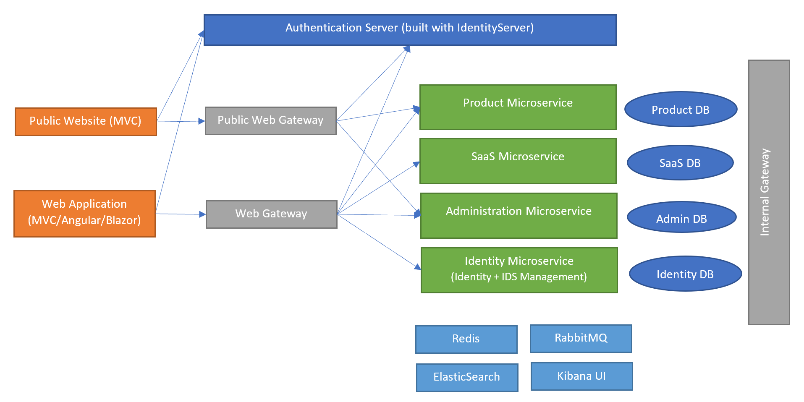

# Microservice Startup Template

> This startup template is not feature complete and well documented yet. However, we found it valuable to share with the ABP Commercial customers. That doesn't mean it is not production ready. You can start to develop your real solution today. But we will improve it and write more documentation for different development and deployment scenarios.

The Microservice Startup Template is a generic solution to start a new microservice solution.

While we accept that every microservice solution will be different and every system has its own design requirements and trade-offs, we believe such a startup solution is a very useful starting point for most of the solutions, and a useful example for others.

## Overall

This section introduce the solution structure and briefly explains the solution components. The following diagram is an overview of the applications, gateways, services, databases and other components;

*Figure: Overall Diagram of the Solution (not all associations are shown, for the sake of simplicity)*

* The **Authentication Server** is a web application that is used as the single sign-on authentication server. It hosts the login, register, forgot password, two factor authentication, profile management... pages, OAuth endpoints and authentication related APIs. All applications and services use this application as a central authority for the authentication.
* There are two **web applications** in the solution (you can add more yourself);
  * The **Web Application** is the main UI of the system. It uses the *Authentication Server* to make users login to the application. Then it uses the *Web Gateway* to access to the HTTP APIs. You mostly develop your UI here. Based on your preference, it can be an **MVC (Razor Pages)**, **Angular** or **Blazor** application.
  * The **Public Website** is a second web application that can be used to develop your landing page for the application. If you don't need, you can just remove it. It uses the *Authentication Server* to make users login to the application. Then it uses the *Public Web Gateway* to access to the HTTP APIs.
* There are three **API gateways** in the solution (you can add more if you need);
  * The **Web Gateway** is a BFF (Backend for Frontend) that provides the necessary HTTP APIs to the *Web Application*.
  * The **Public Web Gateway** is a BFF (Backend for Frontend) that provides the necessary HTTP APIs to the *Public Web Application*.
  * **Internal Gateway** is used for communication of microservices internally. We found it useful to access to other microservices over an API Gateway. Details and alternatives will be discussed.
* There are **four microservices** coming with the solution (you can split existing ones and add new ones);
  * **Identity Microservice** is used to manage users, roles, clients, resources... in the system.
  * **SaaS Microservice** is used to manage tenants and editions for a multi-tenant system. If your system is not multi-tenant, you can remove this service and its database from the solution.
  * **Administration Microservice** is mostly related to infrastructure requirements like permissions, settings, audit logs, dynamic localizations and BLOB storing. This service and the related database can be splitted based on your design decisions.
  * **Product Microservice** is an example microservices that can be investigated to learn how to develop your own microservices.
* There are **four databases**, each is owned by the related microservice. Databases are SQL Server with EF Core integrated in the applications. You can switch to another RDBMS or MongoDB for any of them. Administration and SaaS databases are used by other services since they contains cross-cutting style data (like permissions and audit logs) that is needed by all services. The reasons behind this design decision will be discussed and alternative implementations will be explained.
* There are some infrastructure services are configured in the solution;
  * **Redis** is used as a distributed cache server.
  * **RabbitMQ** is used a a distributed event/message bus.
  * **ElasticSearch** is used as a central point to write application logs.
  * **Kibana** is used to visualize the logs in the Elasticsearch database.

## Get Started

This document explains how to start development with this solution template.

### Downloading the Solution

TODO