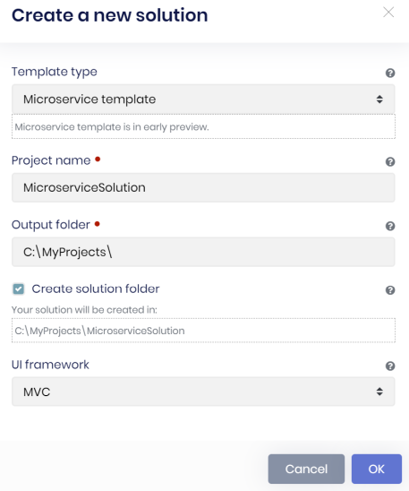
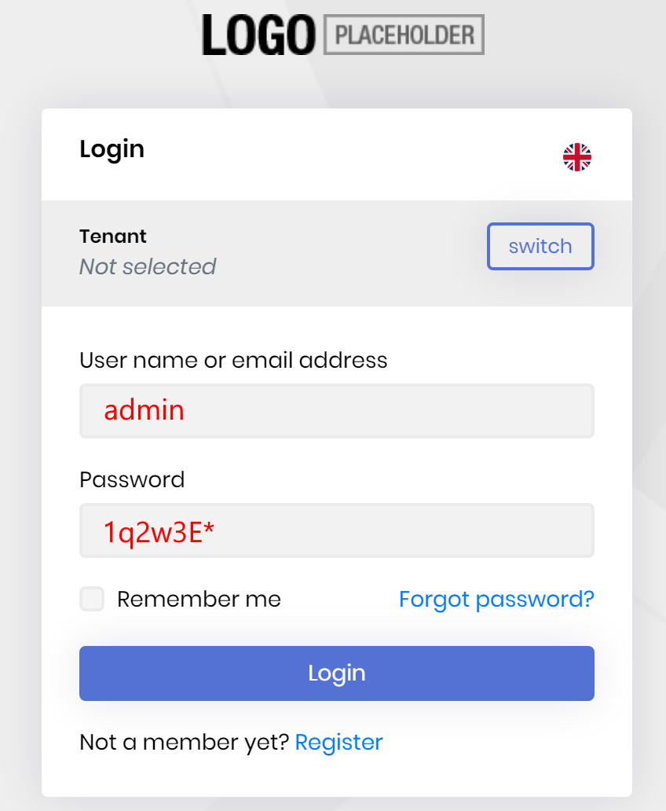
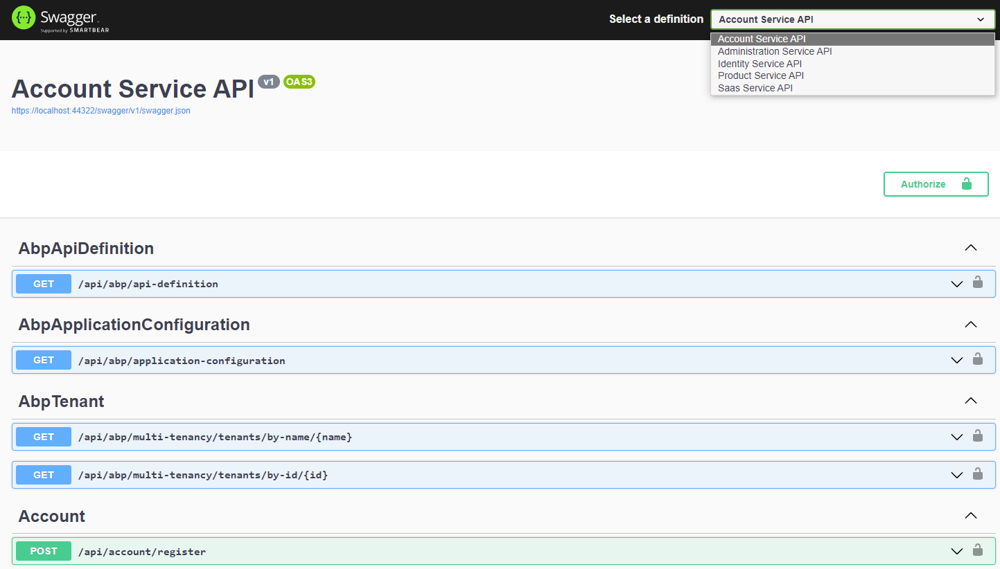
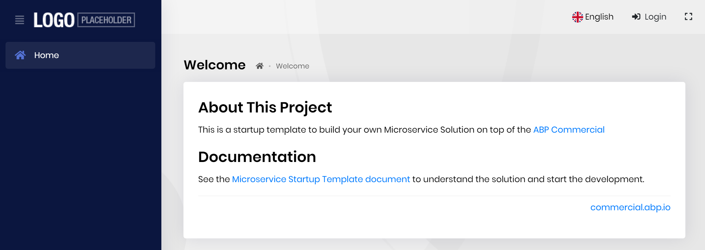

# Microservice Startup Template

> This startup template is not feature complete and well documented yet. However, we found it valuable to share with the ABP Commercial customers. That doesn't mean it is not production ready. You can start to develop your real solution today. But we will improve it and write more documentation for different development and deployment scenarios.

The Microservice Startup Template is a generic solution to start a new microservice solution.

While we accept that every microservice solution will be different and every system has its own design requirements and trade-offs, we believe such a startup solution is a very useful starting point for most of the solutions, and a useful example for others.

## Overall

This section introduce the solution structure and briefly explains the solution components. The following diagram is an overview of the applications, gateways, services, databases and other components;

*Figure: Overall Diagram of the Solution (not all associations are shown, for the sake of simplicity)*

* The **Authentication Server** is a web application that is used as the single sign-on authentication server. It hosts the login, register, forgot password, two factor authentication, profile management... pages, OAuth endpoints and authentication related APIs. All applications and services use this application as a central authority for the authentication.
* There are two **web applications** in the solution (you can add more yourself);
  * The **Web Application** is the main UI of the system. It uses the *Authentication Server* to make users login to the application. Then it uses the *Web Gateway* to access to the HTTP APIs. You mostly develop your UI here. Based on your preference, it can be an **MVC (Razor Pages)**, **Angular** or **Blazor** application.
  * The **Public Website** is a second web application that can be used to develop your landing page for the application. If you don't need, you can just remove it. It uses the *Authentication Server* to make users login to the application. Then it uses the *Public Web Gateway* to access to the HTTP APIs.
* There are three **API gateways** in the solution (you can add more if you need);
  * The **Web Gateway** is a BFF (Backend for Frontend) that provides the necessary HTTP APIs to the *Web Application*.
  * The **Public Web Gateway** is a BFF (Backend for Frontend) that provides the necessary HTTP APIs to the *Public Web Application*.
  * **Internal Gateway** is used for communication of microservices internally. We found it useful to access to other microservices over an API Gateway. Details and alternatives will be discussed.
* There are **four microservices** coming with the solution (you can split existing ones and add new ones);
  * **Identity Microservice** is used to manage users, roles, clients, resources... in the system.
  * **SaaS Microservice** is used to manage tenants and editions for a multi-tenant system. If your system is not multi-tenant, you can remove this service and its database from the solution.
  * **Administration Microservice** is mostly related to infrastructure requirements like permissions, settings, audit logs, dynamic localizations and BLOB storing. This service and the related database can be splitted based on your design decisions.
  * **Product Microservice** is an example microservices that can be investigated to learn how to develop your own microservices.
* There are **four databases**, each is owned by the related microservice. Databases are SQL Server with EF Core integrated in the applications. You can [switch to another RDBMS](https://docs.abp.io/en/abp/latest/Entity-Framework-Core-Other-DBMS) or [MongoDB](https://docs.abp.io/en/abp/latest/MongoDB) for any of them. Administration and SaaS databases are used by other services since they contains cross-cutting style data (like permissions and audit logs) that is needed by all services. The reasons behind this design decision will be discussed and alternative implementations will be explained.
* There are some infrastructure services are configured in the solution (they are configured to run with docker-compose);
  * **Redis** is used as a distributed cache server.
  * **RabbitMQ** is used a a distributed event/message bus.
  * **ElasticSearch** is used as a central point to write application logs.
  * **Kibana** is used to visualize the logs in the Elasticsearch database.
  * **Grafana** is used to compose observability dashboards.
  * **Prometheus** is used for event monitoring and alerting.
  * **Sql-Server-Linux** is used for running the database in container. Default exposed port is 1434.

## Get Started

This document explains how to start development with this solution template.

### Pre-Requirements

The following tools are required in order to run the solution;

* [Visual Studio 2019](https://visualstudio.microsoft.com/vs/community/) (v16.8+) or another suitable IDE.
* [.NET 5.0+ SDK](https://dotnet.microsoft.com/download) (If you have Visual Studio 2019, this will be installed already)
* [NPM](https://nodejs.org/) v14+ (or [Yarn](https://classic.yarnpkg.com/en/docs/install) 1.20+).
* [Powershell](https://docs.microsoft.com/en-us/powershell/) 5.0+
* [Docker Desktop](https://www.docker.com/products/docker-desktop) v3.0+

Other dependencies (like Redis and RabbitMQ) comes with a docker-compose configuration, so no external installation required.

### Downloading the Solution

Use the [ABP Suite](../../abp-suite/index.md) to [create a new solution](../../abp-suite/create-solution.md) by selecting the *Microservice* as the project type.

> Type `abp suite` in a command line terminal to start the ABP Suite.

### Open the Solution

Now, you can open the solution in Visual Studio or your favorite IDE. You will see a solution structure similar to the figure below (solution and project names will be different based on your naming preference);

*Figure: The solution structure (it will be a slightly different based on your UI preference).*

## Run the Infrastructure

The **etc/docker** folder under the main solution contains a `up.ps1` file. Execute it to run the necessary infrastructure services:

> First running may contain additional steps and take a long time since it will download the missing Docker images.

## Run the Solution on TYE

You can run and debug the microservice solution using [dotnet/tye](https://github.com/dotnet/tye). Simply check [Microservice Template Tye Integration](./microservice-tye-integration).

## Run the Solution on IDE

The system consists of multiple applications should be running together.

### Running the Authentication Server

First, run the **AuthServer** application.

> Right click to the project, *Set as Startup Project* and hit Ctrl+F5 while running the applications if you don't need to DEBUG it.

It will open a Login page:

If you want to test it, enter `admin` as the username and `1q2w3E*` as the password and hit ENTER. If you login successfully, you are redirected a *developer test page* that lists the current user claims:

> You can change this page however you like. Users are typically redirected to the *Authentication Server* from the other applications to login the system and they are automatically redirected to the client application after the login process. If you want, this test page can be converted to a landing page that contains links to your actual applications.

### Running the Services

Run the following applications in the given order (right click to each project, *Set as Startup Project* and hit Ctrl+F5) to make the services running;

* **InternalGateway**
* **AdministrationService**
* **IdentityService**
* **SaasService**
* **ProductService**

> Notice: Visual Studio may stop a previously started service (we think it is kind of a bug of the VS). In this case, re-start the stopped application. Alternatively, you can run the project or projects in a command line terminal, using the `dotnet run` command.

All these applications open a Swagger UI to explore the HTTP APIs. For example, the screenshot below was taken from the SaasService:

### Running the Main Web Application

The main *Web Application* can be an MVC (Razor Pages), Angular or Blazor application based on your preference. Regardless of your frontend application, you first need to run the **WebGateway** application. 

#### Run the Web Gateway

When you run the **WebGateway** application, it opens a Swagger UI to explore the HTTP APIs provided by this API Gateway:

> API Gateways in this solution truly shows the APIs they expose. That's normally not possible with using Swagger and Ocelot. However, we have developed a solution to make this possible by using a proper layering and code sharing. Details will be covered later.

#### Run the *MVC (Razor Pages)* Web Application

> You can skip this section if you haven't selected the **MVC (Razor Pages)** as the main web application UI framework.

Run the **Web** application in the solution.

#### Run the *Blazor* Web Application

> You can skip this section if you haven't selected the **Blazor** as the main web application UI framework.

Run the **Blazor** application in the solution.

#### Run the Angular Web Application

> You can skip this section if you haven't selected the **Angular** as the main web application UI framework.

* Open a command line terminal in the `angular` folder in the root folder of the solution.
* Execute `npm install` (or `yarn` if you prefer Yarn as the package manager).
* Execute `yarn start`.

#### Login to the Web Application

This will begin the *Main Web Application*:

Click to the *Login* link. It will redirect to the *Authentication Server*. Enter `admin` as the username and `1q2w3E*` as the password to login to the system. You will be redirected back to the web application.

> If you have previously logged into the *Authentication Server* then you are automatically login to this application when you click to the Login link thanks to the **single sign on** system.

### Running the Public Website

The *Public Web Site* application uses the *Public Web Gateway*, so we need to run it first.

#### Run the Public Web Gateway

When you run the **PublicWebGateway** application, it opens a Swagger UI to explore the HTTP APIs provided by this API Gateway:

#### Run the Public Website

Now, you can run the **PublicWeb** application:

> This is an example application if you need to a public/landing page for your system. It supports login (with **single sign-on** support) via the *Authentication Server*.