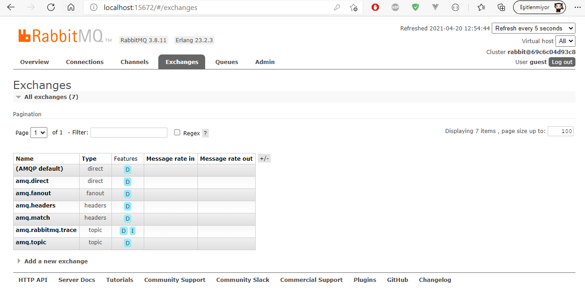
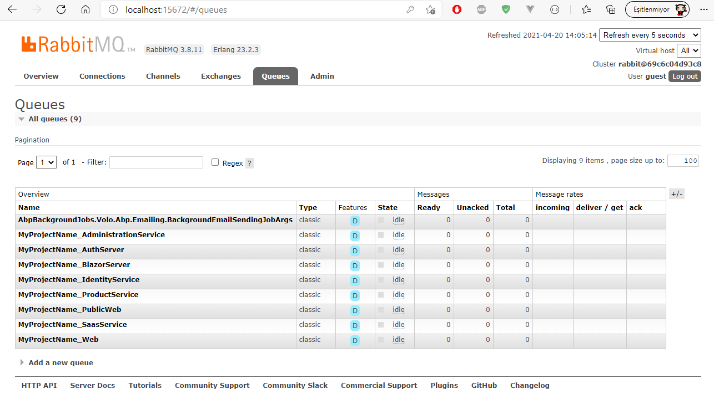
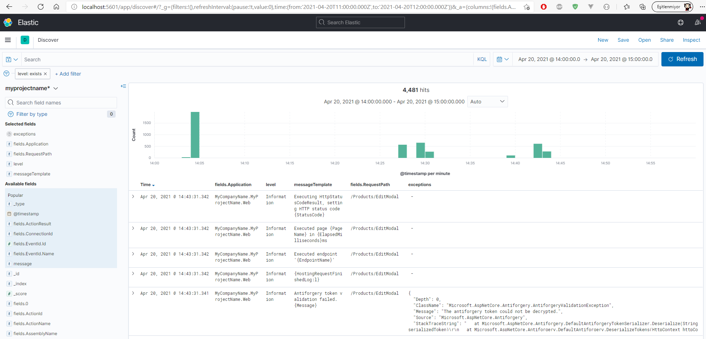
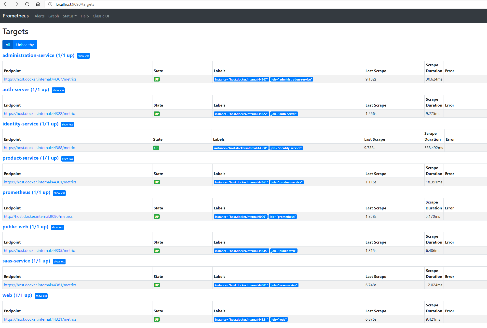
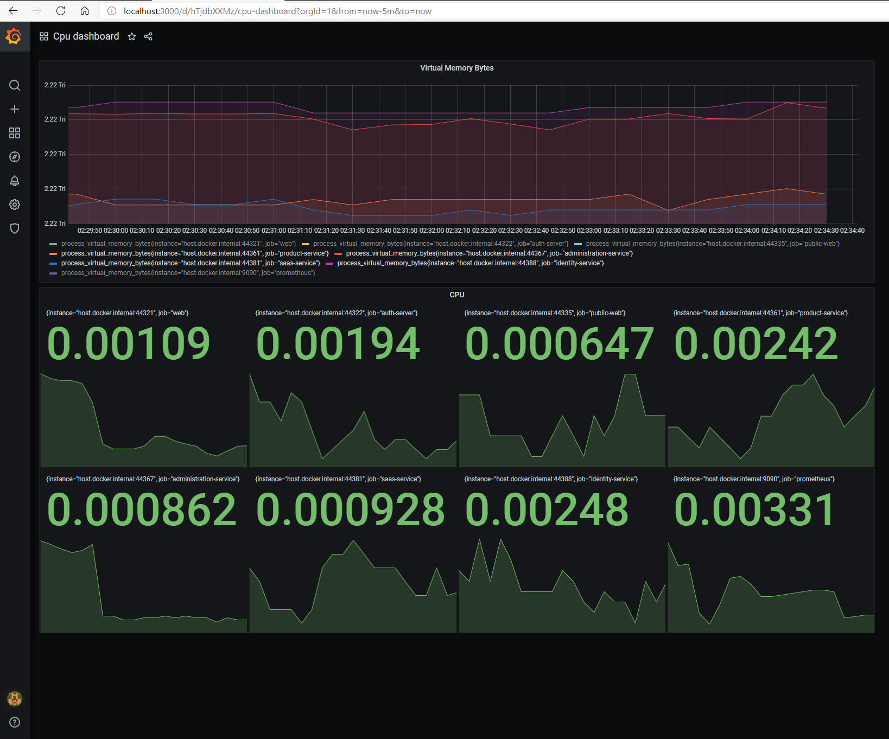

# Microservice Startup Template Infrastructure

> Abp Microservice Startup Template contains shared modules that are used in applications, gateways and microservices. There are also external services run on containers where some of them are mandatory for microservice template to run such as Redis and RabbitMQ.


Shared folder in microservice template solution contains **DbMigrator** project for centralized database migration and data seeding for microservices and shared modules used in applications, microservices and gateways. 

**Infrastructure services run on docker containers** as default and some of the services are **required** for microservice template to run properly while some of them are optional. [Docker compose](https://docs.docker.com/compose/) is used for running the infrastructure services. Two docker-compose.yml files are used for service configurations and they are located under *etc/docker* folder. While `docker-compose.infrastructure.yml` file contains `image`, `container_name`, `network` and `volume` data, `docker-compose.infrastructure.override.yml` file contains service `ports` and `environment` data. 

Docker-compose file defines

- Sql-Server (required as default)
- Redis (required)
- RabbitMQ (required)
- ElasticSearch
- Kibana
- Grafana
- Prometheus

services that run on a predefined **external docker-network**. Use `up.ps1` powershell command located in the same *etc/docker* folder to run the external infrastructure images that will execute the commands

```powershell
docker network create mycompanyname.myprojectname-network
docker-compose -f docker-compose.infrastructure.yml -f docker-compose.infrastructure.override.yml up -d
```

which creates the external docker network for infrastructure services and runs the docker-compose files in detached mode. To stop and remove the containers, use `down.ps1` powershell command. 

> You can use a single docker file by merging **docker-compose.infrastructure.yml** and **docker-compose.infrastructure.override.yml** files as you desire.


## Sql Server & Configuration

[Sql Server Docker Image](https://hub.docker.com/_/microsoft-mssql-server) is the **default database** and a **required** service for the microservice solution template. It's main configuration is located in *docker-compose.infrastructure.yml* file under `sql-server-db` service name. Port and environment information is located in *docker-compose.infrastructure.override.yml* file. The combined docker-compose service configuration is as below

```yaml
sql-server-db:
    container_name: sql-server-db
    image: mcr.microsoft.com/mssql/server
    volumes:
      - sqldata:/var/opt/mssql
    networks:
      - mycompanyname.myprojectname-network
    ports:
      - "1434:1433"
    environment:
      SA_PASSWORD: "myPassw0rd"
      ACCEPT_EULA: "Y"
```

All the microservices and AuthServer has connection strings configured based on containerized sql server database. All the connection strings used in microservice template solution are shown below

```json
"ConnectionStrings": {
    "IdentityService": "Server=localhost,1434;Database=MyProjectName_Identity;User Id=sa;password=myPassw0rd;MultipleActiveResultSets=true",
    "AdministrationService": "Server=localhost,1434;Database=MyProjectName_Administration;User Id=sa;password=myPassw0rd;MultipleActiveResultSets=true",
    "SaasService": "Server=localhost,1434;Database=MyProjectName_Saas;User Id=sa;password=myPassw0rd;MultipleActiveResultSets=true",
    "ProductService": "Server=localhost,1434;Database=MyProjectName_ProductService;User Id=sa;password=myPassw0rd;MultipleActiveResultSets=true"
  },
```

> sql-server-db container exposes **1434** port instead of default 1433 in order to prevent conflicts if there is a local sql-server or sql-server-express is already installed.
>
> You can always use none-containerized installed sql-server-express database but you will need to update all the connection strings in the solution.

## Redis Integration & Configuration

[Redis cache](https://docs.abp.io/en/abp/latest/Redis-Cache) is a **required** service for the microservice solution template. It is used for caching permissions and such.

Redis runs on container with the main configurations are located in *docker-compose.infrastructure.yml* and port information in *docker-compose.infrastructure.override.yml* file. Redis docker-compose service configuration is as below

```yaml
redis:
    container_name: redis
    image: redis:6.0.10-alpine
    networks:
      - mycompanyname.myprojectname-network
    ports:
      - "6379:6379"  
```

All the microservices uses `AbpCachingStackExchangeRedisModule` dependency over *SharedHostingMicroservicesModule* and applications (AuthServer, Web, PublicWeb) references explicitly to *Volo.Abp.Caching.StackExchangeRedis* package.

Microservices and applications have their redis configuration in appsettings *Redis* section

```json
"Redis": {
  "Configuration": "localhost:6379"
}
```

> **Redis 6.0.10-alpine** image is used as default. You can change the image tag in *docker-compose.infrastructure.yml* file and default exposed **6379** port in *docker-compose.infrastructure.override.yml* file.

## RabbitMQ Integration & Configuration

[Distributed Event Bus](https://docs.abp.io/en/abp/latest/Distributed-Event-Bus) is the tool for async communication in microservice systems and abp microservice template solution uses [RabbitMQ integration](https://docs.abp.io/en/abp/latest/Distributed-Event-Bus-RabbitMQ-Integration) for this capability. It is a **required** service in the solution template used for on-the-fly database migration of the microservices. RabbitMQ docker-compose service configuration is as below

```yaml
rabbitmq:
    container_name: rabbitmq
    image: rabbitmq:3.8.11-management-alpine
    networks:
      - mycompanyname.myprojectname-network
    ports:
      - "15672:15672"
      - "5672:5672"  
```

Default RabbitMQ-management port is **15672** and UI can be accessed with default `guest` username/password.



All the microservices uses `AbpEventBusRabbitMqModule` dependency over *SharedHostingMicroservicesModule* and applications (AuthServer, Web, PublicWeb) references explicitly to *Volo.Abp.EventBus.RabbitMQ* package.

Each application and microservice has it's configuration under appsettings *RabbitMQ* section.

```json
"RabbitMQ": {
  "Connections": {
    "Default": {
      "HostName": "localhost"
    }
  },
  "EventBus": {
    "ClientName": "MyProjectName_AuthServer",
    "ExchangeName": "MyProjectName"
  }
}
```

They all share the same **ExchangeName** and individual queues will be created after services start running.



> Minimal configurations are used to connect RabbitMQ. Check [RabbitMQ Integration docs](https://docs.abp.io/en/abp/latest/Distributed-Event-Bus-RabbitMQ-Integration#configuration) for more configuration settings.

## ElasticSearch & Kibana Integration

[ElasticSearch](https://www.elastic.co/elasticsearch/) is used for [Serilog](https://serilog.net/) integration for logging and [Kibana](https://www.elastic.co/kibana) is used as the visualization tool that integrated to ElasticSearch. Docker-compose service configuration for these services is defined as below

```yaml
elasticsearch:
    container_name: elasticsearch
    image: docker.elastic.co/elasticsearch/elasticsearch:7.10.2
    volumes:
      - esdata:/usr/share/elasticsearch/data
    networks:
      - mycompanyname.myprojectname-network
    environment:
      - xpack.monitoring.enabled=true
      - xpack.watcher.enabled=false
      - "ES_JAVA_OPTS=-Xms512m -Xmx512m"
      - discovery.type=single-node
    ports:
      - "9200:9200"

kibana:
    container_name: kibana
    image: docker.elastic.co/kibana/kibana:7.10.2
    depends_on:
      - elasticsearch
    networks:
      - mycompanyname.myprojectname-network
    environment:
      - ELASTICSEARCH_URL=http://host.docker.internal:9200
    ports: 
      - "5601:5601"
```

The ElasticSearch integration of Serilog configuration is done at **SerilogConfigurationHelper** located in *Shared.Hosting.AspNetCore* shared project. The *IndexFormat* is declared as `MyProjectName-log-{0:yyyy.MM}` under this configuration.

After running ElasticSearch in container, its endpoint should be exposed as below


Use the *IndexFormat* explained above to create preferred UI visualization data.



Configuration for each application and microservices is located under *ElasticSearch* section of appsettings

```json
"ElasticSearch": {
  "Url": "http://localhost:9200"
},
```

## Grafana & Prometheus Integration

[Grafana](https://grafana.com/) provides dashboards and data analysis from [Prometheus](https://prometheus.io/) metrics. Docker-compose service configuration for these services is defined as below

```yaml
grafana:
    container_name: grafana
    image: grafana/grafana
    volumes:
      - ../grafana/storage:/var/lib/grafana
    networks:
      - mycompanyname.myprojectname-network
    ports:
      - "3000:3000"
      
  prometheus:
    container_name: prometheus
    image: prom/prometheus
    volumes:
      - ../prometheus/prometheus.yml:/etc/prometheus/prometheus.yml
      - ../prometheus/storage:/prometheus
    networks:
      - mycompanyname.myprojectname-network
    ports:
      - "9090:9090"  
```

Prometheus scrape configuration, *prometheus.yml* file, is mounted and located under *etc/prometheus* folder.

> Grafana storage directory is mounted from *etc/granfana/storage* folder and Prometheus storage directory is from *etc/prometheus/storage*. You can also use [docker volumes](https://docs.docker.com/storage/volumes/#use-a-volume-with-docker-compose) instead of mounting directories.

Navigate to Prometheus targets to check endpoint targets



> If you are not running the solution on docker, you may have to change the prometheus *static_config* targets such as `-targets: ['auth-server']` to `-targets: ['host.docker.internal:44322']`

Run Grafana and add Prometheus as *Data Source*

> For first time entry, default user name and password is **admin/admin**

Add dashboard using prometheus data source



## Shared Modules

Shared modules are as the name implies; modules and configurations that are used in other applications, services and/or microservices to prevent code duplication and centralize basic configurations. There are 5 shared modules in Abp Microservice Template solution.

### Localization

The *Shared.Localization* project contains configuration for [Virtual File System](https://docs.abp.io/en/abp/latest/Virtual-File-System) and **solution-wide** localization. 

```csharp
Configure<AbpVirtualFileSystemOptions>(options =>
{
    options.FileSets.AddEmbedded<MyProjectNameSharedLocalizationModule>();
});

Configure<AbpLocalizationOptions>(options =>
{
    options.Resources
        .Add<MyProjectNameResource>("en")
        .AddBaseTypes(
            typeof(AbpValidationResource)
        ).AddVirtualJson("/Localization/MyProjectName");

    options.DefaultResourceType = typeof(MyProjectNameResource);
});
```

The **SharedLocalizationModule** is depended by all applications, gateways and microservices.

> Use provided localization files if you want your localization keys available in all applications, gateways and microservices.

### Hosting

*Shared.Hosting* project contains **database configurations** in `SharedHostingModule` service configuration which is used in all other hosting modules. 

Each module with database connection in abp has its own connection string so that it can be [migrated](https://docs.abp.io/en/abp/latest/Entity-Framework-Core-Migrations) to [multiple databases](https://docs.abp.io/en/abp/latest/Entity-Framework-Core-Migrations#using-multiple-databases) when needed. This is achieved by [Connection Strings Management](https://docs.abp.io/en/abp/latest/Connection-Strings). Since *infrastructural microservices* such as [AdministrationService](microservices.md#AdministrationService), [IdentityService](microservices.md#IdentityService) and [SaasService](microservices.md#SaasService) uses one or more modules to perform, each module database configuration must be added to related database explicitly so that the module can connect to it's database.

Instead of adding all module connection strings in microservice connection string configuration explicitly; related connection strings are mapped into a single connection string. 

```csharp
private void ConfigureDatabaseConnections()
{
    Configure<AbpDbConnectionOptions>(options =>
    {
        options.Databases.Configure("SaasService", database =>
        {
            database.MappedConnections.Add("Saas");
            database.IsUsedByTenants = false;
        });
        
        options.Databases.Configure("AdministrationService", database =>
        {
            database.MappedConnections.Add("AbpAuditLogging");
            database.MappedConnections.Add("AbpPermissionManagement");
            database.MappedConnections.Add("AbpSettingManagement");
            database.MappedConnections.Add("AbpFeatureManagement");
            database.MappedConnections.Add("AbpLanguageManagement");
            database.MappedConnections.Add("TextTemplateManagement");
            database.MappedConnections.Add("AbpBlobStoring");
        });
        
        options.Databases.Configure("IdentityService", database =>
        {
            database.MappedConnections.Add("AbpIdentity");
            database.MappedConnections.Add("AbpIdentityServer");
        });

        options.Databases.Configure("ProductService", database =>
        {
            database.MappedConnections.Add("ProductService");
        });
    });
}
```

### Hosting AspNetCore

*Shared.Hosting.AspNetCore* project is a base **hosting dependency for applications** such as [AuthServer](applications.md#authentication-server), [Web](applications.md#web-application-back-office), [PublicWeb](applications.md#public-application-landing-page). This module depends on `SharedHostingModule` and contains base configuration for serilog in `SerilogConfigurationHelper` file

```csharp
Log.Logger = new LoggerConfiguration()
#if DEBUG
                .MinimumLevel.Debug()
#else
                .MinimumLevel.Information()
#endif
                .MinimumLevel.Override("Microsoft", LogEventLevel.Information)
                .MinimumLevel.Override("Microsoft.EntityFrameworkCore", LogEventLevel.Warning)
                .Enrich.FromLogContext()
                .Enrich.WithProperty("Application", $"{applicationName}")
                .WriteTo.Async(c => c.File("Logs/logs.txt"))
                .WriteTo.Elasticsearch(
                    new ElasticsearchSinkOptions(new Uri(configuration["ElasticSearch:Url"]))
                    {
                        AutoRegisterTemplate = true,
                        AutoRegisterTemplateVersion = AutoRegisterTemplateVersion.ESv6,
                        IndexFormat = "MyProjectName-log-{0:yyyy.MM}"
                    })
                .WriteTo.Async(c => c.Console())
                .CreateLogger();
```

### Hosting Gateways

*Shared.Hosting.Gateways* project is a base **hosting dependency for gateways** such as [WebGateway](gateways.md#web-gateway), [PublicWebGateway](gateways.md#public-web-gateway) and [InternalGateway](gateways.md#internal-gateway).

This module depends on 

- `SharedHostingAspNetCoreModule` for serilog configuration
- `AbpAspNetCoreMvcUiMultiTenancyModule` for tenantId redirection in the http headers
- `AbpSwashbuckleModule` for swagger authorization using `AddAbpSwaggerGenWithOAuth` method

 modules along with `Ocelot` and `Ocelot.Provider.Polly` libraries. 

Ocelot service is configured to use Polly as default

```csharp
context.Services.AddOcelot(configuration)
    .AddPolly();
```

All the gateways have swagger authentication enabled with the configuration located under `SwaggerWithAuthConfigurationHelper`

```csharp
public static void Configure(
    ServiceConfigurationContext context,
    string authority,
    Dictionary<string, string> scopes,
    string apiTitle,
    string apiVersion = "v1",
    string apiName = "v1"
)
{
    context.Services.AddAbpSwaggerGenWithOAuth(
        authority: authority,
        scopes: scopes,
        options =>
        {
            options.SwaggerDoc(apiName, new OpenApiInfo {Title = apiTitle, Version = apiVersion});
            options.DocInclusionPredicate((docName, description) => true);
            options.CustomSchemaIds(type => type.FullName);
        });
}
```

### Hosting Microservices

*Shared.Hosting.Microservices* project is a base **hosting dependency for microservices** such as [AdministrationService](microservices.md##administrationservice), [IdentityService](microservices.md#identityservice) and [SaasService](microservices.md#saasservice) and [ProductService](microservices.md#productservice). This module depends on `SharedHostingModule` and contains

- Module Configuration that has `AbpDistributedCacheOptions`, `AbpMultiTenancyCacheOptions` and `Redis` configurations,

- `JwtBearerConfigurationHelper` has base JwtBearer authentication configuration,

  ```csharp
  public static void Configure(
              ServiceConfigurationContext context,
              string audience)
          {
              var configuration = context.Services.GetConfiguration();
  
              context.Services.AddAuthentication(JwtBearerDefaults.AuthenticationScheme)
                  .AddJwtBearer(options =>
                  {
                      options.Authority = configuration["AuthServer:Authority"];
                      options.RequireHttpsMetadata = Convert.ToBoolean(configuration["AuthServer:RequireHttpsMetadata"]);
                      options.Audience = audience;
                  });
          }
  ```

- `SwaggerConfigurationHelper` has base swagger configuration,

  ```csharp
  public static void Configure(
      ServiceConfigurationContext context,
      string apiTitle
  )
  {
      context.Services.AddSwaggerGen(options =>
      {
          options.SwaggerDoc("v1", new OpenApiInfo {Title = apiTitle, Version = "v1"});
          options.DocInclusionPredicate((docName, description) => true);
          options.CustomSchemaIds(type => type.FullName);
      });
  }
  ```

- DbMigrations folder that contains `PendingMigrationsCheckerBase` and `DatabaseMigrationEventHandlerBase` which are used for [on-the-fly database migration]().

## Database Migrator

> Infrastructure services must run before running Database Migrator since default connection string for microservices use sql-server running on container.

**DbMigrator** is located under the *shared* folder in the microservice template solution. It is used for running migrating and seeding the databases. `DbMigratorModule` depends on `SharedHostingModule` to use mapped connection string configurations. Since it will be migrating the databases of microservices; it also depends on each microservice's `EntityFrameworkCoreModule` and `ApplicationContractsModule` modules.

DbMigratorService migrates the host first then tenants. 

```csharp
public async Task MigrateAsync(CancellationToken cancellationToken)
{
    await MigrateHostAsync(cancellationToken);
    await MigrateTenantsAsync(cancellationToken);
    _logger.LogInformation("Migration completed!");
}
```

Unlike on-the-fly database migration where services migrates themselves using event bus, this migration happens in this console application.

***Host migration*** migrates all the databases first then seeds the identity and identity-server data.

```csharp
private async Task MigrateAllDatabasesAsync(
    Guid? tenantId,
    CancellationToken cancellationToken)
{
    using (var uow = _unitOfWorkManager.Begin(requiresNew: true, isTransactional: false))
    {
        if (tenantId == null)
        {
            /* SaaS schema should only be available in the host side */
            await MigrateDatabaseAsync<SaasServiceDbContext>(cancellationToken);
        }

        await MigrateDatabaseAsync<AdministrationServiceDbContext>(cancellationToken);
        await MigrateDatabaseAsync<IdentityServiceDbContext>(cancellationToken);
        await MigrateDatabaseAsync<ProductServiceDbContext>(cancellationToken);

        await uow.CompleteAsync(cancellationToken);
    }

    _logger.LogInformation(
        $"All databases have been successfully migrated ({(tenantId.HasValue ? $"tenantId: {tenantId}" : "HOST")}).");
}

private async Task SeedDataAsync()
{
    await _dataSeeder.SeedAsync(
        new DataSeedContext(_currentTenant.Id)
            .WithProperty(IdentityDataSeedContributor.AdminEmailPropertyName,
                IdentityServiceDbProperties.DefaultAdminEmailAddress)
            .WithProperty(IdentityDataSeedContributor.AdminPasswordPropertyName,
                IdentityServiceDbProperties.DefaultAdminPassword)
    );
}
```

Since identity-server data is getting seeded via `IdentityServerDataSeedContributor`, required *IdentityServerClients* data for `IdentityServerSeeder` is located in appsettings

```json
"IdentityServerClients":{
  "MyProjectName_Web": {
    "RootUrl": "https://localhost:44321/"
  },
  "MyProjectName_Blazor": {
    "RootUrl": "https://localhost:44307/"
  },
  "MyProjectName_BlazorServer": {
    "RootUrl": "https://localhost:44314/"
  },
  "MyProjectName_PublicWeb": {
    "RootUrl": "https://localhost:44335/"
  },
  "MyProjectName_Angular": {
    "RootUrl": "http://localhost:4200"
  },
  "InternalGateway": {
    "RootUrl": "https://localhost:44302"
  },
  "WebGateway": {
    "RootUrl": "https://localhost:44325"
  },
  "PublicWebGateway": {
    "RootUrl": "https://localhost:44353"
  }
},
```

> Keep on mind that `IdentityServerDataSeeder` also exists in *IdentityService.HttpApi.Host* project under DbMigrations. If you update the `IdentityServerDataSeeder` under this DbMigrator project; don't forget to update the other one located in IdentityService since you may want to run on-the-fly database migration.

***Tenant migration*** migrates each tenant based on their connection string

```csharp
private async Task MigrateTenantsAsync(CancellationToken cancellationToken)
{
    _logger.LogInformation("Migrating tenants...");

    var tenants =
        await _tenantRepository.GetListAsync(includeDetails: true, cancellationToken: cancellationToken);
    var migratedDatabaseSchemas = new HashSet<string>();
    foreach (var tenant in tenants)
    {
        using (_currentTenant.Change(tenant.Id))
        {
            // Database schema migration
            var connectionString = tenant.FindDefaultConnectionString();
            if (!connectionString.IsNullOrWhiteSpace() && //tenant has a separate database
                !migratedDatabaseSchemas.Contains(connectionString)) //the database was not migrated yet
            {
                _logger.LogInformation($"Migrating tenant database: {tenant.Name} ({tenant.Id})");
                await MigrateAllDatabasesAsync(tenant.Id, cancellationToken);
                migratedDatabaseSchemas.AddIfNotContains(connectionString);
            }

            //Seed data
            _logger.LogInformation($"Seeding tenant data: {tenant.Name} ({tenant.Id})");
            await SeedDataAsync();
        }
    }
```