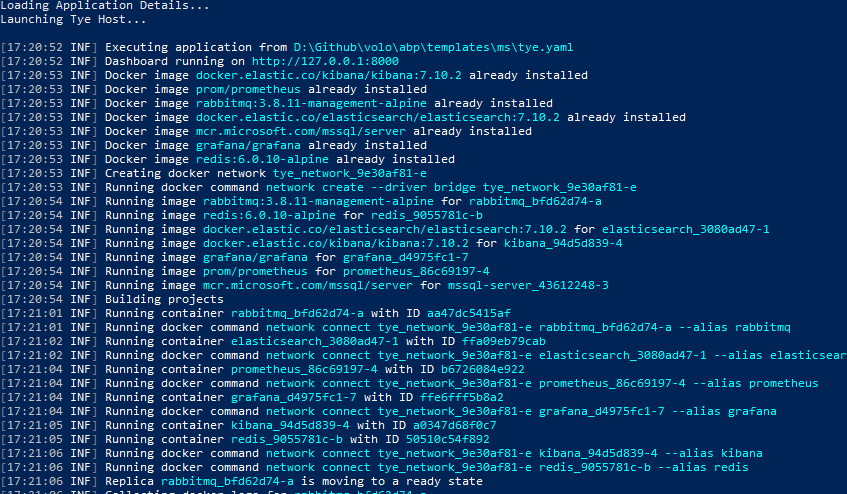

# Microservice Template Tye Integration

> This documentation introduces guidance for running your microservice template on [dotnet/tye](https://github.com/dotnet/tye). We suggest using tye for your development environment. You can check [tye getting started page](https://github.com/dotnet/tye/blob/main/docs/getting_started.md) for installation. 

## **Create Developer Certificates** 
- **Windows Users:** Run the powershell script file `create-certificate.ps1`. This file will create a self-signed certificate named `localhost.pfx` with a predefined password using **dotnet dev-certs** command. 
- **Linux Users:** dotnet dev-certs may not be fully working on Linux so you may need to generate and trust your own certificate and put `localhost.pfx` file under **etc/dev-cert** folder inside solution directory.

  **Generate the certificate:** Run the commands below to create necessary *localhost.pfx* file for https certificate under *etc/dev-cert* folder:

  ```bash
  # See https://stackoverflow.com/questions/55485511/how-to-run-dotnet-dev-certs-https-trust
  # for more details

  # Generate certificate from config
  openssl req -x509 -nodes -days 365 -newkey rsa:2048 -keyout localhost.key -out localhost.crt \
    -config localhost.conf
  
  # Export pfx
  openssl pkcs12 -export -out localhost.pfx -inkey localhost.key -in localhost.crt -password pass:e8202f07-66e5-4619-be07-72ba76fde97f
  
  # Import CA as trusted
  sudo cp localhost.crt /usr/local/share/ca-certificates/
  sudo update-ca-certificates 
  
  # Validate the certificate
  openssl verify localhost.crt
  ```
  
- **Mac Users:** You can either download **powershell** and use the `create-certificate.ps1` file to let dotnet dev-certs create the certificate or create the certificate manually using **openssl** as above.

## Run Infrastructure

Navigate to **etc/docker** folder under your microservice template solution. Run the powershell script file `up.ps1` which does the following:

```yaml
docker network create mycompanyname.myprojectname-network
docker-compose -f docker-compose.infrastructure.yml -f docker-compose.infrastructure.override.yml up -d
```

This will run the following required infrastructure services externally:

- Redis
- RabbitMq
- ElasticSearch
- Kibana
- MsSql-Server-Linux
- Grafana
- Prometheus


## Running Tye

Use the command `tye run` under your main solution directory to run the solution.



After tye is initialized, you can navigate to http://127.0.0.1:8000 (or http://localhost:8000) for tye dashboard.


## Tye Options

> For all the run options, you can simply use `tye run -h` command.

### Debug

You can debug any service by *attaching to a process*. To run a service on debug mode simple use the command with the service name you want to debug: 

```bash
tye run --debug my-service
```

You will see an awaiting notice for attaching to a process when you *View* the *Logs* of the service you debug:


> In this state, product service will not start until you attach a debugger.

In Visual Studio go to menu **Debug -> Attach to Process** then select the service process you are debugging.


You can debug your application normally.

If you want to attach a debugger to all of your services, you can use `*` instead of service name like:

```bash
tye run --debug *
```

### Watch

To improve the development pace, you can also enable the file system watchers. This way, only the modified and effected services will be restarted. To enable file watcher simply add *--watch*  switch to run command:

```bash
tye run --watch
```

### Stop

To stop tye, simply use the command `Ctrl+C` on the console tye is running. Keep in mind that, **close the tye dashboard** before stopping tye since tye may sometime fail to stop processes successfully.