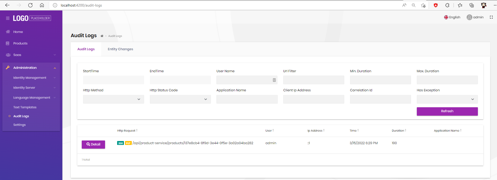
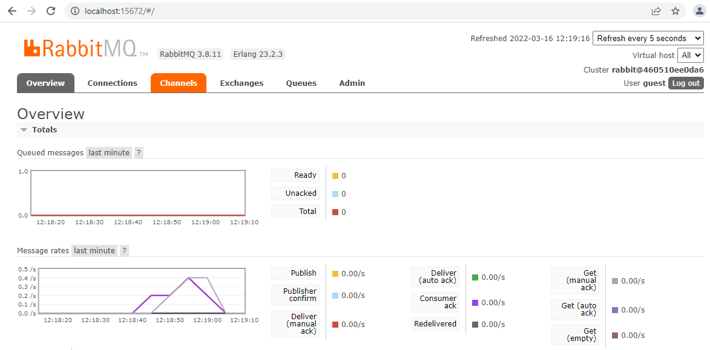
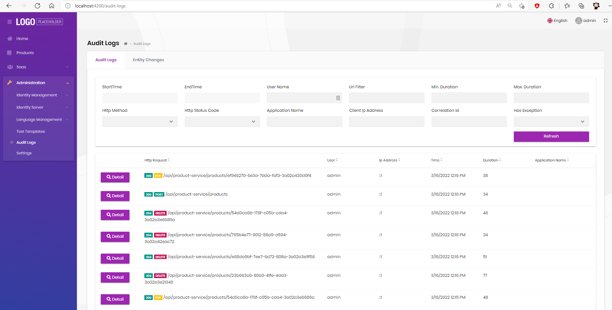

# Using a Management Module as a Microservice

To run the initial microservice template properly, **AdministrationService** hosts required management modules such as permission-management, setting-management, audit-logging etc. However, you may need to extract one or more management system into an isolated microservice as hosted alone.
This guide explains how to extract `Audit-Logging Management` as a sample management module from the Administration service into a different microservice called **LoggingService**.

> Note: You can extract any module as a microservice using this guide. If you want to extract any other management service, you can find detailed configurations about the module in its documentation.

If we decided to run Auditing Management as an isolated microservice, then we need to decide how other microservices and applications can interact with it. There are a few ways to write auditing data in a distributed systems:

1. Each microservice can **directly** write audit logs to the LoggingService database. 
2. Each microservice can **publish event** to write logs and LoggingService can handle this. 
3. Each microservice can make **http requests** to LoggingService to write audit logs. This is the **least performant** way to write audit logging since it will create an *overly chatty* environment for your microservices and also make each of your microservice tightly coupled to the HttpApi.Client layer of the LoggingService. This approach will not be handled in this guide.

## Adding New Logging Microservice

Create a new microservice called LoggingService to host the audit-logging management using the cli command `abp new LoggingService -t microservice-service-pro`.
Follow the guide: [Adding a new Microservice](add-microservice.md).

At the end, you should have a `logging` folder under services that contains the LoggingService solution directory.

### Updating Admin Application
You need to update your admin application to request and use the newly created microservice scope.
- #### Angular
If you are using an angular application, navigate to src/environments and add **LoggingService** to the oAuthConfiguration **scope** object at the `environment.ts` file:
```typescript
const oAuthConfig = {
  issuer: 'https://localhost:44322',
  redirectUri: baseUrl,
  clientId: 'BookStore_Angular',
  responseType: 'code',
  scope:
    'offline_access openid profile email phone AuthServer IdentityService AdministrationService SaasService ProductService LoggingService',
  requireHttps: true,
};
```

- #### Mvc and Blazor Applications
Update the *OpenIdConnect* configuration at the `ConfigureServices` method as below:
```csharp
.AddAbpOpenIdConnect("oidc", options =>
{
	...

	options.SaveTokens = true;
	options.GetClaimsFromUserInfoEndpoint = true;

	options.Scope.Add("role");
	options.Scope.Add("email");
	options.Scope.Add("phone");
	options.Scope.Add("AccountService");
	options.Scope.Add("IdentityService");
	options.Scope.Add("AdministrationService");
	options.Scope.Add("SaasService");
	options.Scope.Add("ProductService");
	options.Scope.Add("LoggingService");
});
```

### Adding the LoggingService.Web Project

> Note: You can skip this step if you are using an angular admin application

Default microservice generation to the solution does not include a ui layer. In order to host Audit-Logging Management UI separately, create a new project named **LoggingService.Web**. Your LoggingService.Web.csproj should look like:
```csharp
<Project Sdk="Microsoft.NET.Sdk">

    <PropertyGroup>
        <TargetFramework>net6.0</TargetFramework>
        <RootNamespace>Acme.BookStore.LoggingService</RootNamespace>
    </PropertyGroup>

    <ItemGroup>
        <PackageReference Include="Volo.Abp.AuditLogging.Web" Version="5.1.4"/>
        <PackageReference Include="Microsoft.Extensions.FileProviders.Embedded" Version="6.0.0"/>
    </ItemGroup>

    <ItemGroup>
        <ProjectReference Include="..\Acme.BookStore.LoggingService.Application.Contracts\Acme.BookStore.LoggingService.Application.Contracts.csproj"/>
    </ItemGroup>

</Project>

```
Also add the module class named LoggingServiceWebModule.cs:
```csharp
using Volo.Abp.AuditLogging.Web;
using Volo.Abp.Modularity;
using Volo.Abp.VirtualFileSystem;

namespace Acme.BookStore.LoggingService;
[DependsOn(
    typeof(AbpAuditLoggingWebModule),
    typeof(LoggingServiceApplicationContractsModule)
)]
public class LoggingServiceWebModule: AbpModule
{
    public override void ConfigureServices(ServiceConfigurationContext context)
    {
        Configure<AbpVirtualFileSystemOptions>(options =>
        {
            options.FileSets.AddEmbedded<LoggingServiceWebModule>();
        });
    }
}
```
Add this layer to your admin application (**Web**) as project reference:
`<ProjectReference Include="..\..\..\..\services\logging\src\Acme.BookStore.LoggingService.Web\Acme.BookStore.LoggingService.Web.csproj" />` and module dependency to the *WebModule* as:
`typeof(LoggingServiceWebModule)`

Now you are ready to extract other layers of AuditLogging.
## Extracting AuditLogging Layers

Navigate to the **AdministrationService** solution and then to the Domain.Shared layer:
- Remove the `<PackageReference Include="Volo.Abp.AuditLogging.Domain.Shared" Version="5.1.4" />` project reference and add it to the LoggingService.Domain.Shared project.
- Remove the `typeof(AbpAuditLoggingDomainSharedModule)` module dependency and `using Volo.Abp.AuditLogging;` using from AdministrationServiceDomainSharedModule and add to **LoggingServiceDomainSharedModule**.

Repeat this extraction for all the layers below:
- Domain
- Application.Contracts
- Application
- HttpApi
- HttpApi.Client
- EntityFrameworkCore 

> Note: If you are using MongoDb for your LoggingService, add the `Volo.Abp.AuditLogging.MongoDB` nuget package instead of `Volo.Abp.AuditLogging.EntityFrameworkCore`.


## Updating Web Gateway
You should have added LoggingService ocelot reRoute to web gateway at adding new microservice steps. Now you need to update audit-logging reRoute to LoggingService instead of AdministrationService as below:
```json
{
      "DownstreamPathTemplate": "/api/audit-logging/{everything}",
      "DownstreamScheme": "https",
      "DownstreamHostAndPorts": [
        {
          "Host": "localhost",
          "Port": 44974
        }
      ],
      "UpstreamPathTemplate": "/api/audit-logging/{everything}",
      "UpstreamHttpMethod": [ "Put", "Delete", "Get", "Post" ]
    },
```
> Note: Update the host and port as same with your LoggingService. In this sample, it is localhost:44974

## Configuring Audit Logging Database
In **AdministrationServiceDbContext**, remove the `IAuditLoggingDbContext` implementation and AuditLog configuration and add to **LoggingServiceDbContext**. Your updated LoggingServiceDbContext.cs should look like:
```csharp
[ConnectionStringName(LoggingServiceDbProperties.ConnectionStringName)]
public class LoggingServiceDbContext : AbpDbContext<LoggingServiceDbContext>, IAuditLoggingDbContext
{
    public DbSet<AuditLog> AuditLogs { get; set; }

    public LoggingServiceDbContext(DbContextOptions<LoggingServiceDbContext> options) : base(options)
    {
    }

    protected override void OnModelCreating(ModelBuilder builder)
    {
        base.OnModelCreating(builder);

        builder.ConfigureLoggingService();
        builder.ConfigureAuditLogging();
    }
}
```
Remove `options.ReplaceDbContext<IAuditLoggingDbContext>();` at AddDbContext configuration of **AdministrationServiceEntityFrameworkCoreModule** and add it to the **LoggingServiceEntityFrameworkCoreModule** AddAbpDbContext configuration options. This will allow DI container to use LoggingServiceDbContext whenever AuditLoggingDbContext is requested.

Under the **LoggingService.EntityFrameworkCore** folder, create an initial migration for AuditLogging by using dotnet ef cli: `dotnet ef migrations add "Initial"`. This should create a *Migration* folder with the creation of related AuditLogging tables.

> **Optional:** Create a new migration to remove the Auditing tables since we moved them to a different microservice database. To do that, use dotnet ef cli: `dotnet ef migrations add "Removed-Audit-Logging"` under the AdministrationService.EntityFrameworkCore project.

## First Approach: Writing Directly to LoggingService Database

This approach will let each microservice write audit logs directly to the LoggingService database. 

As an advantage, this will be a synchronous and immidiate way for writing the audit logs. 

As a disadvantage; it will make all the microservices dependent on the EfCore layer of LoggingService.

### Updating Shared Hosting Module

You need to configure the AbpAuditingLogging database connection string to LoggingService in order to use the LoggingService connection string instead of separating the connection strings.
Remove `database.MappedConnections.Add("AbpAuditLogging");` from the AdministrationService database configuration and add the LoggingService database configuration as below:
```csharp
options.Databases.Configure("LoggingService", database =>
{
	database.MappedConnections.Add("AbpAuditLogging");
});
```

### Updating Shared Hosting Microservice Module

In order to make all the microservices use LoggingService that contains audit logging repository implementation, we need to **reference** to the EfCore layer of LoggingService in all the microservices. Easiest way to achieving that is to add the reference to a shared hosting microservice module.

Add the `<ProjectReference Include="..\..\services\logging\src\Acme.BookStore.LoggingService.EntityFrameworkCore\Acme.BookStore.LoggingService.EntityFrameworkCore.csproj" />` project reference to **Hosting.Microservices.csproj** and add `typeof(LoggingServiceEntityFrameworkCoreModule)` module dependency to **HostingMicroservicesModule**.

### Testing Product Entity Changes
Update ProductServiceDomainModule to track all entity changes as below:
```csharp
Configure<AbpAuditingOptions>(options =>
{
	options.EntityHistorySelectors.AddAllEntities();
});
```
Update the ConnectionStrings under Product.HttpApi.Host appsettings by adding LoggingService:
```json
  "ConnectionStrings": {
    "LoggingService": "Server=localhost,1434;Database=BookStore_LoggingService;User Id=sa;password=myPassw0rd;MultipleActiveResultSets=true",
    "ProductService": "Server=localhost,1434;Database=BookStore_ProductService;User Id=sa;password=myPassw0rd;MultipleActiveResultSets=true",
    "AdministrationService": "Server=localhost,1434;Database=BookStore_Administration;User Id=sa;password=myPassw0rd;MultipleActiveResultSets=true",
    "SaasService": "Server=localhost,1434;Database=BookStore_Saas;User Id=sa;password=myPassw0rd;MultipleActiveResultSets=true"
  },
```

Under the admin application, navigate to the Products page and add/update products: 


Navigate to Administration -> Audit Logs to check the audit logs:


## Second Approach: Publishing Events to Write Audit Logs

This approach will allow each microservice to publish an event to write an audit log to the distributed event bus which shall be handled by the LoggingService. 

It has the advantage of being loosely coupled so there is no project dependencies.

As a disadvantage, it will be slower compared to direct database writing and it will depend on a message broker. Also, there should be extra mapping steps to serialize the auditing object. The `AuditLogInfo` object needs to be **mapped to an *Eto* when publishing the event** and that *Eto* should be **mapped back to the entity when handling** the event.

### Creating a New AuditingStore to Publish AuditLog Creation

We need to implement IAuditingStore in all microservices that should publish an event. To do that, create a new class named `EventBasedAuditingStore` that replaces the current implementation of *IAuditingStore*, **under the shared Hosting.Microservices project** since it will be used by all the microservices:

```csharp
[Dependency(ReplaceServices = true)]
[ExposeServices(typeof(IAuditingStore))]
public class EventBasedAuditingStore : IAuditingStore, ITransientDependency
{
    private readonly IDistributedEventBus _distributedEventBus;
    private readonly ILogger<EventBasedAuditingStore> _logger;

    public EventBasedAuditingStore(IDistributedEventBus distributedEventBus, ILogger<EventBasedAuditingStore> logger)
    {
        _distributedEventBus = distributedEventBus;
        _logger = logger;
    }

    [UnitOfWork]
    public async Task SaveAsync(AuditLogInfo auditInfo)
    {
        _logger.LogInformation("Publishing audit log creation...");

        // EntityEntry will break serialization so we remove it
        for (var i = 0; i < auditInfo.EntityChanges.Count; i++)
        {
            auditInfo.EntityChanges[i].EntityEntry = null;
        }
        
        await _distributedEventBus.PublishAsync(auditInfo);
    }
}
```

You can publish `AuditLogInfo` object directly since it is serializable as long as you remove the **EntityEntry** objects under the `EntityChanges` collection.

From now on, your auditing logs will be published to the distributed event bus that you can monitor using rabbitMq:



### Creating the Audit Creation Handler

Published events will be handled in LoggingService since this service is responsible for writing the auditing logs. Create a handler named `AuditCreationHandler` under **LoggingService.HttpApi.Host**:

```csharp
public class AuditCreationHandler : IDistributedEventHandler<AuditLogInfo>, ITransientDependency
{
    private readonly IAuditLogRepository _auditLogRepository;
    private readonly IAuditLogInfoToAuditLogConverter _converter;
    private readonly ILogger<AuditCreationHandler> _logger;

    public AuditCreationHandler(IAuditLogRepository auditLogRepository, IAuditLogInfoToAuditLogConverter converter,
        ILogger<AuditCreationHandler> logger)
    {
        _converter = converter;
        _logger = logger;
        _auditLogRepository = auditLogRepository;
    }

    [UnitOfWork]
    public async Task HandleEventAsync(AuditLogInfo eventData)
    {
        try
        {
            _logger.LogInformation("Handling Audit Creation...");
            await _auditLogRepository.InsertAsync(await _converter.ConvertAsync(eventData));
        }
        catch (Exception ex)
        {
            _logger.LogWarning("Could not save the audit log object ...");
            _logger.LogException(ex, LogLevel.Error);
        }
    }
}
```

This handler will inject IAuditingLogRepository and use *IAuditLogInfoToAuditLogConverter* to map `AuditLogInfo` to `AuditLog`.

### Testing Product Entity Changes

Update ProductServiceDomainModule to track all entity changes as below:

```csharp
Configure<AbpAuditingOptions>(options =>
{
	options.EntityHistorySelectors.AddAllEntities();
});
```

Add/update/delete new product:


Then you can check Audit Logs under Administration -> Audit Logs




## Next

- [Communications Between Microservices](interservice-communication.md)
