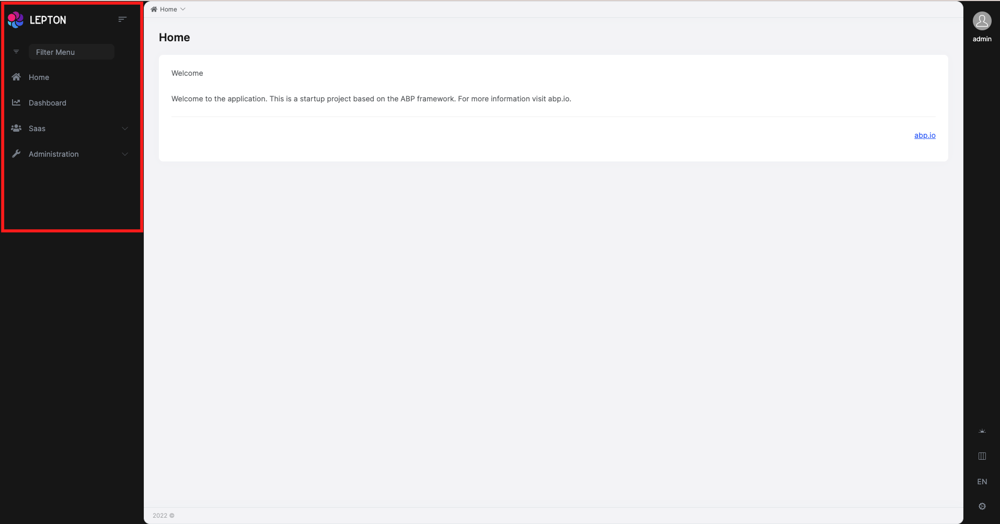
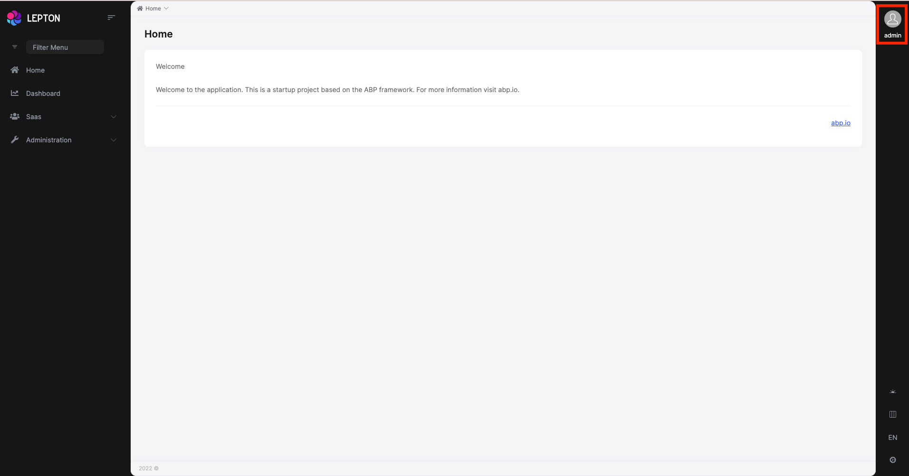
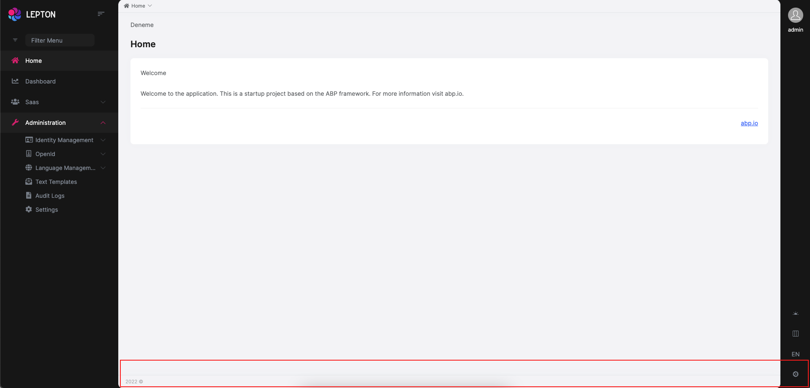

# Client Side

To add `LeptonX` into your existing projects, follow the steps below.

- Firstly, install `@volosoft/abp.ng.theme.lepton-x` using the command below.

`yarn add @volosoft/abp.ng.theme.lepton-x@preview`

- Then, edit `angular.json` as follows:

Add the following ones into the `styles` array

```JSON
"node_modules/bootstrap-icons/font/bootstrap-icons.css",
```

- At last, remove `ThemeLeptonModule` from `app.module.ts` and `shared.module.ts`, and import the following modules in `app.module.ts`

```js
import {
  HttpErrorComponent,
  ThemeLeptonXModule,
} from "@volosoft/abp.ng.theme.lepton-x";
import { SideMenuLayoutModule } from "@volosoft/abp.ng.theme.lepton-x/layouts";

@NgModule({
  // ...
  imports: [
    // ...
    // ThemeLeptonModule.forRoot(), -> remove this line.
    ThemeLeptonXModule.forRoot(),
    SideMenuLayoutModule.forRoot(), // depends on which layout you choose
    // ...
  ],
  // ...
})
export class AppModule {}
```

Note: If you are using [Resource Owner Password Flow](https://docs.abp.io/en/abp/latest/UI/Angular/Authorization#resource-owner-password-flow) for authorization, you should import the following module as well to `app.module.ts`:

```js
import { AccountLayoutModule } from "@volosoft/abp.ng.theme.lepton-x/account";

@NgModule({
  // ...
  imports: [
    // ...
    AccountLayoutModule.forRoot({
      layout: {
        authLayoutImg: "/assets/images/login-bg.jpg",
      },
    }),
    // ...
  ],
  // ...
})
export class AppModule {}
```

`authLayoutImg`: (Optional) If not given, a default image will be placed on the authentication pages.

- At this point, `LeptonX` theme should be up and running within your application. However, you may need to overwrite some css variables based your needs for every theme available as follows:

```scss
:root {
  .lpx-theme-dark {
    --lpx-logo: url("/assets/images/logo/logo-light.svg");
    --lpx-logo-icon: url("/assets/images/logo/logo-light-icon.svg");
    --lpx-brand: #edae53;
  }

  .lpx-theme-dim {
    --lpx-logo: url("/assets/images/logo/logo-light.svg");
    --lpx-logo-icon: url("/assets/images/logo/logo-light-icon.svg");
    --lpx-brand: #f15835;
  }

  .lpx-theme-light {
    --lpx-logo: url("/assets/images/logo/logo-dark.svg");
    --lpx-logo-icon: url("/assets/images/logo/logo-dark-icon.svg");
    --lpx-brand: #69aada;
  }
}
```

If everything is ok, you can remove the `@volo/abp.ng.theme.lepton` in package.json

# Server Side

In order to migrate to LeptonX on your server side projects (Host and/or IdentityServer projects), please follow [Server Side Migration](mvc.md) document.

## Customization

### Layouts

The Angular version of LeptonX provides **layout components** for your **user interface** on [ABP Framework Theming](https://docs.abp.io/en/abp/latest/UI/Angular/Theming).
You can use layouts to **organize your user interface**. You can replace the **layout components** and some parts of the **layout components** with the [ABP replaceable component system](https://docs.abp.io/en/abp/latest/UI/Angular/Component-Replacement).

The main responsibility of a theme is to **provide** the layouts. There are **three pre-defined layouts that must be implemented by all the themes:**

- **ApplicationLayoutComponent:** The **default** layout which is used by the **main** application pages.

- **AccountLayoutComponent:** Mostly used by the **account module** for **login**, **register**, **forgot password**... pages.

- **EmptyLayoutComponent:** The **Minimal** layout that **has no layout components** at all.

The **Layout components** and all the replacable components are predefined in `eThemeLeptonXComponents` as enum.

### How to replace a component

```js
import { ReplaceableComponentsService } from '@abp/ng.core'; // imported ReplaceableComponentsService
import { eThemeLeptonXComponents } from '@volo/abp.ng.theme.lepton';   // imported eThemeLeptonXComponents enum
//...
@Component(/* component metadata */)
export class AppComponent {
  constructor(
    private replaceableComponents: ReplaceableComponentsService, // injected the service
  ) {
    this.replaceableComponents.add({
      component: YourNewApplicationLayoutComponent,
      key: eThemeLeptonXComponents.ApplicationLayout,
    });
  }
}
```

See the [Component Replacement](https://docs.abp.io/en/abp/latest/UI/Angular/Component-Replacement) documentation for more information on how to replace components.

### Brand Component

The **brand component** is a simple component that can be used to display your brand. It contains a **logo** and a **company name**.
You can change the logo with css but if you want to change logo component, the key is `eThemeLeptonXComponents.Logo`

```js
///...
this.replaceableComponents.add({
  component: YourNewLogoComponent,
  key: eThemeLeptonXComponents.Logo,
});
///...
```


## Breadcrumb Component

On websites that have a lot of pages, **breadcrumb navigation** can greatly **enhance the way users find their way** around. In terms of **usability**,
breadcrumbs reduce the number of actions a website **visitor** needs to take in order
to get to a **higher-level page**, and they **improve** the **findability** of **website sections** and **pages**.

```js
///...
this.replaceableComponents.add({
  component: YourNewBreadCrumbComponent,
  key: eThemeLeptonXComponents.Breadcrumb,
});
///...
```


## Page Alerts Component

Provides contextual **feedback messages** for typical user actions with a handful of **available** and **flexible** **alert messages**. Alerts are available for any length of text, as well as an **optional dismiss button**.


```js
///...
this.replaceableComponents.add({
  component: YourNewPageAlertContainerComponent,
  key: eThemeLeptonXComponents.PageAlertContainerComponent,
});
///...
```

## Toolbar Component

Toolbar items are used to add **extra functionality to the toolbar**. The toolbar is a **horizontal bar** that **contains** a group of **toolbar items**.


```js
///...
this.replaceableComponents.add({
  component: YourNewNavItemsComponent,
  key: eThemeLeptonXComponents.Toolbar,
});
///...
```

## Navbar Component

Navbar items are used to add **extra functionality to the Sidebar**. The toolbar is a **vertical bar** that **contains** a group of **Navbar routes**.



```js
///...
this.replaceableComponents.add({
  component: YourNewNavItemsComponent,
  key: eThemeLeptonXComponents.Navbar,
});
///...
```

## Routes Component

The routes component contains routes in the navbar.


```js
///...
this.replaceableComponents.add({
  component: YourNewNavItemsComponent,
  key: eThemeLeptonXComponents.Routes,
});
///...
```

## General Settings

- The **general settings component** is used to change your **Appearance** , **Container width** and **Language**. At the **bottom right** is the section that contains the settings.


```js
///...
this.replaceableComponents.add({
  component: YourNewNavItemsComponent,
  key: eThemeLeptonXComponents.Settings,
});
///...
```

## User Menu Component

The **User Menu** is the **menu** that **drops down** when you **click your name** or **profile picture** in the **upper right corner** of your page (**in the toolbar**). It drops down options such as **Settings**, **Logout**, etc.


```js
///...
this.replaceableComponents.add({
  component: YourNewCurrentUserComponent,
  key: eThemeLeptonXComponents.CurrentUser,
});
///...
```

## Mobile Navbar Component

The **mobile navbar component** is used to display the **navbar menu on mobile devices**. The mobile navbar component is a **dropdown menu** that contains language selection and user menu.


```js
///...
this.replaceableComponents.add({
  component: YourNewMobileNavbarComponent,
  key: eThemeLeptonXComponents.NavbarMobile,
});
///...
```

## Avatar Component

The **Avatar Component** is your user image that displays on the **Toolbar top right**.



```js
///...
this.replaceableComponents.add({
  component: YourNewMobileNavbarComponent,
  key: eThemeLeptonXComponents.CurrentUserImage,
});
///...
```

## Language Component

The **Language Component** allows you to change the **language** under the settings.


```js
///...
this.replaceableComponents.add({
  component: YourNewMobileNavbarComponent,
  key: eThemeLeptonXComponents.Language,
});
///...
```

## Footer Component



The Footer is the section of content at the very bottom of the site. This section of the content can be modified.
Inject **FooterLinksService** and use the **setFooterInfo** method of **FooterLinksService**
to assign path or link and description.
**descUrl** and **footerLinks** are nullable. Constant **footerLinks** are on the right side of the footer.

```js
///...
const footerLinks = [
  {
    link: "/components/bootstrap/badge",
    text: "Manage Your Profile",
  },
  {
    link: "/components/bootstrap/border",
    text: "My Security Logs",
  },
];
const footerInfo: FooterNav = {
  desc: "Home",
  descUrl: "/components/home",
  footerLinks: footerLinks,
};
this.footerLinksService.setFooterInfo(footerInfo);
///...
```

If you want to change the footer component, the key is `eThemeLeptonXComponents.Footer`

```js
///...
this.replaceableComponents.add({
  component: YourNewFooterComponent,
  key: eThemeLeptonXComponents.Footer,
});
///...
```
