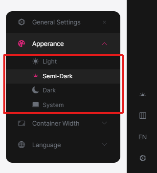

# LeptonX Blazor UI

````json
//[doc-params]
{
    "UI": ["Blazor", "BlazorServer"]
}
````

LeptonX theme is implemented and ready to use with ABP Commercial. No custom implementation is needed for Blazor Server & WebAssembly.

## Installation

{{if UI == "Blazor"}}

- Add **Volo.Abp.AspNetCore.Components.WebAssembly.LeptonXTheme** package to your **Blazor wasm** application.

- Remove old theme from **DependsOn** attribute in your module class and add **AbpAspNetCoreComponentsWebAssemblyLeptonXThemeModule** type to **DependsOn** attribute.

```diff
[DependsOn(
-    typeof(LeptonThemeManagementBlazorModule),
-    typeof(AbpAspNetCoreComponentsWebAssemblyLeptonThemeModule),
+    typeof(AbpAspNetCoreComponentsWebAssemblyLeptonXThemeModule)
)]
```

{{end}}


{{if UI == "BlazorServer"}}

- Complete [MVC Installation steps](mvc.md#installation) first.

- Add **Volo.Abp.AspNetCore.Components.Server.LeptonXTheme** package to your **Blazor wasm** application.

- Remove old theme from **DependsOn** attribute in your module class and add **AbpAspNetCoreComponentsServerLeptonXThemeModule** type to **DependsOn** attribute.

```diff
[DependsOn(
-    typeof(LeptonThemeManagementBlazorModule),
-    typeof(AbpAspNetCoreComponentsServerLeptonThemeModule),
+    typeof(AbpAspNetCoreComponentsServerLeptonXThemeModule)
)]
```
{{end}}

---

## Customization

### Themes
You can set default theme or add or remove themes via using **LeptonXThemeOptions**.

- `DefaultStyle`: Defines deffault fallback theme. Default value is **Dim**
    ```csharp
    Configure<LeptonXThemeOptions>(options =>
    {
        options.DefaultStyle = LeptonXStyleNames.Dark;
    });
    ```

- `Styles`: Defines selectable themes from UI.

    

    ```csharp
    Configure<LeptonXThemeOptions>(options =>
    {
        // Removing existing themes
        options.Styles.Remove(LeptonXStyleNames.Light);

        // Adding a new theme
        options.Styles.Add("red", 
            new LeptonXThemeStyle(
            LocalizableString.Create<YourResource>("Theme:Red"),
            "bi bi-circle-fill"));
    });

    ```

    > `red.css` and `bootstrap-red.css` have to be added under **wwwroot/side-menu/css/** folder for switching to your custom theme properly when selected.


### LeptonXThemeBlazorOptions
Layout options of Blazor UI can be manageable via using **LeptonXThemeMvcOptions**.

- `Layout`: Layout of main application. Default value is `LeptonXMvcLayouts.SideMenu`

    ```csharp
    Configure<LeptonXThemeBlazorOptions>(options =>
    {
        options.Layout = LeptonXBlazorLayouts.SideMenu;
        // Or your custom implemented layout:
        options.Layout = typeof(MyCustomLayoutComponent);
    });
    ```

- `MobileMenuSelector`: Defines items to be displayed at mobile menu. Default value is first 2 items from main menu items.

    

    ```csharp
    Configure<LeptonXThemeBlazorOptions>(options =>
    {
        options.MobileMenuSelector = items => items.Where(x => x.MenuItem.Name == "Home" || x.MenuItem.Name == "Dashboard");
    });
    ```

