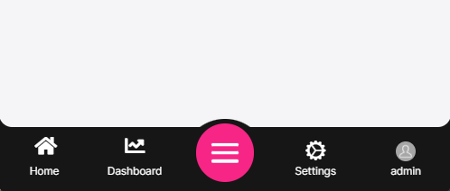

# LeptonX MVC UI
LeptonX theme is implemented and ready to use with ABP Commercial. No custom implementation is needed for Razor Pages.

## Installation

- Install package to your **Web** project with the following CLI command:

```bash
dotnet add package Volo.Abp.AspNetCore.Mvc.UI.Theme.LeptonX --prerelease
```

- Remove `Volo.Abp.AspNetCore.Mvc.UI.Theme.Lepton` and `Volo.Abp.LeptonTheme.Management.Web` references from the project since it's not necessary after switching to LeptonX.

- Make sure the old theme is removed and LeptonX is added in your Module class.

```diff
[DependsOn(
        // ...
        // Remove those two
-        typeof(LeptonThemeManagementWebModule),
-        typeof(AbpAspNetCoreMvcUiLeptonThemeModule)
)]
```

- Replace `LeptonThemeBundles` with `LeptonXThemeBundles` in AbpBundlingOptions.

```csharp
    options.StyleBundles.Configure(
            LeptonXThemeBundles.Styles.Global, // 👈 Here
            bundle =>
            {
                bundle.AddFiles("/global-styles.css");
            }
        );
```


---

## Customization

### Themes
You can set default theme or add or remove themes via using **LeptonXThemeOptions**.

- `DefaultStyle`: Defines deffault fallback theme. Default value is **Dim**
  
```csharp
Configure<LeptonXThemeOptions>(options =>
{
    options.DefaultStyle = LeptonXStyleNames.Dark;
});
```

- `Styles`: Defines selectable themes from UI.


```csharp
Configure<LeptonXThemeOptions>(options =>
{
    // Removing existing themes
    options.Styles.Remove(LeptonXStyleNames.Light);

    // Adding a new theme
    options.Styles.Add("red", 
        new LeptonXThemeStyle(
        LocalizableString.Create<YourResource>("Theme:Red"),
        "bi bi-circle-fill"));
});

```

> `red.css` and `bootstrap-red.css` have to be added under **/Themes/LeptonX/Global/side-menu/css/** folder for switching to your custom theme properly when selected.

---

### LeptonXThemeMvcOptions
Layout options of MVC Razor Pages UI can be manageable via using **LeptonXThemeMvcOptions**.

- `ApplicationLayout`: Layout of main application. Default value is `LeptonXMvcLayouts.SideMenu`

    ```csharp
    Configure<LeptonXThemeMvcOptions>(options =>
    {
        options.ApplicationLayout = LeptonXMvcLayouts.SideMenu;
        // Or your custom implemented layout:
        options.ApplicationLayout = "~/Shared/_Layout.cshtml";
    });
    ```

- `MobileMenuSelector`: Defines items to be displayed at mobile menu. Default value is first 2 items from main menu items.

    

    ```csharp
    Configure<LeptonXThemeMvcOptions>(options =>
    {
        options.MobileMenuSelector = items => items.Where(x => x.MenuItem.Name == "Home" || x.MenuItem.Name == "Dashboard");
    });
    ```
