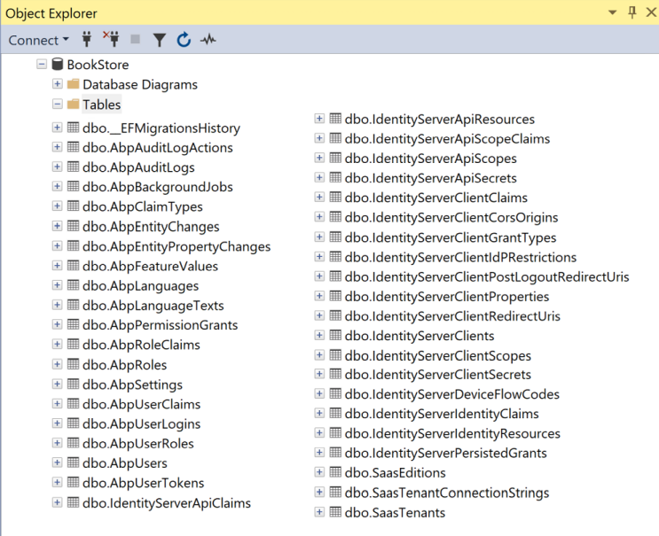
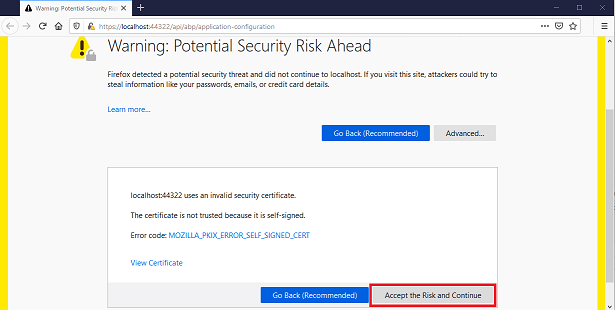
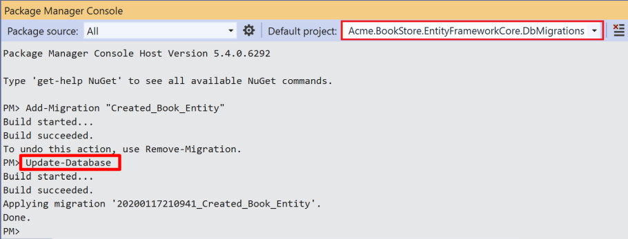
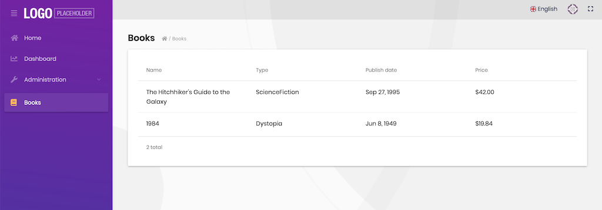
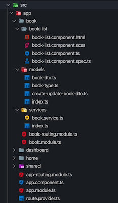

## ASP.NET Core {{UI_Value}} Tutorial - Part 1
````json
//[doc-params]
{
    "UI": ["MVC","NG"]
}
````
{{
if UI == "MVC"
  DB="ef"
  DB_Text="Entity Framework Core"
  UI_Text="mvc"
else if UI == "NG"
  DB="mongodb"
  DB_Text="MongoDB"
  UI_Text="angular"
else 
  DB ="?"
  UI_Text="?"
end
}}

### About this tutorial:

In this tutorial series, you will build an ABP Commercial application named `Acme.BookStore`. In this sample project, we will manage a list of books and authors. **{{DB_Text}}** will be used as the ORM provider. And on the front-end side {{UI_Value}} and JavaScript will be used.

The ASP.NET Core {{UI_Value}} tutorial series consists of 3 parts:

- **Part-1: Creating the project and book list page (this tutorial)** 
- [Part-2: Creating, updating and deleting books](part-2.md)
- [Part-3: Integration tests](part-3.md)

> The completed sample is available: [bookstore-{{UI_Text}}-{{DB}}.zip](https://abp.io/Account/Login?returnUrl=/api/download/samples/bookstore-{{UI_Text}}-{{DB}}). To be able to download this sample, you need to hold an active ABP Commercial license.

*You can also check out [the video course](https://amazingsolutions.teachable.com/p/lets-build-the-bookstore-application) prepared by the community, based on this tutorial.*

### Creating the project

Create a new project named `Acme.BookStore` where `Acme` is the company name and `BookStore` is the project name. You can check out [creating a new project](../../getting-started#create-a-new-project) document to see how you can create a new project.  We will create the project with ABP CLI. But first of all, we need to login to the ABP Platform to create a commercial project.

#### Login to the ABP Platform

Run the below command to login with your username, then enter your password when it asks.

```bash
abp login <username>
```

> If you get the below error message, it means you are not logged in with a commercial account. You can contact to info@abp.io for the license issues.
>
> *Remote server returns '403-Forbidden'. Message: Pro templates require a commercial license! Should login to be able to download a pro template.*

#### Create the project

By running the below command, it creates a new ABP Commercial project with the database provider `{{DB_Text}}` and UI option `MVC`. To see the other CLI options, check out [ABP CLI](https://docs.abp.io/en/abp/latest/CLI) document.

```bash
abp new Acme.BookStore --template app-pro --database-provider {{DB}} --ui {{UI_Text}}
```


### Apply migrations

After creating the project, you need to apply the initial migrations and create the database. To apply migrations, right click on the `Acme.BookStore.DbMigrator` and click **Debug** > **Start New Instance**. This will run the application and apply all migrations. You will see the below result when it successfully completes the process. The application database is  ready!


> Alternatively, you can run `Update-Database` command in the Visual Studio > Package Manager Console to apply migrations.

#### Initial database tables



### Run the application

To run the project, right click to the {{if UI == "MVC"}} `Acme.BookStore.Web`{{end}} {{if UI == "NG"}} `Acme.BookStore.HttpApi.Host` {{end}} project and click **Set As StartUp Project**. And run the web project by pressing **CTRL+F5** (*without debugging and fast*) or press **F5** (*with debugging and slow*). {{if UI == "NG"}}You will see the Swagger UI for BookStore API.{{end}}

Further information, see the [running the application section](../../getting-started.md#run-the-application).


{{if UI == "NG"}}

To start Angular project, go to the `angular` folder, open a command line terminal, execute the `yarn`  command:

```bash
yarn
```

Once all node modules are loaded, execute the `yarn start` command:

```bash
yarn start
```

The website will be accessible from the following default URL:

http://localhost:4200/

If you see the website's landing page successfully, you can exit Angular hosting by pressing `ctrl-c`. (We'll later start it again.)

> Be aware that, Firefox does not use the Windows Certificate Store, so you'll need to add the self-signed developer certificate to Firefox manually. To do this, open Firefox and navigate to the below URL:
>
> https://localhost:44322/api/abp/application-configuration
>
> If you see the below screen, click the **Accept the Risk and Continue** button to bypass this warning.
>
> 

{{end}}

The default login credentials are;

* **Username**: admin
* **Password**: 1q2w3E*

### Solution structure

This is how the layered solution structure looks like:


Check out the [solution structure](../../startup-templates/application/solution-structure.md) document to understand the structure in details. 

### Create the book entity

Domain layer in the startup template is separated into two projects:

- `Acme.BookStore.Domain` contains your [entities](https://docs.abp.io/en/abp/latest/Entities), [domain services](https://docs.abp.io/en/abp/latest/Domain-Services) and other core domain objects.
- `Acme.BookStore.Domain.Shared` contains `constants`, `enums` or other domain related objects those can be shared with clients.

Define [entities](https://docs.abp.io/en/abp/latest/Entities) in the **domain layer** (`Acme.BookStore.Domain` project) of the solution. The main entity of the application is the `Book`. Create a class, named `Book`, in the `Acme.BookStore.Domain` project as shown below:

````csharp
using System;
using Volo.Abp.Domain.Entities.Auditing;

namespace Acme.BookStore
{
    public class Book : AuditedAggregateRoot<Guid>
    {
        public string Name { get; set; }

        public BookType Type { get; set; }

        public DateTime PublishDate { get; set; }

        public float Price { get; set; }

        protected Book()
        {

        }

        public Book(Guid id, string name, BookType type, DateTime publishDate, float price) :
            base(id)
        {
            Name = name;
            Type = type;
            PublishDate = publishDate;
            Price = price;
        }
    }
}
````

* ABP has 2 fundamental base classes for entities: `AggregateRoot` and `Entity`. **Aggregate Root** is one of the **Domain Driven Design (DDD)** concepts. See [entity document](https://docs.abp.io/en/abp/latest/Entities) for details and best practices.
* `Book` entity inherits `AuditedAggregateRoot` which adds some auditing properties (`CreationTime`, `CreatorId`, `LastModificationTime`... etc.) on top of the `AggregateRoot` class.
* `Guid` is the **primary key type** of the `Book` entity.

#### BookType enum

Create the `BookType` enum in the `Acme.BookStore.Domain.Shared` project:

````csharp
namespace Acme.BookStore
{
    public enum BookType
    {
        Undefined,
        Adventure,
        Biography,
        Dystopia,
        Fantastic,
        Horror,
        Science,
        ScienceFiction,
        Poetry
    }
}
````

#### Add book entity to the DbContext

{{if DB == "ef"}}

EF Core requires to relate entities with your `DbContext`. The easiest way to do this is to add a `DbSet` property to the `BookStoreDbContext` class in the `Acme.BookStore.EntityFrameworkCore` project, as shown below:

````csharp
    public class BookStoreDbContext : AbpDbContext<BookStoreDbContext>
    {
        public DbSet<AppUser> Users { get; set; }
        public DbSet<Book> Books { get; set; } //<--added this line-->
		//...
    }
````

{{end}}

{{if DB == "mongodb"}}

Add a `IMongoCollection<Book> Books` property to the `BookStoreMongoDbContext` inside the `Acme.BookStore.MongoDB` project:

```csharp
public class BookStoreMongoDbContext : AbpMongoDbContext
{
        public IMongoCollection<AppUser> Users => Collection<AppUser>();
        public IMongoCollection<Book> Books => Collection<Book>();//<--added this line-->
        //...
}
```

{{end}}

{{if DB == "ef"}}

#### Configure the book entity

Open `BookStoreDbContextModelCreatingExtensions.cs` file in the `Acme.BookStore.EntityFrameworkCore` project and add following code to the end of the `ConfigureBookStore` method to configure the Book entity:

````csharp
builder.Entity<Book>(b =>
{
    b.ToTable(BookStoreConsts.DbTablePrefix + "Books", BookStoreConsts.DbSchema);
    b.ConfigureByConvention(); //auto configure for the base class props
    b.Property(x => x.Name).IsRequired().HasMaxLength(128);
});
````

Add the `using Volo.Abp.EntityFrameworkCore.Modeling;` statement to resolve `ConfigureByConvention` extension method.

{{end}}

{{if DB == "mongodb"}}

#### Add seed (sample) data

Adding sample data is optional, but it's good to have initial data in the database for the first run. ABP provides a [data seed system](https://docs.abp.io/en/abp/latest/Data-Seeding). Create a class deriving from the `IDataSeedContributor` in the `*.Domain` project:

```csharp
using System;
using System.Threading.Tasks;
using Volo.Abp.Data;
using Volo.Abp.DependencyInjection;
using Volo.Abp.Domain.Repositories;
using Volo.Abp.Guids;

namespace Acme.BookStore
{
    public class BookStoreDataSeederContributor
        : IDataSeedContributor, ITransientDependency
    {
        private readonly IRepository<Book, Guid> _bookRepository;
        private readonly IGuidGenerator _guidGenerator;

        public BookStoreDataSeederContributor(
            IRepository<Book, Guid> bookRepository,
            IGuidGenerator guidGenerator)
        {
            _bookRepository = bookRepository;
            _guidGenerator = guidGenerator;
        }

        public async Task SeedAsync(DataSeedContext context)
        {
            if (await _bookRepository.GetCountAsync() > 0)
            {
                return;
            }

            await _bookRepository.InsertAsync(
                new Book(
                    id: _guidGenerator.Create(),
                    name: "1984",
                    type: BookType.Dystopia,
                    publishDate: new DateTime(1949, 6, 8),
                    price: 19.84f
                )
            );

            await _bookRepository.InsertAsync(
                new Book(
                    id: _guidGenerator.Create(),
                    name: "The Hitchhiker's Guide to the Galaxy",
                    type: BookType.ScienceFiction,
                    publishDate: new DateTime(1995, 9, 27),
                    price: 42.0f
                )
            );
        }
    }
}
```

{{end}}

{{if DB == "ef"}}

#### Add new migration & update the database

The startup template uses [EF Core Code First Migrations](https://docs.microsoft.com/en-us/ef/core/managing-schemas/migrations/) to create and maintain the database schema. Open the **Package Manager Console (PMC)** under the menu *Tools > NuGet Package Manager*.


Select the `Acme.BookStore.EntityFrameworkCore.DbMigrations` as the **default project** and execute the following command:

```bash
Add-Migration "Created_Book_Entity"
```


This will create a new migration class inside the `Migrations` folder of the `Acme.BookStore.EntityFrameworkCore.DbMigrations` project. Then execute the `Update-Database` command to update the database schema:

````bash
Update-Database
````



#### Add initial (sample) data

`Update-Database` command has created the `AppBooks` table in the database. Open your database and enter a few sample rows, so you can show them on the listing page.

```mssql
INSERT INTO AppBooks (Id,CreationTime,[Name],[Type],PublishDate,Price) VALUES
('f3c04764-6bfd-49e2-859e-3f9bfda6183e', '2018-07-01', '1984',3,'1949-06-08','19.84')

INSERT INTO AppBooks (Id,CreationTime,[Name],[Type],PublishDate,Price) VALUES
('13024066-35c9-473c-997b-83cd8d3e29dc', '2018-07-01', 'The Hitchhiker`s Guide to the Galaxy',7,'1995-09-27','42')

INSERT INTO AppBooks (Id,CreationTime,[Name],[Type],PublishDate,Price) VALUES
('4fa024a1-95ac-49c6-a709-6af9e4d54b54', '2018-07-02', 'Pet Sematary',5,'1983-11-14','23.7')
```


{{end}}

### Create the application service

The next step is to create an [application service](../../Application-Services.md) to manage the books which will allow us the four basic functions: creating, reading, updating and deleting. Application layer is separated into two projects:

* `Acme.BookStore.Application.Contracts` mainly contains your `DTO`s and application service interfaces.
* `Acme.BookStore.Application` contains the implementations of your application services.

#### BookDto

Create a DTO class named `BookDto` into the `Acme.BookStore.Application.Contracts` project:

````csharp
using System;
using Volo.Abp.Application.Dtos;

namespace Acme.BookStore
{
    public class BookDto : AuditedEntityDto<Guid>
    {
        public string Name { get; set; }

        public BookType Type { get; set; }

        public DateTime PublishDate { get; set; }

        public float Price { get; set; }
    }
}
````

* **DTO** classes are used to **transfer data** between the *presentation layer* and the *application layer*. See the [Data Transfer Objects document](https://docs.abp.io/en/abp/latest/Data-Transfer-Objects) for more details.
* `BookDto` is used to transfer book data to the presentation layer in order to show the book information on the UI.
* `BookDto` is derived from the `AuditedEntityDto<Guid>` which has audit properties just like the `Book` class defined above.

It will be needed to map `Book` entities to `BookDto` objects while returning books to the presentation layer. [AutoMapper](https://automapper.org) library can automate this conversion when you define the proper mapping. The startup template comes with AutoMapper configured, so you can just define the mapping in the `BookStoreApplicationAutoMapperProfile` class in the `Acme.BookStore.Application` project:

````csharp
using AutoMapper;

namespace Acme.BookStore
{
    public class BookStoreApplicationAutoMapperProfile : Profile
    {
        public BookStoreApplicationAutoMapperProfile()
        {
            CreateMap<Book, BookDto>();
        }
    }
}
````

#### CreateUpdateBookDto

Create a DTO class named `CreateUpdateBookDto` into the `Acme.BookStore.Application.Contracts` project:

````csharp
using System;
using System.ComponentModel.DataAnnotations;

namespace Acme.BookStore
{
    public class CreateUpdateBookDto
    {
        [Required]
        [StringLength(128)]
        public string Name { get; set; }

        [Required]
        public BookType Type { get; set; } = BookType.Undefined;

        [Required]
        public DateTime PublishDate { get; set; }

        [Required]
        public float Price { get; set; }
    }
}
````

* This `DTO` class is used to get book information from the user interface while creating or updating a book.
* It defines data annotation attributes (like `[Required]`) to define validations for the properties. `DTO`s are [automatically validated](https://docs.abp.io/en/abp/latest/Validation) by the ABP framework.

Next, add a mapping in `BookStoreApplicationAutoMapperProfile` from the `CreateUpdateBookDto` object to the `Book` entity with the `CreateMap<CreateUpdateBookDto, Book>();` command:

````csharp
using AutoMapper;

namespace Acme.BookStore
{
    public class BookStoreApplicationAutoMapperProfile : Profile
    {
        public BookStoreApplicationAutoMapperProfile()
        {
            CreateMap<Book, BookDto>();
            CreateMap<CreateUpdateBookDto, Book>(); //<--added this line-->
        }
    }
}
````

#### IBookAppService

Create an interface named `IBookAppService` in the `Acme.BookStore.Application.Contracts` project:

````csharp
using System;
using Volo.Abp.Application.Dtos;
using Volo.Abp.Application.Services;

namespace Acme.BookStore
{
    public interface IBookAppService : 
        ICrudAppService< //Defines CRUD methods
            BookDto, //Used to show books
            Guid, //Primary key of the book entity
            PagedAndSortedResultRequestDto, //Used for paging/sorting on getting a list of books
            CreateUpdateBookDto, //Used to create a new book
            CreateUpdateBookDto> //Used to update a book
    {

    }
}
````

* Defining interfaces for the application services **are not required** by the framework. However, it's suggested as a best practice.
* `ICrudAppService` defines common **CRUD** methods: `GetAsync`, `GetListAsync`, `CreateAsync`, `UpdateAsync` and `DeleteAsync`. It's not required to extend it. Instead, you could inherit from the empty `IApplicationService` interface and define your own methods manually.
* There are some variations of the `ICrudAppService` where you can use separated DTOs for each method.

#### BookAppService

Implement the `IBookAppService` as named `BookAppService` in the `Acme.BookStore.Application` project:

````csharp
using System;
using Volo.Abp.Application.Dtos;
using Volo.Abp.Application.Services;
using Volo.Abp.Domain.Repositories;

namespace Acme.BookStore
{
    public class BookAppService : 
        CrudAppService<Book, BookDto, Guid, PagedAndSortedResultRequestDto,
                       CreateUpdateBookDto, CreateUpdateBookDto>,
        IBookAppService
    {
        public BookAppService(IRepository<Book, Guid> repository) 
            : base(repository)
        {

        }
    }
}
````

* `BookAppService` is derived from `CrudAppService<...>` which implements all the CRUD (create, read, update, delete) methods defined above.
* `BookAppService` injects `IRepository<Book, Guid>` which is the default repository for the `Book` entity. ABP automatically creates default repositories for each aggregate root (or entity). See the [repository document](https://docs.abp.io/en/abp/latest/Repositories).
* `BookAppService` uses `IObjectMapper` to map `Book` objects to `BookDto` objects and `CreateUpdateBookDto` objects to `Book` objects. The Startup template uses the [AutoMapper](http://automapper.org/) library as the object mapping provider. We have defined the mappings before, so it will work as expected.

### Auto API Controllers

We normally create **Controllers** to expose application services as **HTTP API** endpoints. This allows browsers or 3rd-party clients to call them via AJAX. ABP can [**automagically**](https://docs.abp.io/en/abp/latest/API/Auto-API-Controllers) configures your application services as MVC API Controllers by convention.

#### Swagger UI

The startup template is configured to run the [Swagger UI](https://swagger.io/tools/swagger-ui/) using the [Swashbuckle.AspNetCore](https://github.com/domaindrivendev/Swashbuckle.AspNetCore) library. Run the application by pressing `CTRL+F5` and navigate to `https://localhost:<port>/swagger/` on your browser. (Replace `<port>` with your own port number.)

You will see some built-in service endpoints as well as the `Book` service and its REST-style endpoints:


Swagger has a nice interface to test the APIs. You can try to execute the `[GET] /api/app/book` API to get a list of books.

{{if UI == "MVC"}}

### Dynamic JavaScript proxies

It's common to call HTTP API endpoints via AJAX from the **JavaScript** side. You can use `$.ajax` or another tool to call the endpoints. However, ABP offers a better way.

ABP **dynamically** creates JavaScript **proxies** for all API endpoints. So, you can use any **endpoint** just like calling a **JavaScript function**.

#### Testing in developer console of the browser

You can easily test the JavaScript proxies using your favorite browser's **Developer Console**. Run the application, open your browser's **developer tools** (*shortcut is F12 for Chrome*), switch to the **Console** tab, type the following code and press enter:

````js
acme.bookStore.book.getList({}).done(function (result) { console.log(result); });
````

* `acme.bookStore` is the namespace of the `BookAppService` converted to [camelCase](https://en.wikipedia.org/wiki/Camel_case).
* `book` is the conventional name for the `BookAppService` (removed `AppService` postfix and converted to camelCase).
* `getList` is the conventional name for the `GetListAsync` method defined in the `AsyncCrudAppService` base class (removed `Async` postfix and converted to camelCase).
* `{}` argument is used to send an empty object to the `GetListAsync` method which normally expects an object of type `PagedAndSortedResultRequestDto` that is used to send paging and sorting options to the server (all properties are optional, so you can send an empty object).
* `getList` function returns a `promise`. You can pass a callback to the `done` (or `then`) function to get the result from the server.

Running this code produces the following output:


You can see the **book list** returned from the server. You can also check the **network** tab of the developer tools to see the client to server communication:


Let's **create a new book** using the `create` function:

````js
acme.bookStore.book.create({ name: 'Foundation', type: 7, publishDate: '1951-05-24', price: 21.5 }).done(function (result) { console.log('successfully created the book with id: ' + result.id); });
````

You should see a message in the console something like that:

````js
successfully created the book with id: 439b0ea8-923e-8e1e-5d97-39f2c7ac4246
````

Check the `Books` table in the database to see the new book row. You can try `get`, `update` and `delete` functions yourself.

### Create the books page

It's time to create something visible and usable! Instead of classic MVC, we will use the new [Razor Pages UI](https://docs.microsoft.com/en-us/aspnet/core/tutorials/razor-pages/razor-pages-start) approach which is recommended by Microsoft.

Create `Books` folder under the `Pages` folder of the `Acme.BookStore.Web` project. Add a new Razor Page by right clicking the Books folder then selecting **Add > Razor Page** menu item. Name it as `Index`:


Open the `Index.cshtml` and change the whole content as shown below:

**Index.cshtml:**

````html
@page
@using Acme.BookStore.Web.Pages.Books
@inherits Acme.BookStore.Web.Pages.BookStorePage
@model IndexModel

<h2>Books</h2>
````

* This code changes the default inheritance of the Razor View Page Model so it **inherits** from the `BookStorePage` class (instead of `PageModel`).  The `BookStorePage` class which comes with the startup template, provides some shared properties/methods used by all pages.

* Set the `IndexModel`'s namespace to `Acme.BookStore.Pages.Books`  in `Index.cshtml.cs`.

  

**Index.cshtml.cs:**

```csharp
using Microsoft.AspNetCore.Mvc.RazorPages;

namespace Acme.BookStore.Web.Pages.Books
{
    public class IndexModel : PageModel
    {
        public void OnGet()
        {

        }
    }
}
```

#### Add books page to the main menu

Open the `BookStoreMenuContributor` class in the `Menus` folder and add the following code to the end of the `ConfigureMainMenuAsync` method:

````csharp
//...
namespace Acme.BookStore.Web.Menus
{
    public class BookStoreMenuContributor : IMenuContributor
    { 
        private async Task ConfigureMainMenuAsync(MenuConfigurationContext context)
        {
            //<-- added the below code
            context.Menu.AddItem(
                new ApplicationMenuItem("BooksStore", l["Menu:BookStore"])
                    .AddItem(
                        new ApplicationMenuItem("BooksStore.Books", l["Menu:Books"], url: "/Books")
                    )
            );
            //-->
        }
    }
}
````

{{end}}

#### Localize the menu items

Localization texts are located under the `Localization/BookStore` folder of the `Acme.BookStore.Domain.Shared` project:


Open the `en.json` (*English translations*) file and add the below localization texts to the end of the file:

```json
{
  "Culture": "en",
  "Texts": {
    "Menu:Home": "Home",
    "Home": "Home",
    "Welcome": "Welcome",
    "LongWelcomeMessage": "Welcome to the application. This is a startup project based on the ABP framework. For more information visit abp.io.",
    "EndDate": "End date",
    "StartDate": "Start date",
    "Permission:Dashboard": "Dashboard",
    "Menu:Dashboard": "Dashboard",
    "Dashboard": "Dashboard",

    "Menu:BookStore": "Book Store",
    "Menu:Books": "Books",
    "Actions": "Actions",
    "Edit": "Edit",
    "PublishDate": "Publish date",
    "NewBook": "New book",
    "Name": "Name",
    "Type": "Type",
    "Price": "Price",
    "CreationTime": "Creation time",
    "AreYouSureToDelete": "Are you sure you want to delete this item?"
  }
}
```

* ABP's localization system is built on [ASP.NET Core's standard localization](https://docs.microsoft.com/en-us/aspnet/core/fundamentals/localization) system and extends it in many ways. See the [localization document](https://docs.abp.io/en/abp/latest/Localization) for details.
* Localization key names are arbitrary. You can set any name. As a best practice, we prefer to add `Menu:` prefix for menu items to distinguish from other texts. If a text is not defined in the localization file, it **fallbacks** to the localization key (as ASP.NET Core's standard behavior).

{{if UI == "MVC"}}

Run the project, login to the application with the username `admin` and password `1q2w3E*` and see the new menu item has been added to the menu.


When you click to the Books menu item under the Book Store parent, you are being redirected to the new Books page.

#### Book list

We will use the [Datatables.net](https://datatables.net/) jQuery plugin to show the book list. [Datatables](https://datatables.net/) can completely work via AJAX, it is fast, popular and provides a good user experience. [Datatables](https://datatables.net/) plugin is configured in the startup template, so you can directly use it in any page without including any style or script file to your page.

##### Index.cshtml

Change the `Pages/Books/Index.cshtml` as following:

````html
@page
@inherits Acme.BookStore.Web.Pages.BookStorePage
@model Acme.BookStore.Web.Pages.Books.IndexModel
@section scripts
{
    <abp-script src="/Pages/Books/index.js" />
}
<abp-card>
    <abp-card-header>
        <h2>@L["Books"]</h2>
    </abp-card-header>
    <abp-card-body>
        <abp-table striped-rows="true" id="BooksTable">
            <thead>
                <tr>
                    <th>@L["Name"]</th>
                    <th>@L["Type"]</th>
                    <th>@L["PublishDate"]</th>
                    <th>@L["Price"]</th>
                    <th>@L["CreationTime"]</th>
                </tr>
            </thead>
        </abp-table>
    </abp-card-body>
</abp-card>
````

* `abp-script` [tag helper](https://docs.microsoft.com/en-us/aspnet/core/mvc/views/tag-helpers/intro) is used to add external **scripts** to the page. It has many additional features compared to standard `script` tag. It handles **minification** and **versioning**. See the [bundling & minification document](https://docs.abp.io/en/abp/latest/UI/AspNetCore/Bundling-Minification) for details.
* `abp-card` and `abp-table` are **tag helpers** for Twitter Bootstrap's [card component](http://getbootstrap.com/docs/4.1/components/card/). There are other useful tag helpers in ABP to easily use most of the [bootstrap](https://getbootstrap.com/) components. You can also use regular HTML tags instead of these tag helpers, but using tag helpers reduces HTML code and prevents errors by help the of IntelliSense and compile time type checking. Further information, see the [tag helpers](https://docs.abp.io/en/abp/latest/UI/AspNetCore/Tag-Helpers/Index) document.
* You can **localize** the column names in the localization file as you did for the menu items above.

##### Add a Script File

Create `index.js` JavaScript file under the `Pages/Books/` folder:


`index.js` content is shown below:

````js
$(function () {
    var dataTable = $('#BooksTable').DataTable(abp.libs.datatables.normalizeConfiguration({
        ajax: abp.libs.datatables.createAjax(acme.bookStore.book.getList),
        columnDefs: [
            { data: "name" },
            { data: "type" },
            { data: "publishDate" },
            { data: "price" },
            { data: "creationTime" }
        ]
    }));
});
````

* `abp.libs.datatables.createAjax` is a helper function to adapt ABP's dynamic JavaScript API proxies to [Datatable](https://datatables.net/)'s format.
* `abp.libs.datatables.normalizeConfiguration` is another helper function. There's no requirement to use it, but it simplifies the [Datatables](https://datatables.net/) configuration by providing conventional values for missing options.
* `acme.bookStore.book.getList` is the function to get list of books (as described in [dynamic JavaScript proxies](#Dynamic JavaScript proxies)).
* See [Datatables documentation](https://datatables.net/manual/) for all configuration options.

It's end of this part. The final UI of this work is shown as below:


{{end}}

{{if UI == "NG"}} 

### Angular development
#### Create the books page

It's time to create something visible and usable! There are some tools that we will use when developing ABP Angular frontend application:

- [Angular CLI](https://angular.io/cli) will be used to create modules, components and services.
- [NGXS](https://ngxs.gitbook.io/ngxs/) will be used as the state management library.
- [Ng Bootstrap](https://ng-bootstrap.github.io/#/home) will be used as the UI component library.
- [Visual Studio Code](https://code.visualstudio.com/) will be used as the code editor (you can use your favorite editor).

#### Install NPM packages

Open a new command line interface (terminal window) and go to your `angular` folder and then run `yarn` command to install NPM packages:

```bash
yarn
```

#### BooksModule

Run the following command line to create a new module, named `BookModule`:

```bash
yarn ng generate module book --routing true
```


#### Routing

Open the `app-routing.module.ts` file in `src\app` folder. Add the new `import` and add a route as shown below

```js
import { ApplicationLayoutComponent } from '@volo/abp.ng.theme.lepton'; //==> added this line to imports <==

//...added books path with the below to the routes array
{
  path: 'books',
  component: ApplicationLayoutComponent,
  loadChildren: () => import('./book/book.module').then(m => m.BookModule),
  data: {
    routes: {
      name: '::Menu:Books',
      iconClass: 'fas fa-book'
    } as ABP.Route
  },
}
```

* The `ApplicationLayoutComponent` configuration sets the application layout to the new page. We added the `data` object. The `name` is the menu item name and the `iconClass` is the icon of the menu item.


#### Book list component

Run the command below on the terminal in the root folder to generate a new component, named book-list:

```bash
yarn ng generate component book/book-list
```


Open `book.module.ts` file in the `app\book` folder and replace the content as below:

```js
import { NgModule } from '@angular/core';
import { CommonModule } from '@angular/common';
import { BookRoutingModule } from './book-routing.module';
import { BookListComponent } from './book-list/book-list.component';
import { SharedModule } from '../shared/shared.module'; //<== added this line ==>

@NgModule({
  declarations: [BookListComponent],
  imports: [
    CommonModule,
    BookRoutingModule,
    SharedModule, //<== added this line ==>
  ],
})
export class BookModule {}
```

* We imported `SharedModule` and added to `imports` array.

Open `book-routing.module.ts`  file in the `app\book` folder and replace the content as below:

```js
import { NgModule } from '@angular/core';
import { Routes, RouterModule } from '@angular/router';
import { BookListComponent } from './book-list/book-list.component'; // <== added this line ==>

// <== replaced routes ==>
const routes: Routes = [
  {
    path: '',
    component: BookListComponent,
  },
];

@NgModule({
  imports: [RouterModule.forChild(routes)],
  exports: [RouterModule]
})
export class BookRoutingModule { }
```

* We imported `BookListComponent` and replaced `routes` const.

Run `yarn start` and wait for Angular to serve the application:

```bash
yarn start
```

Open the browser and navigate to http://localhost:4200/books. We'll see **book-list works!**  text on the books page:


#### Create BookState

Run the following command in the terminal to create a new state, named `BooksState`:

```bash
npx @ngxs/cli --name book --directory src/app/book
```

* This command creates `book.state.ts` and `book.actions.ts` files in the `src/app/book/state` folder. See the [NGXS CLI documentation](https://www.ngxs.io/plugins/cli).

Import the `BookState` to the `app.module.ts` in the `src/app` folder and then add the `BookState` to `forRoot` static method of `NgxsModule` as an array element of the first parameter of the method.

```js
// ...
import { BookState } from './books/state/book.state'; //<== imported BookState ==>

@NgModule({
  imports: [
    // other imports

    NgxsModule.forRoot([BookState]), //<== added BookState ==>

    //other imports
  ],
  // ...
})
export class AppModule {}
```

#### Generate proxies

ABP CLI provides `generate-proxy` command that generates client proxies for your HTTP APIs to make easy to consume your services from the client side. Before running generate-proxy command, your host must be up and running. See the [CLI documentation](https://docs.abp.io/en/abp/latest/CLI)

Run the following command in the `angular` folder:

```bash
abp generate-proxy --module app
```


The generated files looks like below:


#### GetBooks Action

Actions can either be thought of as a command which should trigger something to happen, or as the resulting event of something that has already happened. [See NGXS Actions documentation](https://www.ngxs.io/concepts/actions).

Open the `book.actions.ts` file in `app/book/state` folder and replace the content below:

```js
export class GetBooks {
  static readonly type = '[Book] Get';
}
```


#### Implement BooksState

Open the `book.state.ts` file in `app/book/state` folder and replace the content below:

```js
import { PagedResultDto } from '@abp/ng.core';
import { State, Action, StateContext, Selector } from '@ngxs/store';
import { GetBooks } from './book.actions';
import { BookService } from '../services';
import { tap } from 'rxjs/operators';
import { Injectable } from '@angular/core';
import { BookDto } from '../models';

export class BookStateModel {
  public book: PagedResultDto<BookDto>;
}

@State<BookStateModel>({
  name: 'BookState',
  defaults: { book: {} } as BookStateModel,
})
@Injectable()
export class BookState {
  @Selector()
  static getBooks(state: BookStateModel) {
    return state.book.items || [];
  }

  constructor(private bookService: BookService) {}

  @Action(GetBooks)
  get(ctx: StateContext<BookStateModel>) {
    return this.bookService.getListByInput().pipe(
      tap((booksResponse) => {
        ctx.patchState({
          book: booksResponse,
        });
      })
    );
  }
}
```

* We added the book property to BookStateModel model.
* We added the `GetBooks` action that retrieves the book data via `BookService` that generated via ABP CLI and patches the state.
* `NGXS` requires to return the observable without subscribing it in the get function.


#### BookListComponent

Open the `book-list.component.ts` file in `app\book\book-list` folder and replace the content as below:

```js
import { Component, OnInit } from '@angular/core';
import { Select, Store } from '@ngxs/store';
import { Observable } from 'rxjs';
import { finalize } from 'rxjs/operators';
import { BookDto, BookType } from '../models';
import { GetBooks } from '../state/book.actions';
import { BookState } from '../state/book.state';

@Component({
  selector: 'app-book-list',
  templateUrl: './book-list.component.html',
  styleUrls: ['./book-list.component.scss'],
})
export class BookListComponent implements OnInit {
  @Select(BookState.getBooks)
  books$: Observable<BookDto[]>;

  booksType = BookType;

  loading = false;

  constructor(private store: Store) {}

  ngOnInit() {
    this.get();
  }

  get() {
    this.loading = true;
    this.store
      .dispatch(new GetBooks())
      .pipe(finalize(() => (this.loading = false)))
      .subscribe(() => {});
  }
}
```

* We added the `get` function that updates store to get the books.
* See the [Dispatching actions](https://ngxs.gitbook.io/ngxs/concepts/store#dispatching-actions) and [Select](https://ngxs.gitbook.io/ngxs/concepts/select) on the `NGXS` documentation for more information on these `NGXS` features.

Open the `book-list.component.html` file in `app\book\book-list` folder and replace the content as below:

```html
<div class="row entry-row">
    <div class="col-auto">
        <h1 class="content-header-title"></h1>
    </div>
    <div class="col-lg-auto pl-lg-0">
        <abp-breadcrumb></abp-breadcrumb>
    </div>
    <div class="col">
        <div class="text-lg-right pt-2" id="AbpContentToolbar"></div>
    </div>
</div>

<div id="wrapper" class="card">
    <div class="card-body">
      <abp-table
        [value]="books$ | async"
        [abpLoading]="loading"
        [headerTemplate]="tableHeader"
        [bodyTemplate]="tableBody"
        [rows]="10"
        [scrollable]="true"
      >
      </abp-table>
      <ng-template #tableHeader>
        <tr>
          <th></th>
          <th></th>
          <th></th>
          <th></th>
        </tr>
      </ng-template>
      <ng-template #tableBody let-data>
        <tr>
          <td></td>
          <td></td>
          <td></td>
          <td></td>
        </tr>
      </ng-template>
    </div>
</div>
```

* We added HTML code of book list page.

Now you can see the final result on your browser:



The file system structure of the project:



In this tutorial we have applied the rules of official [Angular Style Guide](https://angular.io/guide/styleguide#file-tree).

{{end}}

### Next Part

See the [part 2](part-2.md) for creating, updating and deleting books.
