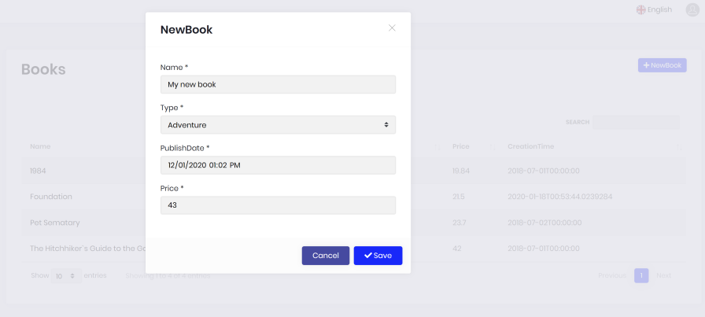
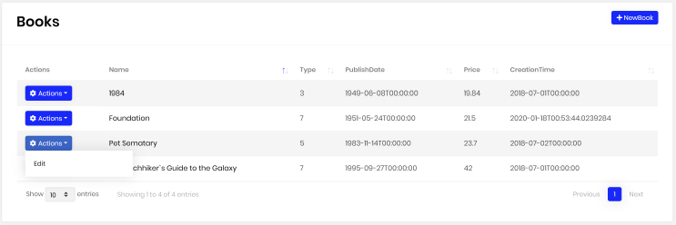

## ASP.NET Core {{UI_Value}} Tutorial - Part 2
````json
//[doc-params]
{
    "UI": ["MVC","NG"]
}
````

### About this tutorial

This is the second part of the ASP.NET Core {{UI_Value}} tutorial series. All parts:

* [Part I: Creating the project and book list page](part-1.md)
* **Part II: Creating, updating and deleting books (this tutorial)**
* [Part III: Integration tests](part-3.md)

> The completed sample is available on GitHub: [BookStore-{{UI}}](https://github.com/volosoft/volo/tree/dev/abp/samples/BookStore-{{UI}}).
>

*You can also watch [this video course](https://amazingsolutions.teachable.com/p/lets-build-the-bookstore-application) prepared by an ABP community member, based on this tutorial.*

### Creating a new book

In this section, you will learn how to create a new modal dialog form to create a new book. The modal dialog will look like in the below image:



#### Create the modal form

Create a new razor page, named `CreateModal.cshtml` under the `Pages/Books` folder of the `Acme.BookStore.Web` project.


##### CreateModal.cshtml.cs

Open the `CreateModal.cshtml.cs` file (`CreateModalModel` class) and replace with the following code:

````C#
using System.Threading.Tasks;
using Microsoft.AspNetCore.Mvc;

namespace Acme.BookStore.Web.Pages.Books
{
    public class CreateModalModel : BookStorePageModel
    {
        [BindProperty]
        public CreateUpdateBookDto Book { get; set; }

        private readonly IBookAppService _bookAppService;

        public CreateModalModel(IBookAppService bookAppService)
        {
            _bookAppService = bookAppService;
        }

        public async Task<IActionResult> OnPostAsync()
        {
            await _bookAppService.CreateAsync(Book);
            return NoContent();
        }
    }
}
````

* This class is derived from the `BookStorePageModel` instead of standard `PageModel`. `BookStorePageModel` inherits the `PageModel` and adds some common properties & methods that can be used in your page model classes.
* `[BindProperty]` attribute on the `Book` property binds post request data to this property.
* This class simply injects the `IBookAppService` in the constructor and calls the `CreateAsync` method in the `OnPostAsync` handler.

##### CreateModal.cshtml

Open the `CreateModal.cshtml` file and paste the code below:

````html
@page
@inherits Acme.BookStore.Web.Pages.BookStorePage
@using Volo.Abp.AspNetCore.Mvc.UI.Bootstrap.TagHelpers.Modal
@model Acme.BookStore.Web.Pages.Books.CreateModalModel
@{
    Layout = null;
}
<abp-dynamic-form abp-model="Book" data-ajaxForm="true" asp-page="/Books/CreateModal">
    <abp-modal>
        <abp-modal-header title="@L["NewBook"].Value"></abp-modal-header>
        <abp-modal-body>
            <abp-form-content />
        </abp-modal-body>
        <abp-modal-footer buttons="@(AbpModalButtons.Cancel|AbpModalButtons.Save)"></abp-modal-footer>
    </abp-modal>
</abp-dynamic-form>
````

* This modal uses `abp-dynamic-form` tag helper to automatically create the form from the model  `CreateBookViewModel`.
  * `abp-model` attribute indicates the model object where it's the `Book` property in this case.
  * `data-ajaxForm` attribute sets the form to submit via AJAX, instead of a classic page post.
  * `abp-form-content` tag helper is a placeholder to render the form controls (it is optional and needed only if you have added some other content in the `abp-dynamic-form` tag, just like in this page).

#### Add the "New book" button

Open the `Pages/Books/Index.cshtml` and set the content of `abp-card-header` tag as below:

````html
<abp-card-header>
    <abp-row>
        <abp-column size-md="_6">
            <h2>@L["Books"]</h2>
        </abp-column>
        <abp-column size-md="_6" class="text-right">
            <abp-button id="NewBookButton"
                        text="@L["NewBook"].Value"
                        icon="plus"
                        button-type="Primary" />
        </abp-column>
    </abp-row>
</abp-card-header>
````

This adds a new button called **New book** to the **top-right** of the table:


Open the `pages/books/index.js` and add the following code just after the `Datatable` configuration:

````js
var createModal = new abp.ModalManager(abp.appPath + 'Books/CreateModal');

createModal.onResult(function () {
    dataTable.ajax.reload();
});

$('#NewBookButton').click(function (e) {
    e.preventDefault();
    createModal.open();
});
````

* `abp.ModalManager` is a helper class to manage modals in the client side. It internally uses Twitter Bootstrap's standard modal, but abstracts many details by providing a simple API.

Now, you can **run the application** and add new books using the new modal form.

### Updating a book

Create a new razor page, named `EditModal.cshtml` under the `Pages/Books` folder of the `Acme.BookStore.Web` project:


#### EditModal.cshtml.cs

Open the `EditModal.cshtml.cs` file (`EditModalModel` class) and replace with the following code:

````csharp
using System;
using System.Threading.Tasks;
using Microsoft.AspNetCore.Mvc;

namespace Acme.BookStore.Web.Pages.Books
{
    public class EditModalModel : BookStorePageModel
    {
        [HiddenInput]
        [BindProperty(SupportsGet = true)]
        public Guid Id { get; set; }

        [BindProperty]
        public CreateUpdateBookDto Book { get; set; }

        private readonly IBookAppService _bookAppService;

        public EditModalModel(IBookAppService bookAppService)
        {
            _bookAppService = bookAppService;
        }

        public async Task OnGetAsync()
        {
            var bookDto = await _bookAppService.GetAsync(Id);
            Book = ObjectMapper.Map<BookDto, CreateUpdateBookDto>(bookDto);
        }

        public async Task<IActionResult> OnPostAsync()
        {
            await _bookAppService.UpdateAsync(Id, Book);
            return NoContent();
        }
    }
}
````

* `[HiddenInput]` and `[BindProperty]` are standard ASP.NET Core MVC attributes. `SupportsGet` is used to be able to get `Id` value from query string parameter of the request.
* In the `GetAsync` method, we get `BookDto `from `BookAppService` and this is being mapped to the DTO object `CreateUpdateBookDto`.
* The `OnPostAsync` uses `BookAppService.UpdateAsync()` to update the entity.

#### Mapping from BookDto to CreateUpdateBookDto 

To be able to map the `BookDto` to `CreateUpdateBookDto`, configure a new mapping. To do this, open the `BookStoreWebAutoMapperProfile.cs` in the `Acme.BookStore.Web` project and change it as shown below:

````csharp
using AutoMapper;

namespace Acme.BookStore.Web
{
    public class BookStoreWebAutoMapperProfile : Profile
    {
        public BookStoreWebAutoMapperProfile()
        {
            CreateMap<BookDto, CreateUpdateBookDto>();
        }
    }
}
````

* We have just added `CreateMap<BookDto, CreateUpdateBookDto>();` to define this mapping.

#### EditModal.cshtml

Replace `EditModal.cshtml` content with the following content:

````html
@page
@inherits Acme.BookStore.Web.Pages.BookStorePage
@using Acme.BookStore.Web.Pages.Books
@using Volo.Abp.AspNetCore.Mvc.UI.Bootstrap.TagHelpers.Modal
@model EditModalModel
@{
    Layout = null;
}
<abp-dynamic-form abp-model="Book" data-ajaxForm="true" asp-page="/Books/EditModal">
    <abp-modal>
        <abp-modal-header title="@L["Update"].Value"></abp-modal-header>
        <abp-modal-body>
            <abp-input asp-for="Id" />
            <abp-form-content />
        </abp-modal-body>
        <abp-modal-footer buttons="@(AbpModalButtons.Cancel|AbpModalButtons.Save)"></abp-modal-footer>
    </abp-modal>
</abp-dynamic-form>
````

This page is very similar to the `CreateModal.cshtml`, except:

* It includes an `abp-input` for the `Id` property to store `Id` of the editing book (which is a hidden input).
* It uses `Books/EditModal` as the post URL and *Update* text as the modal header.

#### Add "Actions" dropdown to the table

We will add a dropdown button to the table named *Actions*. 

Open the `Pages/Books/Index.cshtml` page and change the `<abp-table>` section as shown below:

````html
<abp-table striped-rows="true" id="BooksTable">
    <thead>
        <tr>
            <th>@L["Actions"]</th>
            <th>@L["Name"]</th>
            <th>@L["Type"]</th>
            <th>@L["PublishDate"]</th>
            <th>@L["Price"]</th>
            <th>@L["CreationTime"]</th>
        </tr>
    </thead>
</abp-table>
````

* We just added a new `th` tag for the "*Actions*" button.

Open the `pages/books/index.js` and replace the content as below:

````js
$(function () {

    var l = abp.localization.getResource('BookStore');

    var createModal = new abp.ModalManager(abp.appPath + 'Books/CreateModal');
    var editModal = new abp.ModalManager(abp.appPath + 'Books/EditModal');

    var dataTable = $('#BooksTable').DataTable(abp.libs.datatables.normalizeConfiguration({
        processing: true,
        serverSide: true,
        paging: true,
        searching: false,
        autoWidth: false,
        scrollCollapse: true,
        order: [[1, "asc"]],
        ajax: abp.libs.datatables.createAjax(acme.bookStore.book.getList),
        columnDefs: [
            {
                rowAction: {
                    items:
                        [
                            {
                                text: l('Edit'),
                                action: function (data) {
                                    editModal.open({ id: data.record.id });
                                }
                            }
                        ]
                }
            },
            { data: "name" },
            { data: "type" },
            { data: "publishDate" },
            { data: "price" },
            { data: "creationTime" }
        ]
    }));

    createModal.onResult(function () {
        dataTable.ajax.reload();
    });

    editModal.onResult(function () {
        dataTable.ajax.reload();
    });

    $('#NewBookButton').click(function (e) {
        e.preventDefault();
        createModal.open();
    });
});
````

* Used `abp.localization.getResource('BookStore')` to be able to use the same localization texts defined on the server-side.
* Added a new `ModalManager` named `createModal` to open the create modal dialog.
* Added a new `ModalManager` named `editModal` to open the edit modal dialog.
* Added a new column at the beginning of the `columnDefs` section. This column is used for the "*Actions*" dropdown button.
* "*New Book*" action simply calls `createModal.open()` to open the create dialog.
* "*Edit*" action simply calls `editModal.open()` to open the edit dialog.

You can run the application and edit any book by selecting the edit action. The final UI looks as below:



### Deleting a book

Open the `pages/books/index.js` and add a new item to the `rowAction` `items`:

````js
{
    text: l('Delete'),
    confirmMessage: function (data) {
        return l('BookDeletionConfirmationMessage', data.record.name);
    },
    action: function (data) {
        acme.bookStore.book
            .delete(data.record.id)
            .then(function() {
                abp.notify.info(l('SuccessfullyDeleted'));
                dataTable.ajax.reload();
            });
    }
}
````

* `confirmMessage` option is used to ask a confirmation question before executing the `action`.
* `acme.bookStore.book.delete()` method makes an AJAX request to JavaScript proxy function to delete a book.
* `abp.notify.info()` shows a notification after the delete operation.

The final `index.js` content is shown below:

````js
$(function () {

    var l = abp.localization.getResource('BookStore');

    var createModal = new abp.ModalManager(abp.appPath + 'Books/CreateModal');
    var editModal = new abp.ModalManager(abp.appPath + 'Books/EditModal');

    var dataTable = $('#BooksTable').DataTable(abp.libs.datatables.normalizeConfiguration({
        processing: true,
        serverSide: true,
        paging: true,
        searching: false,
        autoWidth: false,
        scrollCollapse: true,
        order: [[1, "asc"]],
        ajax: abp.libs.datatables.createAjax(acme.bookStore.book.getList),
        columnDefs: [
            {
                rowAction: {
                    items:
                    [
                        {
                            text: l('Edit'),
                            action: function (data) {
                                editModal.open({ id: data.record.id });
                            }
                        },
                        {
                            text: l('Delete'),
                            confirmMessage: function (data) {
                                return l('BookDeletionConfirmationMessage', data.record.name);
                            },
                            action: function (data) {
                                acme.bookStore.book
                                    .delete(data.record.id)
                                    .then(function() {
                                        abp.notify.info(l('SuccessfullyDeleted'));
                                        dataTable.ajax.reload();
                                    });
                            }
                        }
                    ]
                }
            },
            { data: "name" },
            { data: "type" },
            { data: "publishDate" },
            { data: "price" },
            { data: "creationTime" }
        ]
    }));

    createModal.onResult(function () {
        dataTable.ajax.reload();
    });

    editModal.onResult(function () {
        dataTable.ajax.reload();
    });

    $('#NewBookButton').click(function (e) {
        e.preventDefault();
        createModal.open();
    });
});
````

Open the `en.json` in the `Acme.BookStore.Domain.Shared` project and add the following line for localization:

````json
"BookDeletionConfirmationMessage": "Are you sure to delete the book {0}?",
"SuccessfullyDeleted": "Successfully deleted"
````

Run the application and try to delete a book.

### Next Part

See the [next part](part-3.md) of this tutorial.
