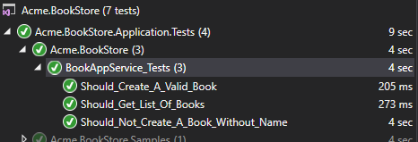

## ASP.NET Core {{UI_Value}} Tutorial - Part 3
````json
//[doc-params]
{
    "UI": ["MVC","NG"]
}
````

{{
if UI == "MVC"
  DB="ef"
  DB_Text="Entity Framework Core"
  UI_Text="mvc"
else if UI == "NG"
  DB="mongodb"
  DB_Text="MongoDB"
  UI_Text="angular"
else 
  DB ="?"
  UI_Text="?"
end
}}

### About this tutorial

This is the third part of the ASP.NET Core {{UI_Value}} tutorial series. See all parts:

- [Part I: Creating the project and book list page](part-1.md)
- [Part II: Creating, updating and deleting books](part-2.md)
- **Part III: Integration tests (this tutorial)**

> The completed sample is available: [bookstore-{{UI_Text}}-{{DB}}.zip](https://abp.io/Account/Login?returnUrl=/api/download/samples/bookstore-{{UI_Text}}-{{DB}}). To be able to download this sample, you need to hold an active ABP Commercial license.

*You can also check out [the video course](https://amazingsolutions.teachable.com/p/lets-build-the-bookstore-application) prepared by the community, based on this tutorial.*

### Test projects in the solution

This part covers the **server side** tests. There are several test projects in the solution:


Each project is used to test the related project. Test projects use the following libraries for testing:

* [Xunit](https://xunit.github.io/) as the main test framework.
* [Shoudly](http://shouldly.readthedocs.io/en/latest/) as the assertion library.
* [NSubstitute](http://nsubstitute.github.io/) as the mocking library.

### Adding test data

Startup template contains the `BookStoreTestDataBuilder` class in the `Acme.BookStore.TestBase` project which creates initial data to run tests. Change the content of `BookStoreTestDataSeedContributor` class as show below:

````csharp
using System;
using System.Threading.Tasks;
using Volo.Abp.Data;
using Volo.Abp.DependencyInjection;
using Volo.Abp.Domain.Repositories;
using Volo.Abp.Guids;

namespace Acme.BookStore
{
    public class BookStoreTestDataSeedContributor
        : IDataSeedContributor, ITransientDependency
    {
        private readonly IRepository<Book, Guid> _bookRepository;
        private readonly IGuidGenerator _guidGenerator;

        public BookStoreTestDataSeedContributor(
            IRepository<Book, Guid> bookRepository,
            IGuidGenerator guidGenerator)
        {
            _bookRepository = bookRepository;
            _guidGenerator = guidGenerator;
        }

        public async Task SeedAsync(DataSeedContext context)
        {
            await _bookRepository.InsertAsync(
                new Book(id: _guidGenerator.Create(),
                    name: "Test book 1",
                    type: BookType.Fantastic,
                    publishDate: new DateTime(2015, 05, 24),
                    price: 21
                )
            );

            await _bookRepository.InsertAsync(
                new Book(id: _guidGenerator.Create(),
                    name: "Test book 2",
                    type: BookType.Science,
                    publishDate: new DateTime(2014, 02, 11),
                    price: 15
                )
            );
        }
    }
}
````

* `IRepository<Book, Guid>` is injected and used it in the `SeedAsync` to create two book entities as the test data.

### Testing the application service BookAppService 
* `IGuidGenerator` is injected to create GUIDs. While `Guid.NewGuid()` would perfectly work for testing, `IGuidGenerator` has additional features especially important while using real databases. Further information, see the [Guid generation document](https://docs.abp.io/{{Document_Language_Code}}/abp/{{Document_Version}}/Guid-Generation).

Create a test class named `BookAppService_Tests` in the `Acme.BookStore.Application.Tests` project:

````csharp
using System;
using System.Linq;
using System.Threading.Tasks;
using Xunit;
using Shouldly;
using Volo.Abp.Application.Dtos;
using Volo.Abp.Validation;
using Microsoft.EntityFrameworkCore.Internal;

namespace Acme.BookStore
{
    public class BookAppService_Tests : BookStoreApplicationTestBase
    {
        private readonly IBookAppService _bookAppService;

        public BookAppService_Tests()
        {
            _bookAppService = GetRequiredService<IBookAppService>();
        }

        [Fact]
        public async Task Should_Get_List_Of_Books()
        {
            //Act
            var result = await _bookAppService.GetListAsync(
                new PagedAndSortedResultRequestDto()
            );

            //Assert
            result.TotalCount.ShouldBeGreaterThan(0);
            result.Items.ShouldContain(b => b.Name == "Test book 1");
        }
    }
}
````

* `Should_Get_List_Of_Books` test simply uses `BookAppService.GetListAsync` method to get and check the list of users.

Add a new test that creates a valid new book:

````csharp
[Fact]
public async Task Should_Create_A_Valid_Book()
{
    //Act
    var result = await _bookAppService.CreateAsync(
        new CreateUpdateBookDto
        {
            Name = "New test book 42",
            Price = 10,
            PublishDate = System.DateTime.Now,
            Type = BookType.ScienceFiction
        }
    );

    //Assert
    result.Id.ShouldNotBe(Guid.Empty);
    result.Name.ShouldBe("New test book 42");
}
````

Add a new test that tries to create an invalid book and fails:

````csharp
[Fact]
public async Task Should_Not_Create_A_Book_Without_Name()
{
    var exception = await Assert.ThrowsAsync<Volo.Abp.Validation.AbpValidationException>(async () =>
    {
        await _bookAppService.CreateAsync(
            new CreateUpdateBookDto
            {
                Name = "",
                Price = 10,
                PublishDate = DateTime.Now,
                Type = BookType.ScienceFiction
            }
        );
    });

    exception.ValidationErrors
        .ShouldContain(err => err.MemberNames.Any(mem => mem == "Name"));
}
````

* Since the `Name` is empty, ABP will throw an `AbpValidationException`.

Open the **Test Explorer Window** (use Test -> Windows -> Test Explorer menu if it is not visible) and **Run All** tests:



Congratulations, the green icons show, the tests have been successfully passed!

---

> You can access to the completed **source-code** of this application from the following link [bookstore-{{UI_Text}}-{{DB}}.zip](https://abp.io/Account/Login?returnUrl=/api/download/samples/bookstore-{{UI_Text}}-{{DB}}). To be able to download this sample, you need to hold an active ABP Commercial license.