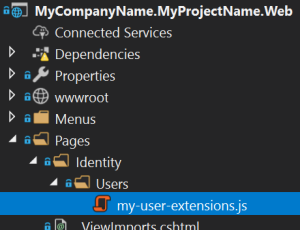

# Entity Action Extensions for ASP.NET Core UI

## Introduction

Entity action extension system allows you to add a new action to the action menu for an entity. A "Click Me" action was added to the user management page below:


You can take any action (open a modal, make an HTTP API call, redirect to another page... etc) by writing your custom code. You can access to the current entity in your code.

## How to Set Up

In this example, we will add a "Click Me!" action and execute a JavaScript code for the user management page of the [Identity Module](../../modules/identity.md).

### Create a JavaScript File

First, add a new JavaScript file to your solution. We added inside the `/Pages/Identity/Users` folder of the `.Web` project:



Here, the content of this JavaScript file:

````js
abp.ui.extensions.entityActions
    .addLast('identity.user',
        {
            text: 'Click Me!',
            action: function (data) {
                //TODO: Write your custom code
                alert(data.record.userName);
            }
        }
    );
````

In the `action` function, you can do anything you need. See the *abp.ui.extensions.entityActions* section for detailed usage.

### Add the File to the User Management Page

Then you need to add this JavaScript file to the user management page. You can take the power of the [Bundling & Minification system](https://docs.abp.io/en/abp/latest/UI/AspNetCore/Bundling-Minification).

Write the following code inside the `ConfigureServices` of your module class:

````csharp
Configure<AbpBundlingOptions>(options =>
{
    options.ScriptBundles.Configure(
        typeof(Volo.Abp.Identity.Web.Pages.Identity.Users.IndexModel).FullName,
        bundleConfiguration =>
        {
            bundleConfiguration.AddFiles(
                "/Pages/Identity/Users/my-user-extensions.js"
            );
        });
});
````

This configuration adds `my-user-extensions.js` to the user management page of the Identity Module. `typeof(Volo.Abp.Identity.Web.Pages.Identity.Users.IndexModel).FullName` is the name of the bundle in the user management page. This is a common convention used for all the ABP Commercial modules.

## abp.ui.extensions.entityActions

This section explains details of the `abp.ui.extensions.entityActions` JavaScript API.

### addLast()

Used to add a new action item to end of the action list. Gets the following parameters:

* **name**: The name of the entity defined by the related module.
* **options**: An object with the properties defining the action item. See the [Datatables.Net Integration](https://docs.abp.io/en/abp/latest/UI/AspNetCore/Libraries/DatatablesNet) document for details of this object.

This is a shortcut method when you want to add an action item as the last element (instead of writing a custom contributor - see `addContributor()` function below).

#### Example

````js
abp.ui.extensions.entityActions
    .addLast('identity.user',
        {
            text: 'Click Me!',
            action: function (data) {
                //TODO: Write your custom code
                alert(data.record.userName);
            }
        }
    );
````

### addContributor()

Can be used for more advanced scenarios, e.g. you want to add your action in a different position in the list, change or remove an existing action item. In such cases, use `addContributor` with the following parameters:

* **name**: The name of the entity defined by the related module.
* **contributeCallback**: A callback function that is called whenever the action list should be created. You can freely modify the action list inside this callback method.

#### Example

````js
abp.ui.extensions.entityActions.addContributor('identity.user', function (data) {
    var actionsArray = data.actionList.getList();
    //You can now remove an item or add a new item to the array of actions
    actionsArray.push({
        text: 'Click Me 2!',
        icon: 'fas fa-hand-point-right',
        action: function (data) {
            //TODO: Write your custom code
            alert(data.record.userName);
        }
    });
});
````

`data.actionList.getList()` returns an array of the current actions. You can `push` an item to the array or manipulate the array however you need.

>`data.actionList` is an object of type `abp.ui.extensions.ActionList` that is explained below.

### getActions()

Used to get the array of actions. It executes all the contributors and prepares the final action list. This is normally called by the modules to show the list. However, you can use it if you are building your own extensible UIs.

## abp.ui.extensions.ActionList

`abp.ui.extensions.ActionList` is a class that is accessed as `data.actionList` object inside the `abp.ui.extensions.entityActions.addContributor` function. This section explains the members of this class.

### addLast()

Used to add a new action to end of the action list. Get the following parameter:

* **options**: An object with the properties defining the action item. This can also be an array of object each for an action item. See the [Datatables.Net Integration](https://docs.abp.io/en/abp/latest/UI/AspNetCore/Libraries/DatatablesNet) document for details of this object.

#### Example

````js
//Add a single action item
data.actionList.addLast({
    text: 'Click Me!',
    icon: 'fas fa-hand-point-right',
    action: function (data) {
        //TODO: Write your custom code
        alert(data.record.userName);
    }
});

//Add an array of action items
data.actionList.addLast([{ ... }, { ... }, { ... }]);
````

### getList()

Returns the current list of actions as an array of objects.
